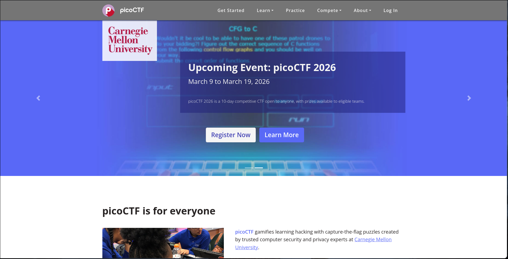

# 🚩 picoCTF

#
picoCTF adalah platform Capture The Flag (CTF) internasional yang dirancang khusus untuk pemula hingga tingkat menengah dalam bidang Cyber Security. Platform ini dikembangkan oleh tim keamanan dari Carnegie Mellon University sebagai bagian dari inisiatif pendidikan untuk memperkenalkan keamanan siber kepada pelajar di seluruh dunia.

picoCTF menyediakan berbagai tantangan berbasis praktik yang dirancang untuk mengajarkan konsep keamanan informasi secara bertahap dan terstruktur. Setiap challenge disusun untuk membantu peserta memahami dasar-dasar eksploitasi sistem, analisis kerentanan, serta teknik pemecahan masalah dalam konteks keamanan digital.

Melalui picoCTF, peserta mempelajari berbagai bidang seperti eksploitasi web, kriptografi, forensik digital, reverse engineering, binary exploitation, dan keamanan jaringan. Tantangan yang diberikan dirancang agar edukatif sekaligus menantang, sehingga peserta dapat mengembangkan pola pikir analitis dan pendekatan sistematis dalam menyelesaikan permasalahan keamanan.

Sebagai salah satu platform CTF edukatif yang paling populer di dunia, picoCTF telah membantu banyak pelajar membangun fondasi yang kuat dalam bidang keamanan siber dan menjadi langkah awal menuju kompetisi tingkat lanjut maupun karier profesional di industri teknologi.

