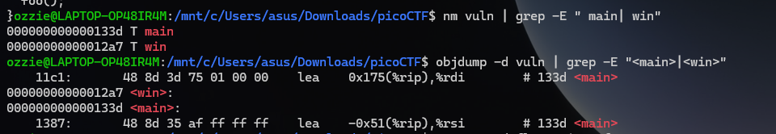
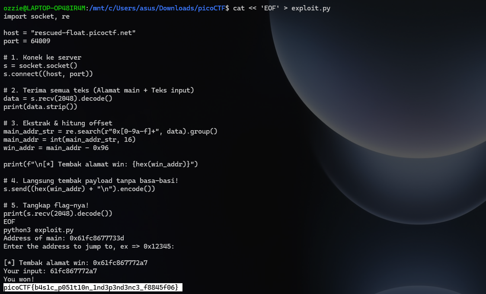

# Write-Up: PIE TIME (Easy)

## Analisis Masalah

Challenge "PIE TIME" merupakan soal kategori *Binary Exploitation* (Pwn). Diberikan sebuah *source code* C dan *binary* yang telah di-*compile*. Dari *source code*, program memiliki fungsi `win()` yang akan membaca dan mencetak isi dari `flag.txt`.

Kerentanan utama program ini ada pada fungsi `main()`:

1. **Memory Leak**: Program secara eksplisit mencetak alamat memori dari fungsi `main` saat dijalankan.
2. **Arbitrary Code Execution**: Program meminta input alamat dalam format *hexadecimal*, lalu mengonversinya menjadi *function pointer* dan langsung mengeksekusinya (`foo()`).

Meskipun *binary* dikompilasi dengan proteksi **PIE (Position Independent Executable)** yang mengacak alamat dasar (*Base Address*) program setiap kali dijalankan, sifat bawaan PIE adalah **jarak (offset) antar fungsi di dalam binary akan selalu tetap/konstan**. Dengan berbekal alamat `main` yang bocor, kita bisa menghitung alamat pasti dari fungsi `win()`.

## Langkah Penyelesaian

### 1. Mencari Offset Fungsi Secara Lokal

Sebelum menyerang server, saya harus mengetahui *offset* (jarak) antara fungsi `main` dan `win`. Saya menggunakan perintah `nm` dan `objdump` pada *file binary* `vuln` yang diunduh:

```bash
nm vuln | grep -E " main| win"

```
****
Hasilnya menunjukkan:

* Alamat `main` lokal: `0x133d`
* Alamat `win` lokal: `0x12a7`

Dari sini, saya menghitung selisihnya: `0x133d` - `0x12a7` = `0x96`. Artinya, di memori mana pun program ini di-*load*, alamat `win` akan selalu berada sejauh **`0x96` byte di bawah** alamat `main`.

### 2. Otomatisasi Eksploitasi dengan Python

Karena eksekusi manual rentan terhadap *timeout* koneksi dari server `netcat`, saya membuat *script* Python sederhana menggunakan *library* `socket` dan `re` (Regex) untuk melakukan otomasi:

* Terhubung ke server target.
* Menangkap teks yang membocorkan alamat `main` dan mengekstraknya menggunakan Regex.
* Mengurangi alamat tersebut dengan `0x96` untuk mendapatkan alamat `win` yang absolut pada sesi tersebut.
* Mengirimkan alamat `win` kembali ke server.

### 3. Mendapatkan Flag

Setelah *script* dieksekusi, payload langsung meluncur dan server merespons dengan mengeksekusi fungsi `win()`.

```bash
python3 exploit.py

```
****


## Tools yang Digunakan

1. **nm / objdump** - Untuk inspeksi *binary* lokal dan mendapatkan *offset* tabel simbol fungsi.
2. **Python 3 (socket, re)** - Untuk melakukan interaksi jaringan secara otomatis, ekstraksi data *real-time*, dan kalkulasi alamat eksploitasi sebelum server melakukan *timeout*.

## Kesimpulan

Proteksi PIE (*Position Independent Executable*) dirancang untuk menggagalkan eksploitasi *hardcoded address* dengan mengacak memori. Namun, tantangan ini mendemonstrasikan bahwa **PIE menjadi sama sekali tidak berguna jika terdapat kelemahan *Information/Memory Leak***. Mengetahui satu saja alamat fungsi pada saat *runtime* sudah cukup bagi penyerang untuk memetakan seluruh isi *binary* menggunakan kalkulasi *offset* statis.

Flag yang ditemukan adalah: **`picoCTF{b4s1c_p051t10n_1nd3p3nd3nc3_f8845f06}`**. Pesan pada flag ini menegaskan teknik yang kita pelajari: mengeksploitasi proteksi *Position Independence* dasar.

---