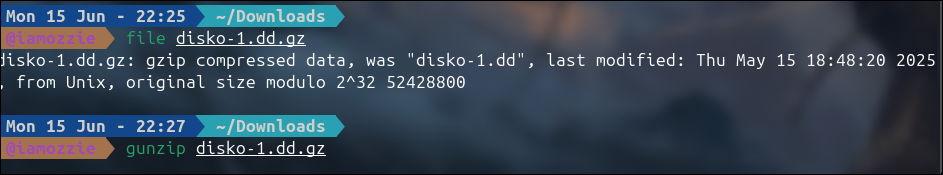
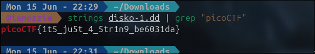

# Write-Up: Disk Image Strings - Forensics (Easy)

## Analisis Masalah

Challenge ini memberikan sebuah *file* bernama `disko-1.dd.gz` dengan deskripsi *"Can you find the flag in this disk image?"*. Petunjuk yang diberikan sangat eksplisit: *"Maybe Strings could help? If only there was a way to do that?"*. Petunjuk ini mengarahkan kita untuk menggunakan perintah Linux `strings` untuk mencari teks yang bisa dibaca manusia di dalam *file* tersebut.

Namun, saat saya melakukan pengecekan awal menggunakan perintah `file` dan `exiftool`, terlihat bahwa `disko-1.dd.gz` adalah *file* yang dikompresi menggunakan **gzip**. Karena datanya masih terkompresi dalam bentuk biner, menjalankan perintah `strings` secara langsung tidak akan membuahkan hasil. Oleh karena itu, *file* ini harus diekstrak terlebih dahulu untuk mendapatkan *raw disk image* yang asli (`disko-1.dd`), baru setelahnya pencarian teks bisa dilakukan.

## Langkah Penyelesaian

### 1. Identifikasi dan Ekstraksi File GZIP

Langkah pertama adalah memverifikasi tipe *file* untuk memastikan bentuk kompresinya. Setelah mengetahui bahwa itu adalah *gzip compressed data* dengan ukuran asli sekitar 50MB, saya mengekstraknya menggunakan perintah `gunzip`.

```bash
file disko-1.dd.gz
gunzip disko-1.dd.gz
```

****
*(Di sini saya mengambil screenshot terminal yang menunjukkan output perintah `file` dan eksekusi perintah `gunzip`)*

### 2. Mencari Flag Menggunakan Strings dan Grep

Setelah proses ekstraksi selesai, *file* `.gz` menghilang dan menyisakan *file* `disko-1.dd`. Karena *disk image* ini cukup besar, mencari secara manual di dalamnya akan sangat sulit. Saya menggunakan perintah `strings` untuk mengeluarkan seluruh teks yang dapat dibaca (*printable characters*) dari dalam *disk image* tersebut, lalu meneruskannya (*piping*) ke perintah `grep` untuk memfilter teks dan hanya menampilkan baris yang mengandung format flag "picoCTF".

```bash
strings disko-1.dd | grep "picoCTF"
```

****

*(Di sini saya mengambil screenshot eksekusi perintah `strings` dan `grep` yang langsung memunculkan flag di terminal)*

## Tools yang Digunakan

1. **file** - Untuk memverifikasi jenis *file* awal dan mengonfirmasi bahwa *file* tersebut merupakan arsip kompresi gzip.
2. **gunzip** - Untuk mengekstrak/dekompresi *file* `.gz` agar kembali menjadi format aslinya (`.dd`).
3. **strings** - Untuk memindai dan mengekstrak semua teks atau karakter yang dapat dibaca dari dalam *file* biner (*raw disk image*).
4. **grep** - Untuk memfilter hasil *output* yang sangat panjang dari perintah `strings`, agar hanya menampilkan baris yang memiliki kata kunci pencarian (dalam hal ini "picoCTF").

## Kesimpulan

Challenge ini adalah pengenalan yang sangat baik tentang bagaimana cara kerja *file system* dan *raw data*. Sebuah *disk image* (biasanya berekstensi `.img` atau `.dd`) adalah salinan *bit-by-bit* dari sebuah media penyimpanan. Jika data di dalamnya tidak dienkripsi, teks biasa (*plaintext*) yang pernah tersimpan atau terhapus di dalam *disk* tersebut sering kali masih dapat dibaca secara langsung dari data binernya.

Flag yang berhasil ditemukan adalah **`picoCTF{1t5_ju5t_4_5tr1n9_be6031da}`**. Flag ini dibaca sebagai *"it's just a string"*, yang mendeskripsikan inti dari tantangan forensik ini: flagnya hanyalah sebuah teks (string) biasa yang terkubur di dalam tumpukan data biner *disk image*.