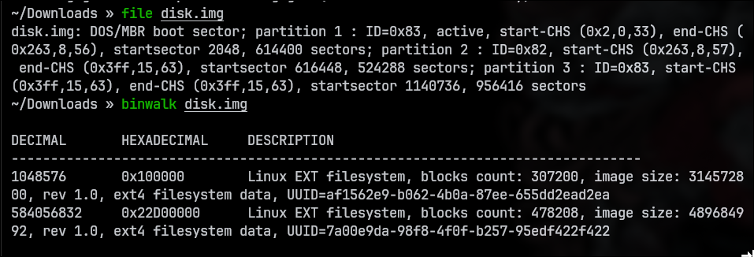
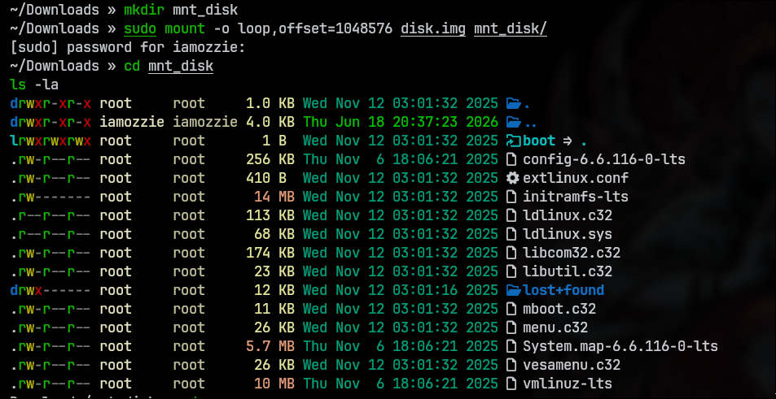
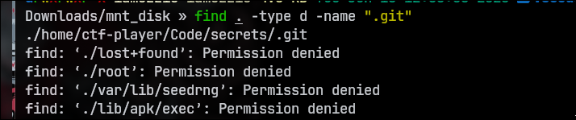
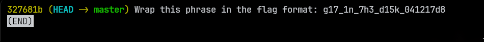

## Write-Up: Forensics Git 0 (Medium)

### Analisis Masalah

Challenge ini memberikan sebuah berkas citra disk (*disk image*) bernama `disk.img.gz`. Deskripsi soal meminta kita untuk menemukan sebuah *flag* di dalam berkas tersebut dengan sebuah petunjuk (*hint*):

1. *How can you extract the directory from the disk image?*

Nama tantangan yang mengandung kata **"Git"** memberikan petunjuk implisit yang sangat kuat bahwa bendera (*flag*) disembunyikan di dalam sebuah repositori Git (`.git`) yang tertanam di dalam sistem berkas (*filesystem*) pada *disk image* tersebut. Membaca langsung menggunakan perintah `strings` akan menghasilkan banyak teks acak karena data dibaca dalam bentuk *raw bytes*, sehingga kita perlu mengekstrak atau melakukan *mounting* pada partisi yang tepat terlebih dahulu.

---

### Langkah Penyelesaian

#### 1. Ekstraksi Berkas dan Identifikasi Struktur Disk

Langkah pertama adalah mengekstrak berkas `.gz` menggunakan perintah `gunzip`. Setelah mendapatkan berkas mentah `disk.img`, saya menganalisis tipenya menggunakan perintah `file` dan `binwalk` untuk melihat struktur partisi serta mendeteksi *offset* sistem berkas di dalamnya.

```bash
file disk.img
binwalk disk.img
```

Output:

```text
DECIMAL       HEXADECIMAL     DESCRIPTION
--------------------------------------------------------------------------------
1048576       0x100000        Linux EXT filesystem, blocks count: 307200, image size: 314572800, rev 1.0, ext4 filesystem data, UUID=af1562e9-b062-4b0a-87ee-655dd2ead2ea
584056832     0x22D00000      Linux EXT filesystem, blocks count: 478208, image size: 489684992, rev 1.0, ext4 filesystem data, UUID=7a00e9da-98f8-4f0f-b257-95edf422f422
```

****
****

Hasil analisis `binwalk` mendeteksi adanya **dua partisi Linux EXT (ext4)**:

* Partisi 1 berada pada *offset* `1048576` (diidentifikasi sebagai partisi `/boot`).
* Partisi 2 berada pada *offset* `584056832` (diidentifikasi sebagai *root filesystem* `/`).

---

#### 2. Mounting Partisi Kedua (Root Filesystem)

Untuk menjelajahi isi sistem berkas utama tempat data pengguna berada, saya membuat direktori baru bernama `mnt_disk` dan melakukan *mounting* secara khusus pada partisi kedua menggunakan *offset* `584056832`.

```bash
mkdir mnt_disk
sudo mount -o loop,offset=584056832 disk.img mnt_disk/
cd mnt_disk
ls -la
```

Output:

```text
drwxr-xr-x root     root     1.0 KB Wed Nov 19 15:38:54 2025  .
drwxr-xr-x iamozzie iamozzie 4.0 KB Thu Jun 18 20:37:23 2026  ..
drwxr-xr-x root     root     4.0 KB Wed Nov 19 15:39:08 2025  bin
...
drwxr-xr-x root     root     1.0 KB Wed Nov 12 03:01:17 2025  home
drwx------ root     root     1.0 KB Wed Nov 19 15:39:07 2025  root
```

****
****

Setelah berhasil masuk, terlihat struktur direktori standar Linux lengkap, yang menandakan partisi kedua adalah *root filesystem* yang kita cari.

---

#### 3. Pencarian Repositori Git Tersembunyi

Sesuai dengan petunjuk nama tantangan (*Git*), saya mencari keberadaan folder `.git` yang tersembunyi di dalam seluruh direktori yang telah di-*mount* dengan menggunakan perintah `find`.

```bash
find . -type d -name ".git"
```

Output:

```text
./home/ctf-player/Code/secrets/.git
```

****
****

Perintah tersebut berhasil menemukan sebuah repositori Git tersembunyi yang terletak di dalam direktori kerja milik user `ctf-player`, tepatnya pada jalur `./home/ctf-player/Code/secrets/.git`.

---

#### 4. Ekstraksi Informasi dan Riwayat Git Commit

Saya kemudian berpindah ke direktori proyek tersebut. Untuk menghindari kendala hak akses keamanan Git modern (`safe.directory`) saat membaca repositori milik user lain di dalam disk image, saya menambahkan konfigurasi pengecualian global terlebih dahulu sebelum memeriksa riwayat *commit* menggunakan `git log`.

```bash
cd home/ctf-player/Code/secrets/
git config --global --add safe.directory "*"
git log --oneline
```

Output:

```text
327681b (HEAD -> master) Wrap this phrase in the flag format: g17_1n_7h3_d15k_041217d8
```

****
****
Riwayat *commit* langsung menampilkan pesan instruksi yang memuat sebuah string *leetspeak*:

> `Wrap this phrase in the flag format: g17_1n_7h3_d15k_041217d8`

---

#### 5. Penyusunan Format Flag

Sesuai instruksi pada pesan *commit* dan format standar dari platform picoCTF (`picoCTF{}`), kita hanya perlu membungkus teks *leetspeak* yang ditemukan ke dalam tanda kurung kurawal.

| Komponen | Nilai |
| --- | --- |
| Teks Leetspeak | `g17_1n_7h3_d15k_041217d8` |
| **Flag Lengkap** | **`picoCTF{g17_1n_7h3_d15k_041217d8}`** |

---

### Tools yang Digunakan

1. **binwalk** — Untuk menganalisis struktur partisi dan menemukan *offset bytes* dari *filesystem* di dalam berkas citra (*disk image*).
2. **mount (Linux Tool)** — Untuk melakukan *mounting loop device* pada partisi spesifik berdasarkan nilai offset agar sistem berkas bisa diakses secara interaktif.
3. **find (Linux Tool)** — Untuk melacak letak direktori `.git` yang tersembunyi di dalam repositori sistem tanpa harus membukanya satu per satu.
4. **git-cli** — Untuk memeriksa riwayat modifikasi data (*commit log*) pada repositori proyek yang ditemukan.

---

### Kesimpulan

Tantangan "Forensics Git 0" melatih kemampuan analisis forensik digital pada media penyimpanan (*disk image*) dan pemahaman struktur repositori kontrol versi (Git). Fokus utama dari tantangan ini adalah kemampuan melakukan *mounting* partisi sistem yang tepat berdasarkan informasi sektor/offset byte hasil analisis *tools* eksternal.

Banyak berkas rahasia atau modifikasi penting dalam sejarah pengembangan aplikasi tetap terekam secara permanen di dalam basis data Git (folder `.git`) meskipun file aslinya di area kerja (*working directory*) telah diubah atau dihapus. Dengan memeriksa riwayat log *commit*, data sensitif yang sengaja ditinggalkan dapat diambil kembali dengan mudah.

Flag yang berhasil didapatkan adalah **`picoCTF{g17_1n_7h3_d15k_041217d8}`**, di mana kalimat *leetspeak* tersebut secara harfiah merepresentasikan petunjuk penyelesaian tantangan ini, yaitu *"git in the disk"*.