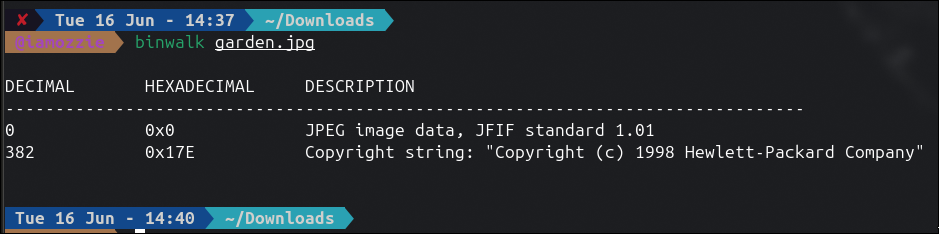
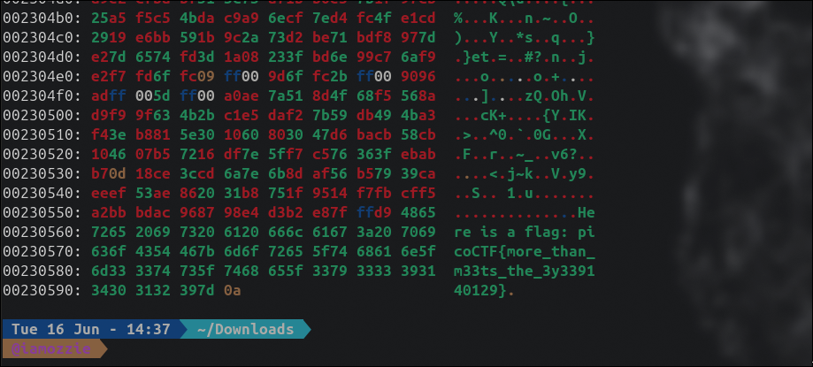

## Write-Up: Glory of the Garden (Easy)

### Analisis Masalah

Challenge ini memberikan sebuah berkas gambar bernama `garden.jpg`. Deskripsi soal menyebutkan *"This file contains more than it seems"*, yang mengindikasikan adanya data tersembunyi di dalam berkas tersebut. Satu hint diberikan:

1. *What is a hex editor?*

Hint tersebut secara langsung mengarahkan kita untuk memeriksa konten berkas pada level byte mentah menggunakan hex editor atau hex dump tool, karena data tersembunyi mungkin tidak terlihat jika hanya membuka gambar secara normal.

---

### Langkah Penyelesaian

#### 1. Unduh dan Identifikasi Berkas

Langkah pertama adalah mengunduh berkas `garden.jpg` dari URL yang diberikan, kemudian memeriksa struktur internalnya menggunakan `binwalk` untuk mendeteksi apakah ada berkas lain yang tertanam di dalamnya.

```bash
binwalk garden.jpg
```

Output `binwalk`:
```
DECIMAL       HEXADECIMAL     DESCRIPTION
--------------------------------------------------------------------------------
0             0x0             JPEG image data, JFIF standard 1.01
382           0x17E           Copyright string: "Copyright (c) 1998 Hewlett-Packard Company"
```

****

`binwalk` tidak mendeteksi adanya berkas tersembunyi yang ter-embed di dalam gambar. Tidak ada file ZIP, berkas lain, atau signature mencurigakan yang ditemukan. Namun hal ini belum berarti gambar bersih sepenuhnya — data bisa saja disisipkan **setelah** JPEG end-of-file marker (`FFD9`) sebagai *appended data* yang tidak terdeteksi oleh signature-based scanner seperti `binwalk`.

---

#### 2. Inspeksi Hex Dump dengan xxd

Merujuk pada hint yang menyebut hex editor, saya menggunakan `xxd` untuk melihat representasi heksadesimal dari seluruh isi berkas. Perhatian difokuskan pada bagian **akhir berkas**, karena data yang disisipkan setelah JPEG end-of-file marker (`FFD9`) adalah teknik steganografi sederhana yang umum digunakan dalam CTF.

```bash
xxd garden.jpg | tail -30
```

****

Pada bagian akhir hex dump, ditemukan kejanggalan yang signifikan. Setelah byte `FFD9` yang menandai akhir data JPEG yang valid, terdapat string teks yang dapat dibaca (*human-readable*) secara langsung:

```
00230550: ...ffd9 4865  ..............He
00230560: 7265 2069 7320 6120 666c 6167 3a20 7069  re is a flag: pi
00230570: 636f 4354 467b 6d6f 7265 5f74 6861 6e5f  coCTF{more_than_
00230580: 6d33 3374 735f 7468 655f 3379 3333 3931  m33ts_the_3y3391
00230590: 3430 3132 397d 0a                        40129}.
```

Data teks tersebut dimulai tepat setelah byte `FFD9` (offset `0x230557`), membuktikan bahwa flag disisipkan sebagai *appended plaintext* di luar batas data gambar yang sah.

---

#### 3. Ekstraksi Flag

Dari pembacaan hex dump di atas, string flag dapat langsung dibaca pada kolom ASCII di sisi kanan output `xxd`:

```
Here is a flag: picoCTF{more_than_m33ts_the_3y3391 40129}
```

Flag berhasil diekstrak: **`picoCTF{more_than_m33ts_the_3y3391 40129}`**

---

### Tools yang Digunakan

1. **binwalk** — Untuk melakukan analisis signature-based terhadap struktur internal berkas dan mendeteksi kemungkinan embedded file.
2. **xxd** — Untuk menampilkan hex dump berkas dan menginspeksi konten raw byte, khususnya pada bagian akhir berkas setelah JPEG end-of-file marker.

---

### Kesimpulan

Challenge "Garden" merupakan tantangan forensik yang berfokus pada teknik **Data Appending** atau **File Trailing Data**, yaitu metode menyisipkan data tersembunyi dengan cara menambahkannya **setelah end-of-file marker** dari format berkas yang legitimate.

Teknik ini bekerja karena sebagian besar aplikasi penampil gambar hanya membaca data hingga menemukan marker `FFD9` (JPEG EOF) dan mengabaikan byte-byte setelahnya, sehingga gambar tetap tampil normal. Namun saat diperiksa menggunakan hex editor atau `xxd`, data tersembunyi tersebut langsung terlihat sebagai teks biasa.

Pelajaran penting dari challenge ini adalah bahwa `binwalk` yang berbasis signature detection tidak selalu mendeteksi *appended plaintext*, sehingga inspeksi manual menggunakan hex dump tetap diperlukan sebagai langkah lanjutan dalam analisis forensik.

Flag yang berhasil didapatkan adalah **`picoCTF{more_than_m33ts_the_3y3391 40129}`**, di mana `more_than_m33ts` merupakan referensi langsung ke deskripsi soal *"more than it seems"* yang ditulis dalam gaya *leetspeak*.