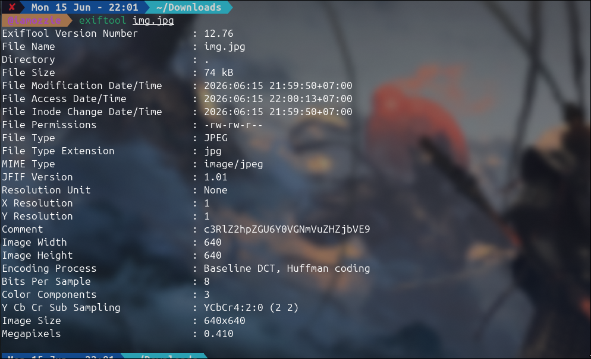
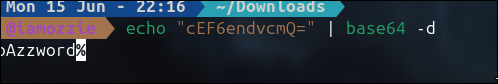
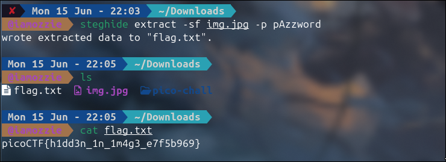

# Write-Up: Hidden Payload - Steganography (Easy)

## Analisis Masalah

Challenge ini memberikan sebuah *file* gambar JPG biasa dengan deskripsi *"Something is tucked away out of sight inside the file. Your task is to discover the hidden payload and extract the flag"*. Petunjuk pertama (Hint 1) meminta kita untuk mengunduh gambar dan membaca *metadata*-nya. Ini adalah indikasi kuat bahwa terdapat informasi penting atau *credential* yang disembunyikan di dalam atribut non-visual gambar tersebut (steganografi).

Melalui analisis awal, ditemukan sebuah *string* acak berbentuk Base64 pada bagian *Comment* gambar. Setelah dilakukan *decoding*, *string* tersebut mengarah pada penggunaan *tool* steganografi populer bernama **steghide** disertai dengan sebuah *passphrase* (kata sandi) tersembunyi yang digunakan untuk mengamankan *payload* di dalam gambar.

## Langkah Penyelesaian

### 1. Analisis Metadata Menggunakan ExifTool

Sesuai dengan petunjuk yang diberikan, langkah pertama adalah memeriksa *metadata* dari *file* `img.jpg` menggunakan `exiftool`.

```bash
exiftool img.jpg
```

****
*(Di sini saya mengambil screenshot tampilan terminal saat menjalankan exiftool, yang memperlihatkan nilai field Comment berisi string Base64 "c3RlZ2hpZGU6Y0VGNmVuZHZjbVE9")*

### 2. Dekoding Pesan Base64 (Mendapatkan Password)

Pada field *Comment*, ditemukan *string* `c3RlZ2hpZGU6Y0VGNmVuZHZjbVE9`. Saya melakukan *decode* Base64 menggunakan terminal, yang menghasilkan teks `steghide:cEF6endvcmQ=`. Teks ini mengonfirmasi bahwa *tool* yang harus digunakan adalah `steghide`.

Selanjutnya, saya melakukan *decode* kembali pada bagian string setelah titik dua (`cEF6endvcmQ=`) dan berhasil mendapatkan *passphrase* asli, yaitu `pAzzword`.

```bash
echo "c3RlZ2hpZGU6Y0VGNmVuZHZjbVE9" | base64 -d
echo "cEF6endvcmQ=" | base64 -d
```

****

*(Di sini saya mengambil screenshot proses decoding Base64 di terminal hingga memunculkan teks "pAzzword")*

### 3. Ekstraksi Payload Menggunakan Steghide

Setelah mendapatkan *tool* dan *password*-nya, saya menggunakan `steghide` dengan argumen `extract` untuk mengeluarkan data rahasia dari dalam `img.jpg`. Saya memasukkan `-sf` untuk menentukan *source file* dan `-p` untuk memasukkan *passphrase* `pAzzword`.

Proses ini berhasil mengekstrak sebuah *file* baru bernama `flag.txt`. Langkah terakhir adalah melihat isi dari `flag.txt` menggunakan perintah `cat`.

```bash
steghide extract -sf img.jpg -p pAzzword
ls
cat flag.txt
```

****
*(Di sini saya mengambil screenshot terminal yang menunjukkan keberhasilan ekstraksi steghide, kemunculan file flag.txt saat di-ls, dan isi flag saat di-cat)*

## Tools yang Digunakan

1. **exiftool** - Untuk menganalisis *metadata* gambar dan menemukan *string* tersembunyi di kolom *Comment*.
2. **base64 (Linux utility)** - Untuk menerjemahkan sandi Base64 menjadi teks biasa (*plaintext*).
3. **steghide** - Untuk mengekstrak *payload* (file tersembunyi) yang berada di dalam gambar JPG menggunakan *passphrase*.
4. **cat** - Untuk membaca isi dari *file* berekstensi `.txt` hasil ekstraksi di dalam terminal.

## Kesimpulan

Challenge ini merupakan tantangan steganografi dasar yang melatih kemampuan analisis *metadata* gambar dan penggunaan *tool* ekstraksi biner. Informasi penting seperti *password* sering kali disembunyikan di tempat yang tidak terlihat secara visual, seperti pada segmen komentar JFIF/EXIF.

Flag yang berhasil ditemukan adalah **`picoCTF{h1dd3n_1n_1m4g3_e7f5b969}`**. Isi *flag* tersebut merepresentasikan inti dari tantangan ini secara tepat, yaitu "*hidden in image*" (tersembunyi di dalam gambar).
