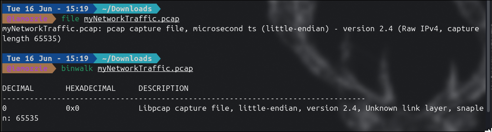
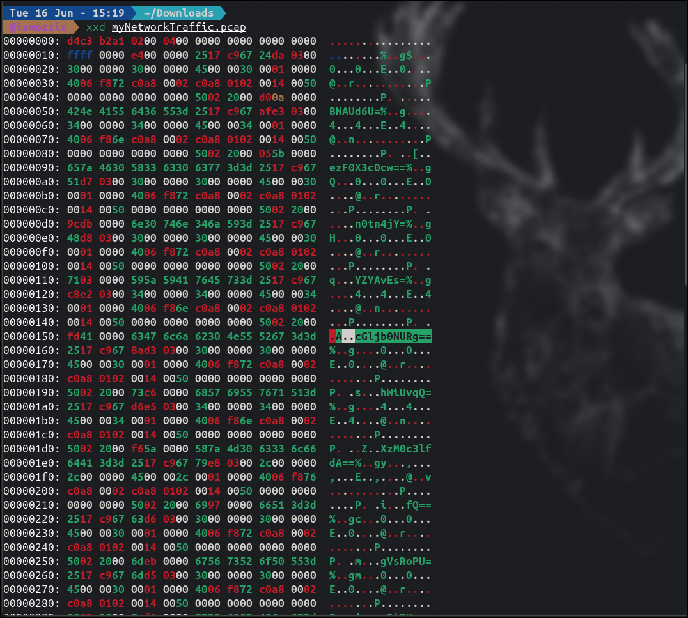
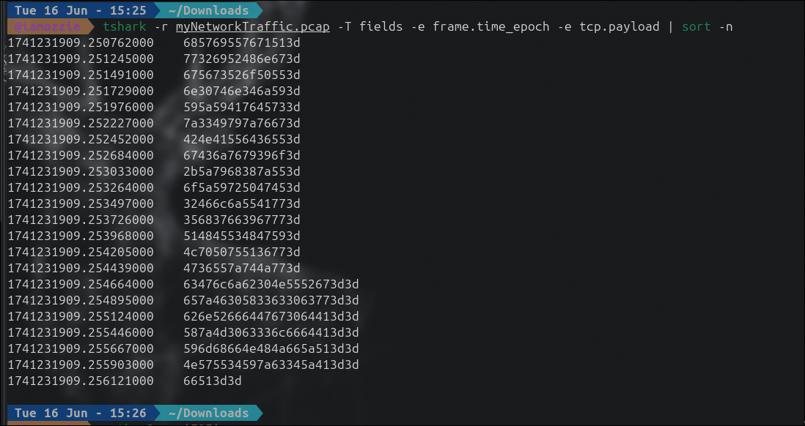
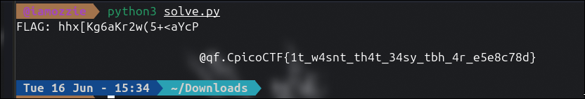

## Write-Up: Ph4nt0m 1ntrud3r (Easy)

### Analisis Masalah

Challenge ini memberikan sebuah berkas `myNetworkTraffic.pcap` berisi rekaman trafik jaringan yang mencurigakan. Deskripsi soal menyebutkan seorang penyerang telah menyusup dan mencuri data sensitif secara diam-diam. Tiga hint diberikan:

1. *Filter your packets to narrow down your search*
2. *Attacks were done in timely manner*
3. *Time is essential*

Hint kedua dan ketiga secara kuat mengindikasikan bahwa **urutan waktu (timestamp) paket adalah kunci** untuk merekonstruksi data yang dieksfiltrasi.

---

### Langkah Penyelesaian

#### 1. Identifikasi Tipe File

```bash
file myNetworkTraffic.pcap
binwalk myNetworkTraffic.pcap
```

****

`file` mengonfirmasi ini adalah **Raw IPv4 PCAP** (bukan Ethernet standar). `binwalk` hanya mendeteksi satu signature Libpcap, tidak ada embedded file.

---

#### 2. Inspeksi Raw Hex dengan xxd

```bash
xxd myNetworkTraffic.pcap
```

****

Dari kolom ASCII di sisi kanan `xxd`, terlihat pola string seperti `cGljb0NURg==`, `ezF0X3c0cw==`, dan `fQ==` yang merupakan indikasi kuat encoding **Base64**. String `cGljb0NURg==` langsung dikenali sebagai Base64 dari `picoCTF`.

---

#### 3. Ekstraksi Payload TCP Berdasarkan Timestamp

Mengingat hint *"Time is essential"*, payload harus diekstrak dan diurutkan berdasarkan **timestamp paket**, bukan urutan posisi byte dalam file.

```bash
tshark -r myNetworkTraffic.pcap -T fields -e frame.time_epoch -e tcp.payload | sort -n
```

****

Output menunjukkan 22 paket dengan payload hex, masing-masing dengan timestamp unik dalam rentang `1741231909.250762` hingga `1741231909.256121`.

---

#### 4. Decode Double-Layer: Hex → Base64 → Plaintext

Setiap payload menggunakan **dua lapis encoding**:
- Layer 1: Hex (format output tshark)
- Layer 2: Base64 (konten aktual payload)

```bash
python3 << 'EOF'
import base64

payloads_hex = [
    "685769557671513d",
    "77326952486e673d",
    "675673526f50553d",
    "6e30746e346a593d",
    "595a59417645733d",
    "7a3349797a76673d",
    "424e41556436553d",
    "67436a7679396f3d",
    "2b5a7968387a553d",
    "6f5a59725047453d",
    "32466c6a5541773d",
    "356837663967773d",
    "514845534847593d",
    "4c7050755136773d",
    "4736557a744a773d",
    "63476c6a62304e5552673d3d",
    "657a46305833633063773d3d",
    "626e52666447673064413d3d",
    "587a4d3063336c6664413d3d",
    "596d68664e484a665a513d3d",
    "4e575534597a63345a413d3d",
    "66513d3d",
]

result = ""
for hex_payload in payloads_hex:
    b64_string = bytes.fromhex(hex_payload).decode('ascii')
    try:
        decoded = base64.b64decode(b64_string).decode('utf-8', errors='ignore')
        result += decoded
    except:
        pass

print("FLAG:", result)
EOF
```

****

---

#### 5. Identifikasi Flag dari Output

Output menunjukkan adanya **decoy data** di paket-paket awal (menghasilkan karakter random), sedangkan flag asli tersusun dari paket-paket akhir secara berurutan:

| Timestamp | Base64 | Decoded |
|---|---|---|
| `...254664` | `cGljb0NURg==` | `picoCTF` |
| `...254895` | `ezF0X3c0cw==` | `{1t_w4s` |
| `...255124` | `bnRfdGg0dA==` | `nt_th4t` |
| `...255446` | `XzM0c3lfdA==` | `_34sy_t` |
| `...255667` | `YmhfNHJfZQ==` | `bh_4r_e` |
| `...255903` | `NWU4Yzc4ZA==` | `5e8c78d` |
| `...256121` | `fQ==` | `}` |

---

### Tools yang Digunakan

1. **file & binwalk** — Identifikasi tipe dan struktur file PCAP.
2. **xxd** — Inspeksi raw hex untuk mendeteksi pola Base64 secara visual.
3. **tshark** — Ekstraksi payload TCP beserta timestamp secara terurut.
4. **Python3 (base64)** — Decode double-layer encoding Hex → Base64 → Plaintext.

---

### Kesimpulan

Challenge "Ph4nt0m 1ntrud3r" merupakan tantangan forensik yang berfokus pada teknik **Data Exfiltration via Covert Channel** — flag dieksfiltrasi dengan cara memecahnya menjadi potongan kecil, meng-encode setiap potongan dengan Base64, lalu mengirimkannya sebagai payload TCP dalam paket-paket yang terpisah secara berurutan berdasarkan waktu.

Teknik yang perlu dikenali: ketika hint menekankan **waktu**, selalu ekstrak dan urutkan data berdasarkan **timestamp paket**, bukan posisi dalam file. Paket-paket awal berisi decoy data untuk mengecoh investigator, sementara flag asli tersembunyi di paket-paket akhir.

Flag: **`picoCTF{1t_w4snt_th4t_34sy_tbh_4r_e5e8c78d}`**