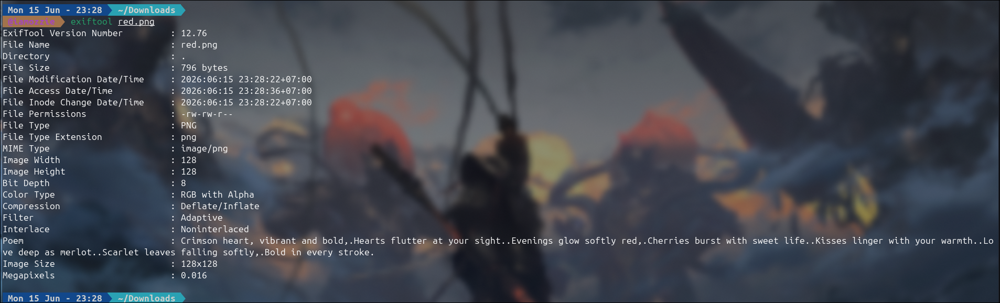
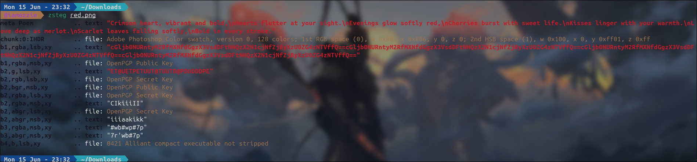
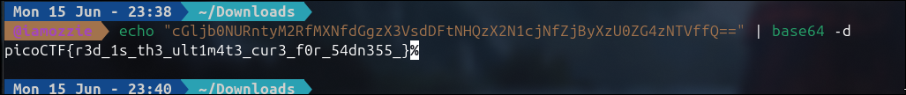

# Write-Up: RED (Easy)

## Analisis Masalah

Challenge ini memberikan sebuah *file* gambar bernama `red.png` dengan tiga buah *hint* yang sangat krusial:

1. *The picture seems pure, but is it though?*
2. *Red?Ged?Bed?Aed?*
3. *Check whatever Facebook is called now.*

Dari *Hint 3*, perubahan nama Facebook menjadi **Meta** merupakan petunjuk langsung untuk memeriksa bagian **Metadata** dari *file* gambar tersebut. Setelah melakukan pengecekan menggunakan `exiftool`, ditemukan sebuah *field* khusus bernama `Poem` yang berisi sebuah puisi 8 baris. Jika kita mengambil huruf pertama dari setiap baris puisi tersebut (teknik *Acrostic Poem*):

* **C**rimson heart...
* **H**earts flutter...
* **E**venings glow...
* **C**herries burst...
* **K**isses linger...
* **L**ove deep...
* **S**carlet leaves...
* **B**old in every stroke.

Gabungan huruf pertama tersebut membentuk instruksi: **`CHECK LSB`** (*Least Significant Bit*). Petunjuk ini diperkuat oleh *Hint 2* (*Red?Ged?Bed?Aed?*) yang merupakan plesetan dari *channel* warna **RGBA** (**R**ed, **G**reen, **B**lue, **A**lpha). Hal ini mengonfirmasi bahwa challenge ini menggunakan teknik steganografi LSB pada *channel* warna RGBA gambar PNG.

## Langkah Penyelesaian

### 1. Identifikasi File dan Pemeriksaan Metadata

Pertama-tama, saya memeriksa properti dasar gambar menggunakan `file` dan mengekstrak *metadata* menggunakan `exiftool` untuk menemukan puisi tersembunyi seperti yang diisyaratkan oleh petunjuk soal.

```bash
file red.png
exiftool red.png
```

****
*(Di sini saya mengambil screenshot tampilan terminal saat menjalankan perintah `exiftool red.png` yang menampilkan field `Poem` berisi bait puisi teks tersembunyi)*

### 2. Ekstraksi Data LSB Menggunakan Zsteg

Karena sudah dipastikan bahwa teknik yang digunakan adalah LSB pada file PNG, saya menggunakan *tool* **`zsteg`** untuk menyisir bit-bit tersembunyi pada *channel* RGBA secara otomatis.

```bash
zsteg red.png
```

****
*(Di sini saya mengambil screenshot tampilan terminal saat menjalankan perintah `zsteg red.png` yang menampilkan teks string Base64 berulang pada baris ketujuh berlabel `b1,rgba,lsb,xy`)*

Dari hasil pemindaian, `zsteg` berhasil menemukan sebuah *string* terkompresi berulang dalam format **Base64** pada mode `b1,rgba,lsb,xy`:
`cGljb0NURntyM2RfMXNfdGgzX3VsdDFtNHQzX2N1cjNfZjByXzU0ZG4zNTVffQ==...`

### 3. Mendekode Payload Base64 untuk Mendapatkan Flag

Langkah terakhir adalah mengambil satu bagian dari *string* Base64 tersebut dan mendekodenya menggunakan perintah `base64 -d` di terminal untuk mendapatkan teks flag yang asli.

```bash
echo "cGljb0NURntyM2RfMXNfdGgzX3VsdDFtNHQzX2N1cjNfZjByXzU0ZG4zNTVffQ==" | base64 -d
```

****
*(Di sini saya mengambil screenshot tampilan terminal saat menjalankan perintah `echo` yang di-pipe ke `base64 -d` untuk mendekode payload hingga memunculkan flag asli secara berulang)*

## Tools yang Digunakan

1. **file** - Untuk memverifikasi format asli dari berkas `red.png`.
2. **exiftool** - Untuk membaca informasi metadata (Meta/Facebook) dan menemukan petunjuk puisi *Acrostic*.
3. **zsteg** - Untuk mendeteksi dan mengekstrak data tersembunyi pada *Least Significant Bit* (LSB) dari *channel* RGBA.
4. **base64 (utility)** - Untuk mendekode data *payload* biner menjadi teks flag yang dapat dibaca.

## Kesimpulan

Challenge "RED" merupakan tantangan steganografi yang mengombinasikan analisis **Metadata** dan **LSB (Least Significant Bit) Extraction**. Pembuat soal memberikan teka-teki cerdas melalui nama "Meta" (Facebook) untuk mengarahkan pemain ke metadata, serta plesetan "RGBA" untuk menunjukkan lokasi bit yang dimanipulasi. Dengan memanfaatkan `zsteg`, *string* tersandi Base64 yang disembunyikan di dalam bit terendah warna gambar berhasil diekstrak dan dikonversi kembali.

Flag yang ditemukan dari tantangan ini adalah **`picoCTF{r3d_1s_th3_ult1m4t3_cur3_f0r_54dn355_}`**. Makna dari flag ini adalah *"red is the ultimate cure for sadness"*, sebuah kalimat berbasis lelucon yang berkaitan erat dengan judul serta visualisasi serba merah dari challenge ini.