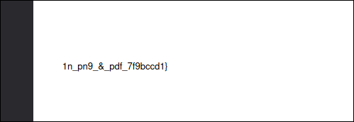
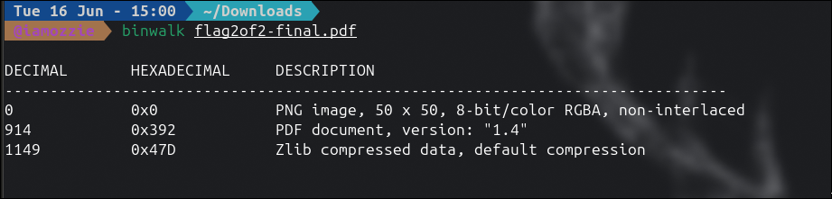
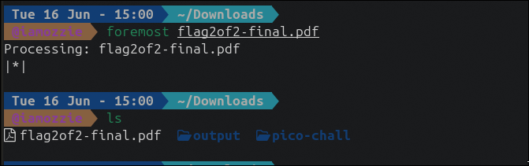
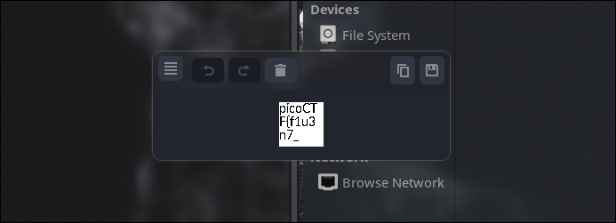

## Write-Up: Secret of the Polyglot (Easy)

### Analisis Masalah

Challenge ini memberikan sebuah berkas bernama `flag2of2-final.pdf`. Deskripsi soal menyebutkan bahwa NOC mendapatkan *"conflicting information on what type of file it is"*, yang merupakan petunjuk kuat bahwa berkas ini adalah **polyglot file** — sebuah berkas yang valid sekaligus sebagai dua format berbeda secara bersamaan. Satu hint diberikan:

1. *This problem can be solved by just opening the file in different ways*

Nama berkas `flag2of2-final.pdf` juga mengandung petunjuk implisit: kata *"2of2"* mengindikasikan bahwa ini adalah **bagian kedua dari dua bagian flag**, yang berarti ada bagian pertama yang tersembunyi di dalam berkas itu sendiri dengan format yang berbeda.

---

### Langkah Penyelesaian

#### 1. Buka sebagai PDF — Mendapatkan Bagian Kedua Flag

Langkah pertama yang paling natural adalah membuka berkas mengikuti ekstensinya sebagai PDF menggunakan PDF viewer.

****

Pada halaman PDF, terlihat teks yang merupakan **bagian kedua** dari flag:

```
1n_pn9_&_pdf_7f9bccd1}
```

Ini mengkonfirmasi nama berkas `flag2of2` — kita hanya mendapatkan separuh flag dari sini. Bagian pertama harus dicari di tempat lain.

---

#### 2. Analisis Struktur Internal dengan Binwalk — Menemukan Polyglot

Untuk menemukan bagian pertama flag, saya menggunakan `binwalk` guna memeriksa struktur internal berkas pada level byte.

```bash
binwalk flag2of2-final.pdf
```

Output:
```
DECIMAL       HEXADECIMAL     DESCRIPTION
--------------------------------------------------------------------------------
0             0x0             PNG image, 50 x 50, 8-bit/color RGBA, non-interlaced
914           0x392           PDF document, version: "1.4"
1149          0x47D           Zlib compressed data, default compression
```

****

Temuan ini sangat krusial. `binwalk` mendeteksi **dua signature format sekaligus** dalam satu berkas:

| Offset | Format | Keterangan |
|---|---|---|
| `0x0` | **PNG image** (50x50 px, RGBA) | Dimulai dari byte pertama |
| `0x392` | **PDF document** v1.4 | Tertanam setelah data PNG |

Inilah yang dimaksud *polyglot file* — berkas ini secara bersamaan merupakan PNG yang valid **dan** PDF yang valid, tergantung bagaimana program membacanya. PDF viewer membaca dari offset `0x392` ke bawah dan menampilkan konten PDF, sementara PNG reader membaca dari offset `0x0` dan mendapatkan gambar yang berbeda.

---

#### 3. Ekstraksi File Tersembunyi dengan Foremost

Untuk mengekstrak berkas PNG yang tertanam di dalam berkas tersebut, saya menggunakan `foremost` — tool forensik yang bekerja dengan cara mencari file signature dan mengekstrak berkas berdasarkan header dan footer yang dikenali.

```bash
foremost flag2of2-final.pdf
ls output/
```

****

`foremost` berhasil mengekstrak berkas PNG dari dalam berkas polyglot tersebut ke dalam folder `output/`.

---

#### 4. Buka PNG — Mendapatkan Bagian Pertama Flag

Saya kemudian membuka berkas PNG hasil ekstraksi menggunakan image viewer.

****

Gambar PNG berukuran 50x50 pixel tersebut menampilkan teks yang merupakan **bagian pertama** dari flag:

```
picoCTF{f1u3n7_
```

---

#### 5. Gabungkan Kedua Bagian Flag

Dengan menggabungkan bagian pertama dari PNG dan bagian kedua dari PDF, flag lengkap berhasil diperoleh:

| Sumber | Konten |
|---|---|
| PNG (tersembunyi) | `picoCTF{f1u3n7_` |
| PDF (terlihat) | `1n_pn9_&_pdf_7f9bccd1}` |
| **Flag Lengkap** | **`picoCTF{f1u3n7_1n_pn9_&_pdf_7f9bccd1}`** |

---

### Tools yang Digunakan

1. **PDF Viewer** — Untuk membuka berkas sebagai PDF dan mendapatkan bagian kedua flag.
2. **binwalk** — Untuk menganalisis struktur internal berkas dan mengidentifikasi keberadaan dua format sekaligus (polyglot).
3. **foremost** — Untuk mengekstrak berkas PNG yang tertanam di dalam berkas polyglot berdasarkan file signature.

---

### Kesimpulan

Challenge "Secret of the Polyglot" merupakan tantangan forensik yang berfokus pada konsep **Polyglot File** — sebuah berkas tunggal yang secara bersamaan valid sebagai lebih dari satu format file. Teknik ini dimungkinkan karena beberapa format file seperti PDF tidak mengharuskan data dimulai dari byte pertama, sehingga data format lain (dalam hal ini PNG) dapat ditempatkan di awal berkas tanpa merusak validitas PDF yang dimulai dari offset berikutnya.

Pola yang perlu dikenali dalam CTF: ketika sebuah berkas memberikan *"conflicting information"* mengenai tipe filenya, atau ketika nama berkas mengandung petunjuk seperti *"2of2"*, selalu periksa dengan `binwalk` untuk mendeteksi kemungkinan multiple signature dalam satu berkas. Tool `foremost` kemudian menjadi pilihan utama untuk mengekstrak komponen-komponen tersebut.

Flag yang berhasil didapatkan adalah **`picoCTF{f1u3n7_1n_pn9_&_pdf_7f9bccd1}`**, di mana `f1u3n7_1n_pn9_&_pdf` merupakan representasi *leetspeak* dari kata *"fluent in png & pdf"* — merujuk langsung pada sifat polyglot dari berkas yang dapat "berbicara" dalam dua format sekaligus.