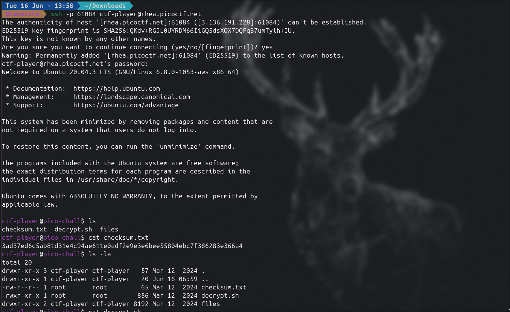
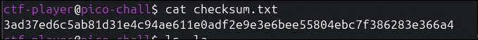
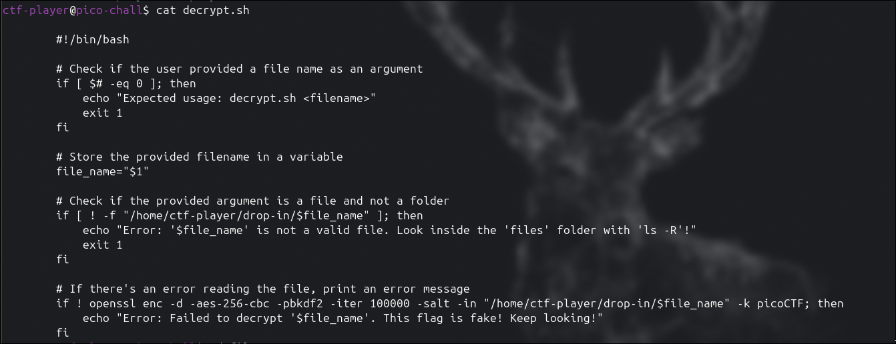
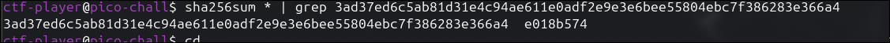
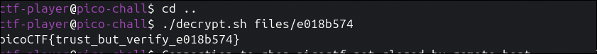

## Write-Up: Verify (Easy)

### Analisis Masalah

Challenge ini memberikan akses ke sebuah server melalui SSH. Deskripsi soal menyebutkan bahwa pembuat soal ingin memastikan pemain mendapatkan flag yang asli, bukan imitasi. Untuk itu, disediakan sebuah **SHA-256 checksum** dan sebuah **script dekripsi** sebagai alat bantu verifikasi.

Tiga hint yang diberikan mengarahkan kita pada konsep utama challenge ini:

1. *Checksums let you tell if a file is complete and from the original distributor.*
2. *You can create a SHA checksum of a file with `sha256sum <file>` or all files in a directory with `sha256sum <directory>/*`.*
3. *Remember you can pipe the output of one command to another with `|`.*

Hint-hint tersebut secara eksplisit mengarahkan kita untuk menggunakan `sha256sum` dikombinasikan dengan `grep` melalui operator pipe (`|`) guna menemukan satu file asli di antara ratusan file decoy.

---

### Langkah Penyelesaian

#### 1. Reconnect dan Eksplorasi Awal

Setelah login ke server via SSH, saya menjalankan `ls` dan `ls -la` untuk melihat isi direktori home.

```bash
ssh -p 61084 ctf-player@rhea.picoctf.net
ls -la
```

Ditemukan tiga item penting:

| Item | Keterangan |
|---|---|
| `checksum.txt` | Berisi SHA-256 hash dari file flag asli |
| `decrypt.sh` | Script bash untuk mendekripsi file |
| `files/` | Folder berisi ratusan file terenkripsi |

****

---

#### 2. Membaca Checksum dan Script Dekripsi

Saya membaca isi `checksum.txt` untuk mendapatkan hash target:

```bash
cat checksum.txt
```

Output:
```
3ad37ed6c5ab81d31e4c94ae611e0adf2e9e3e6bee55804ebc7f386283e366a4
```

****

Kemudian saya membaca isi `decrypt.sh` untuk memahami cara kerjanya:

```bash
cat decrypt.sh
```

****

Dari script tersebut, terlihat bahwa proses dekripsi menggunakan:
- Algoritma: **AES-256-CBC**
- Method key derivation: **PBKDF2** dengan 100.000 iterasi
- Password: **`picoCTF`** (hardcoded di dalam script)

Script ini hanya mendekripsi — ia **tidak** memverifikasi hash. Tugas kita adalah menemukan file yang benar terlebih dahulu sebelum mendekripsinya.

---

#### 3. Menemukan File Asli dengan SHA-256

Folder `files/` berisi ratusan file dengan nama acak. Mencarinya satu per satu secara manual tidak mungkin dilakukan. Solusinya adalah menghitung hash semua file sekaligus, lalu memfilter hasilnya menggunakan `grep`.

```bash
cd files
sha256sum * | grep 3ad37ed6c5ab81d31e4c94ae611e0adf2e9e3e6bee55804ebc7f386283e366a4
```

Output:
```
3ad37ed6c5ab81d31e4c94ae611e0adf2e9e3e6bee55804ebc7f386283e366a4  e018b574
```

****

File asli berhasil diidentifikasi: **`e018b574`**

> **Catatan:** Perhatikan bahwa command dijalankan dari **dalam** folder `files/`, sehingga menggunakan `*` bukan `files/*`. Penggunaan `files/*` dari dalam direktori tersebut akan menghasilkan error `No such file or directory` karena shell mencari subfolder `files/` di dalam `files/`.

---

#### 4. Mendekripsi File untuk Mendapatkan Flag

Kembali ke direktori parent, lalu jalankan script dekripsi pada file yang telah diverifikasi:

```bash
cd ..
./decrypt.sh files/e018b574
```

Output:
```
picoCTF{trust_but_verify_e018b574}
```

****

---

### Tools yang Digunakan

1. **ssh** — Untuk mengakses server challenge secara remote.
2. **sha256sum** — Untuk menghitung hash SHA-256 dari seluruh file secara sekaligus.
3. **grep** — Untuk memfilter output `sha256sum` dan menemukan file dengan hash yang cocok.
4. **openssl** (via `decrypt.sh`) — Untuk mendekripsi file menggunakan AES-256-CBC.

---

### Kesimpulan

Challenge "Verify" merupakan tantangan forensik mendasar yang berfokus pada konsep **File Integrity Verification**. Challenge ini memperlihatkan bagaimana SHA-256 checksum digunakan untuk membuktikan keaslian sebuah file di antara ratusan file palsu (decoy). Tanpa verifikasi hash, seseorang bisa saja mendekripsi file yang salah dan mendapat flag palsu.

Teknik `sha256sum * | grep <hash>` adalah pola yang sangat umum digunakan dalam digital forensics dan distribusi software untuk memvalidasi integritas file secara efisien.

Flag yang berhasil didapatkan adalah **`picoCTF{trust_but_verify_e018b574}`**, di mana bagian `trust_but_verify` merupakan referensi ke prinsip keamanan siber klasik yang menekankan pentingnya verifikasi meskipun sumber sudah dipercaya.