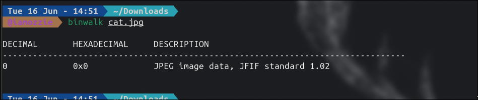
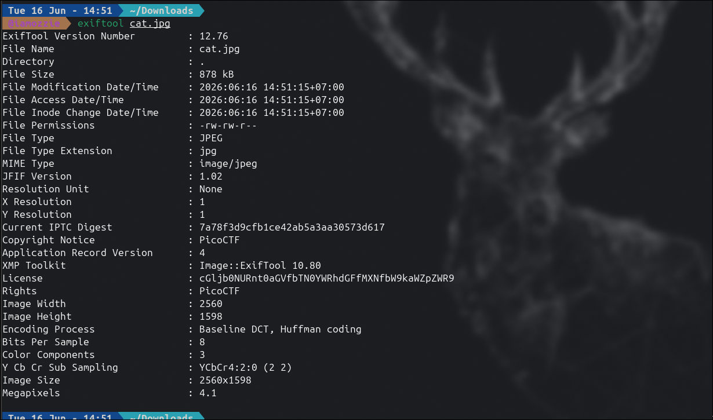
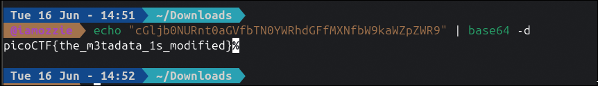

## Write-Up: Information (Easy)

### Analisis Masalah

Challenge ini memberikan sebuah berkas gambar bernama `cat.jpg`. Deskripsi soal menyebutkan *"Files can always be changed in a secret way"*, yang mengindikasikan adanya modifikasi tersembunyi pada berkas tersebut. Dua hint diberikan:

1. *Look at the details of the file*
2. *Make sure to submit the flag as picoCTF{XXXXX}*

Hint pertama secara langsung mengarahkan kita untuk memeriksa **detail** atau **properti** dari berkas gambar, bukan konten visualnya. Kata *"details"* dalam konteks forensik berkas gambar merujuk pada **metadata** yang melekat pada berkas tersebut.

---

### Langkah Penyelesaian

#### 1. Unduh dan Analisis Struktur Internal dengan Binwalk

Langkah pertama adalah mengunduh berkas `cat.jpg` dari URL yang diberikan, kemudian memeriksa struktur internalnya menggunakan `binwalk` untuk mendeteksi apakah ada berkas lain yang tertanam di dalamnya.

```bash
binwalk cat.jpg
```

Output `binwalk`:
```
DECIMAL       HEXADECIMAL     DESCRIPTION
--------------------------------------------------------------------------------
0             0x0             JPEG image data, JFIF standard 1.02
```

****

`binwalk` hanya mendeteksi satu signature tunggal berupa data JPEG standar. Tidak ada embedded file, arsip tersembunyi, atau data mencurigakan lainnya yang ditemukan. Investigasi dilanjutkan ke analisis metadata.

---

#### 2. Pemeriksaan Metadata dengan ExifTool

Merujuk pada hint *"Look at the details of the file"*, saya menggunakan `exiftool` untuk membaca seluruh informasi metadata yang melekat pada `cat.jpg`.

```bash
exiftool cat.jpg
```

****

Dari seluruh field metadata yang ditampilkan, ditemukan sebuah kejanggalan pada field **`License`**:

```
License : cGljb0NURnt0aGVfbTN0YWRhdGFfMXNfbW9kaWZpZWR9
```

String tersebut jelas bukan nilai lisensi yang normal. Pola karakter alfanumerik yang diakhiri dengan `=` atau tanpa padding namun memiliki rasio karakter yang konsisten merupakan indikasi kuat representasi data tersandi **Base64**. Selain itu, field **`Copyright Notice`** dan **`Rights`** keduanya bernilai `PicoCTF`, yang semakin memperkuat indikasi bahwa metadata berkas ini telah dimodifikasi secara sengaja.

---

#### 3. Dekode Base64 untuk Mendapatkan Flag

Langkah terakhir adalah mengambil string Base64 dari field `License` tersebut, kemudian mendekodenya ke dalam format teks biasa menggunakan utilitas `base64 -d` di terminal.

```bash
echo "cGljb0NURnt0aGVfbTN0YWRhdGFfMXNfbW9kaWZpZWR9" | base64 -d
```

Output:
```
picoCTF{the_m3tadata_1s_modified}
```

****

Flag berhasil diekstrak dari metadata berkas gambar.

---

### Tools yang Digunakan

1. **binwalk** — Untuk melakukan analisis signature-based terhadap struktur internal berkas dan memastikan tidak ada embedded file.
2. **exiftool** — Untuk melakukan analisis metadata secara menyeluruh pada berkas JPEG hingga menemukan kejanggalan data pada field `License`.
3. **base64** — Untuk mendekode string Base64 yang ditemukan di dalam metadata menjadi teks flag asli.

---

### Kesimpulan

Challenge "Information" merupakan tantangan forensik mendasar yang berfokus pada teknik **Metadata Manipulation**, yaitu metode menyembunyikan informasi sensitif di dalam properti metadata sebuah berkas tanpa mengubah tampilan visual berkas tersebut sama sekali.

Teknik ini bekerja karena metadata seperti field EXIF, IPTC, dan XMP pada berkas gambar dapat diisi dengan nilai apapun secara bebas menggunakan tool seperti `exiftool`, sementara sebagian besar pengguna hanya memperhatikan konten visual gambar dan mengabaikan properti-propertinya.

Pola yang perlu dikenali dalam CTF: ketika sebuah field metadata berisi string acak yang tidak sesuai dengan peruntukan normalnya, terutama jika diakhiri dengan karakter `==` atau memiliki karakter set `[A-Za-z0-9+/]`, maka string tersebut hampir pasti merupakan encoding **Base64** yang perlu didekode.

Flag yang berhasil didapatkan adalah **`picoCTF{the_m3tadata_1s_modified}`**, di mana `the_m3tadata_1s_modified` secara tepat merepresentasikan teknik yang digunakan, yaitu metadata yang telah dimodifikasi secara sengaja untuk menyembunyikan flag.
