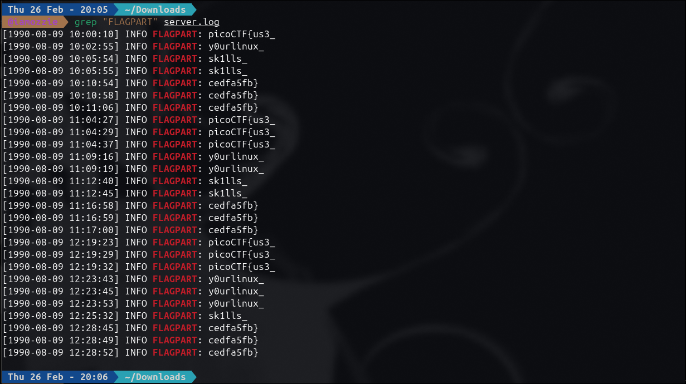

# Write-Up: Log Hunt (Easy)

## Analisis Masalah

Pada tantangan ini, kita diberikan sebuah *file* bernama `server.log` yang berisi ribuan baris catatan aktivitas server (*log server*). Berdasarkan deskripsi soal, server tersebut tanpa sengaja membocorkan potongan-potongan *secret flag* di dalam *log*-nya. Potongan-potongan tersebut tersebar dan berulang. Tugas kita adalah menemukan semua pecahan tersebut dan merekonstruksinya menjadi *flag* yang utuh.

Mencari *flag* secara manual dengan membaca ribuan baris teks tentu tidak efisien. Oleh karena itu, pendekatan terbaik adalah menggunakan utilitas *Command Line Interface* (CLI) pada Linux untuk memfilter baris yang relevan.

## Langkah Penyelesaian

### 1. Memfilter File Log

Alih-alih membuka *file* menggunakan *text editor*, saya langsung mengeksekusi perintah `grep` di terminal untuk mencari kata kunci spesifik. Karena pola *flag* biasanya diawali dengan suatu indikator, saya mencari kata "FLAG".

```bash
grep "FLAGPART" server.log

```
****
*(Di sini saya menyertakan screenshot terminal yang menampilkan output dari perintah grep, di mana terlihat jelas potongan-potongan flag beserta stempel waktunya)*

### 2. Merekonstruksi Flag

Dari *output* yang dihasilkan, terlihat bahwa server mencetak bagian-bagian *flag* secara berulang pada stempel waktu yang berbeda. Jika kita mengambil urutan kemunculan pertama kali berdasarkan stempel waktu paling awal (sekitar jam `10:00:10` hingga `10:10:54`), kita mendapatkan urutan pecahan berikut:

1. `picoCTF{us3_`
2. `y0urlinux_`
3. `sk1lls_`
4. `cedfa5fb}`

Saya kemudian menggabungkan keempat potongan *string* tersebut menjadi satu kesatuan yang memiliki makna yang jelas.

## Tools yang Digunakan

1. **Linux Terminal** - Sebagai lingkungan eksekusi perintah utama.
2. **grep** - Utilitas pencarian teks (*command-line utility*) bawaan Unix/Linux untuk menyaring baris yang mengandung *string* spesifik ("FLAGPART").

## Kesimpulan

Tantangan "Log Hunt" mendemonstrasikan pentingnya penguasaan dasar-dasar *Command Line Interface* (CLI) di Linux, khususnya dalam skenario *Log Analysis* atau *Forensics* sederhana. Mencari informasi spesifik (*needle in a haystack*) di dalam *file* teks berukuran besar dapat diselesaikan hanya dalam hitungan milidetik menggunakan perintah `grep` dibandingkan pencarian manual.

Flag yang berhasil direkonstruksi adalah: **`picoCTF{us3_y0urlinux_sk1lls_cedfa5fb}`**. Pesan pada *flag* ini selaras dengan metode penyelesaiannya, yaitu imbauan untuk menggunakan *skill* Linux yang kita miliki.

---