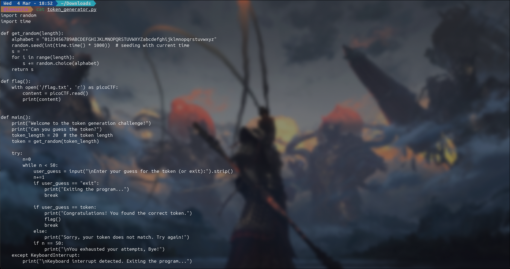
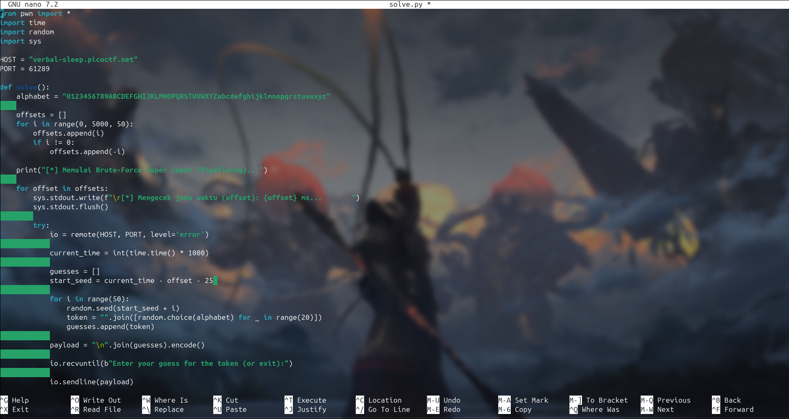
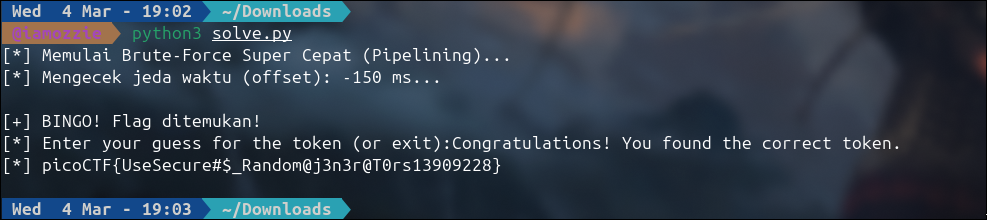

# Write-Up: Chronohack (Medium)

## Analisis Masalah

Tantangan ini memberikan sebuah file *source code* Python bernama `token_generator.py` dan akses ke server melalui `nc verbal-sleep.picoctf.net 61289`. Program ini meminta kita untuk menebak *token* sepanjang 20 karakter. Jika ditelusuri, sistem autentikasi ini menggunakan *Pseudo-Random Number Generator* (PRNG) dengan *seed* berbasis waktu saat ini. Tugas kita adalah memprediksi *token* tersebut dengan menyinkronkan waktu lokal kita dengan waktu *server*.

## Langkah Penyelesaian

### 1. Inspeksi Awal & Analisis Source Code

Langkah pertama adalah membaca dan memahami alur logika di dalam file `token_generator.py`.

```bash
cat token_generator.py
```

****

Output ini menampilkan *source code* program. Terlihat jelas celah keamanan pada fungsi `get_random()`, di mana program menggunakan `random.seed(int(time.time() * 1000))`. Karena bergantung pada waktu, *token* yang dihasilkan tidak sepenuhnya acak dan bisa diprediksi.

### 2. Identifikasi Celah Logika (Vulnerability)

Modul `random` bawaan Python sangat rentan jika *seed*-nya diketahui. Karena *seed* menggunakan waktu sistem saat ini (dalam milidetik), kita bisa menebak *token* dengan mencatat waktu di komputer kita persis saat terhubung ke *server*. Program juga memberikan kesempatan 50 kali tebakan, yang bisa kita manfaatkan untuk melakukan *brute-force* guna mencari jeda waktu jaringan (*latency*) antara komputer kita dan *server*.

### 3. Pembuatan Script Exploit

Untuk mempercepat eksploitasi dan mengakali *latency*, saya membuat *script solver* menggunakan Python. *Script* ini menggunakan teknik *pipelining*, yaitu mengirim 50 tebakan sekaligus dalam satu waktu.

```bash
nano solve.py
```

****

Berikut adalah *script* eksploitasinya:

```python
from pwn import *
import time
import random
import sys

# Ganti dengan host dan port yang sesuai
HOST = "verbal-sleep.picoctf.net"
PORT = 61289

def solve():
    alphabet = "0123456789ABCDEFGHIJKLMNOPQRSTUVWXYZabcdefghijklmnopqrstuvwxyz"
    
    # Bikin daftar offset yang melebar: 0, 50, -50, 100, -100, 150, -150...
    # Ini untuk mengatasi kalau jam komputer kamu dan server beda beberapa detik
    offsets = []
    for i in range(0, 5000, 50):
        offsets.append(i)
        if i != 0:
            offsets.append(-i)

    print("[*] Memulai Brute-Force Super Cepat (Pipelining)...")
    
    for offset in offsets:
        # Update tampilan di terminal agar tidak spam log
        sys.stdout.write(f"\r[*] Mengecek jeda waktu (offset): {offset} ms...       ")
        sys.stdout.flush()
        
        try:
            io = remote(HOST, PORT, level='error')
            
            # Waktu saat connect
            current_time = int(time.time() * 1000)
            
            # Kita buat 50 tebakan sekaligus
            guesses = []
            start_seed = current_time - offset - 25 
            
            for i in range(50):
                random.seed(start_seed + i)
                token = "".join([random.choice(alphabet) for _ in range(20)])
                guesses.append(token)
            
            # Gabungkan 50 tebakan pakai enter (\n)
            payload = "\n".join(guesses).encode()
            
            # Tunggu prompt pertama
            io.recvuntil(b"Enter your guess for the token (or exit):")
            
            # KIRIM SEMUA SEKALIGUS! (Ini yang bikin cepat)
            io.sendline(payload)
            
            # Karena 50 tebakan sudah dikirim, server akan memproses dan langsung menutup koneksi.
            # Kita tinggal baca semua balasannya.
            response = io.recvall(timeout=3).decode('utf-8', errors='ignore')
            
            if "Congratulations" in response:
                print("\n\n[+] BINGO! Flag ditemukan!")
                # Filter output untuk mencari flagnya
                for line in response.split('\n'):
                    if "picoCTF{" in line or "Congratulations" in line or "flag{" in line:
                        print(f"[*] {line}")
                break
            
            io.close()
            
        except Exception as e:
            # Kalau ada error jaringan/timeout, abaikan dan lanjut
            io.close()
            continue

if __name__ == "__main__":
    solve()
```

 *Script* di atas akan mengkalkulasi kemungkinan *token* dari rentang waktu yang disesuaikan (*offset*), lalu menembakkan 50 tebakan sekaligus ke *server netcat* target untuk mempercepat proses *brute-force*.

### 4. Eksekusi dan Pengambilan Flag

Setelah *script solver* disimpan, langkah terakhir adalah mengeksekusinya di terminal untuk mengambil *flag*.

```bash
python3 solve.py
```

****
 *Script* berjalan dengan sangat cepat dan berhasil menemukan kecocokan *seed* pada *offset* `-150 ms`. *Server* langsung merespons dengan pesan `"Congratulations! You found the correct token."` dan mengembalikan *flag*-nya.

---

## Tools yang Digunakan

1. **Python 3 & Pwntools** - Digunakan untuk membuat *script exploit* (replikasi PRNG Python dan otomatisasi koneksi *socket*).
2. **Cat & Nano (CLI Tools)** - Digunakan untuk membaca *source code* dan menulis *script solver* di terminal.

## Kesimpulan

Tantangan "Chronohack" membuktikan bahaya dari *Insecure Randomness*. Menggunakan fungsi `random` berbasis waktu sistem untuk menghasilkan *token* keamanan memungkinkan penyerang untuk memprediksi nilainya dengan mudah. Penyerang hanya perlu menyinkronkan waktu komputernya dengan *server* dan menggunakan teknik *pipelining* untuk melakukan *brute-force* secara instan.

Flag yang ditemukan adalah: **`picoCTF{UseSecure#$_Random@j3n3r@T0rs13909228}`**.