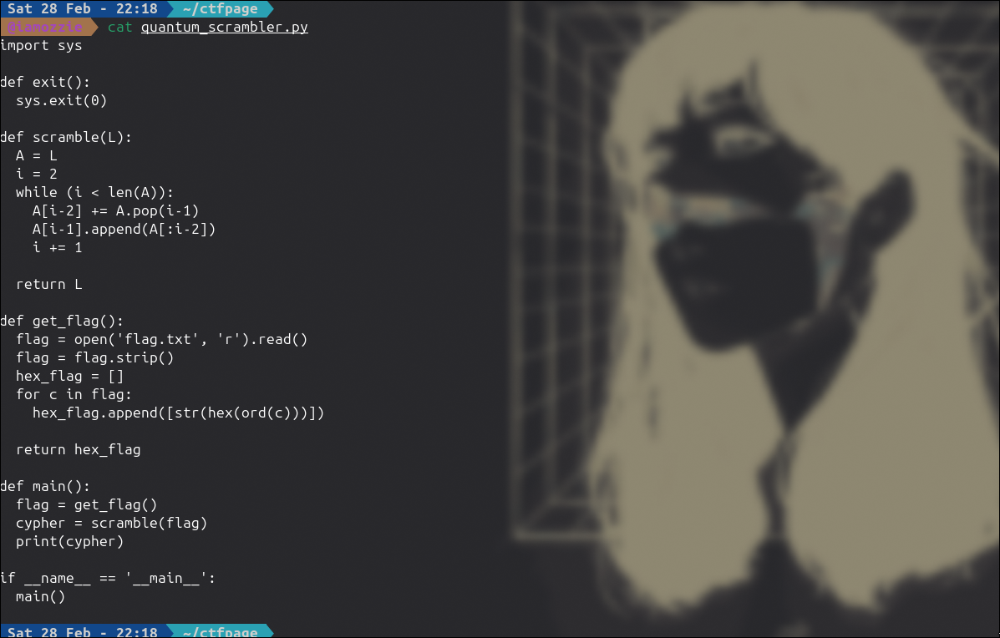
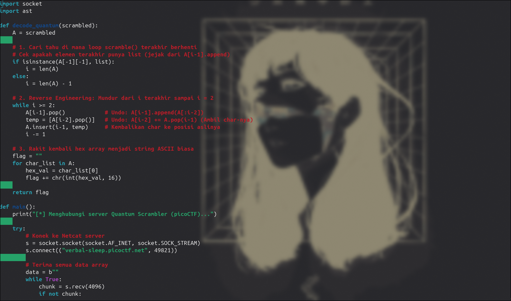
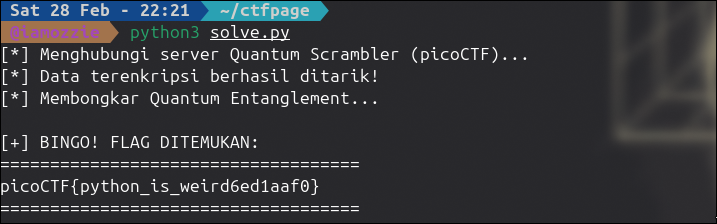

# Write-Up: Quantum Scrambler (Medium)

## Analisis Masalah

Tantangan ini memberikan sebuah file *source code* Python bernama `quantum_scrambler.py` beserta alamat server yang dapat diakses melalui utilitas `netcat` (`nc verbal-sleep.picoctf.net 49821`). Berdasarkan deskripsi dan isi kode, program ini mengklaim menggunakan algoritma enkripsi *custom* berbasis "quantum entanglement" pada fungsi `scramble(L)` untuk mengacak susunan teks *flag*. Tugas kita adalah menganalisis logika pengacakan tersebut, menangkap *output* dari server, dan membuat *dekoder* untuk membalikkan (*reverse*) prosesnya agar *flag* asli dapat terbaca.

## Langkah Penyelesaian

### 1. Inspeksi Awal & Analisis Source Code

Langkah pertama adalah membaca alur logika pada file `quantum_scrambler.py`. Program mengambil *flag* dari file lokal (`flag.txt`), mengubah setiap karakternya menjadi representasi bilangan heksadesimal dalam bentuk *list*, dan memasukkannya ke fungsi `scramble`.

```bash
cat quantum_scrambler.py

```

---
****
Saya memfokuskan analisis pada fungsi inti yang melakukan pengacakan:
```python
def scramble(L):
  A = L
  i = 2
  while (i < len(A)):
    A[i-2] += A.pop(i-1)
    A[i-1].append(A[:i-2])
    i += 1
  return L

```

### 2. Identifikasi Celah Logika (Vulnerability)

Dari fungsi `scramble` di atas, terlihat bahwa algoritma ini **sepenuhnya deterministik** dan **tidak bersifat destruktif** (tidak ada data yang dihapus secara permanen atau di-*hash*). Operasi yang dilakukan di dalam *loop* hanyalah:

1. Memotong elemen array (`pop`).
2. Menggabungkan elemen (`+=`).
3. Menyisipkan rekaman/bayangan elemen masa lalu (`append(A[:i-2])`).

Karena Python menangani *list* dengan referensi memori (yang seringkali berperilaku aneh atau *weird* jika digabungkan), susunannya menjadi terlihat sangat rumit. Namun, karena tidak ada data yang hilang, enkripsi ini bisa dibongkar dengan cara mengeksekusi kebalikan dari instruksi tersebut secara mundur (dari akhir *loop* kembali ke iterasi awal).

Tantangan utamanya hanya menentukan di mana iterasi `i` terakhir berhenti, yang dapat diselesaikan dengan mengecek apakah elemen array paling ujung memiliki sisipan *list* di dalamnya.

### 3. Pembuatan Script Unpacking (Reverse Engineering)

Alih-alih menyelesaikannya secara manual, saya menyusun sebuah *script solver* menggunakan Python. *Script* ini akan terhubung langsung ke server Netcat, menangkap *output array* yang teracak, lalu melakukan dekonstruksi langkah demi langkah secara mundur (*reverse loop*).

```bash
nano solve.py

```
****
---

*Script* inti untuk proses dekonstruksi (*decode*):

```python
import socket
import ast

def decode_quantum(scrambled):
    A = scrambled
    
    # 1. Cari tahu di mana loop scramble() terakhir berhenti
    # Cek apakah elemen terakhir punya list (jejak dari A[i-1].append)
    if isinstance(A[-1][-1], list):
        i = len(A)
    else:
        i = len(A) - 1

    # 2. Reverse Engineering: Mundur dari i terakhir sampai i = 2
    while i >= 2:
        A[i-1].pop()            # Undo: A[i-1].append(A[:i-2])
        temp = [A[i-2].pop()]   # Undo: A[i-2] += A.pop(i-1) (Ambil char-nya)
        A.insert(i-1, temp)     # Kembalikan char ke posisi aslinya
        i -= 1

    # 3. Rakit kembali hex array menjadi string ASCII biasa
    flag = ""
    for char_list in A:
        hex_val = char_list[0]
        flag += chr(int(hex_val, 16))
    
    return flag

def main():
    print("[*] Menghubungi server Quantum Scrambler (picoCTF)...")
    
    try:
        # Konek ke Netcat server
        s = socket.socket(socket.AF_INET, socket.SOCK_STREAM)
        s.connect(("verbal-sleep.picoctf.net", 49821))
        
        # Terima semua data array
        data = b""
        while True:
            chunk = s.recv(4096)
            if not chunk:
                break
            data += chunk
        s.close()
        
        raw_output = data.decode('utf-8').strip()
        print("[*] Data terenkripsi berhasil ditarik!")
        
        # Ubah string netcat kembali menjadi tipe data List Python
        scrambled_list = ast.literal_eval(raw_output)
        
        print("[*] Membongkar Quantum Entanglement...")
        flag = decode_quantum(scrambled_list)
        
        print("\n[+] BINGO! FLAG DITEMUKAN:")
        print("====================================")
        print(flag)
        print("====================================\n")
        
    except Exception as e:
        print("[-] Gagal mengeksekusi:", e)

if __name__ == '__main__':
    main()

```

### 4. Eksekusi dan Pengambilan Flag

Setelah *script solver* siap, saya mengeksekusinya di terminal. *Script* secara otomatis berinteraksi dengan server dan membalikkan array kuantum tersebut menjadi *string* yang dapat dibaca.

```bash
python3 solve.py


```

*Output:*
****

## Tools yang Digunakan

1. **Python 3** - Digunakan untuk menganalisis algoritma *source code*, membangun fungsi dekripsi kebalikan, serta membuat otomatisasi koneksi *socket* ke server Netcat.
2. **Netcat (nc)** - Protokol jaringan yang digunakan oleh server tantangan untuk mengirimkan data array terenkripsi ke *client*.

## Kesimpulan

Tantangan "Quantum Scrambler" memanfaatkan keunikan manipulasi *list* (*pop* dan *append* referensi) pada Python untuk menciptakan susunan array bersarang yang tampak kacau dan acak layaknya *entanglement*. Namun, karena ketiadaan proses perusakan data (*one-way destruction*) dan sifat modifikasi iteratifnya yang terprediksi, manipulasi ini dapat dipetakan dan dikembalikan ke wujud aslinya (*reversed*) menggunakan perulangan mundur.

Flag yang ditemukan adalah: **`picoCTF{python_is_weird6ed1aaf0}`**. Pesan *flag* tersebut memvalidasi bahwa keanehan penanganan memori referensi *list* di Python adalah inti dari tantangan ini.

---