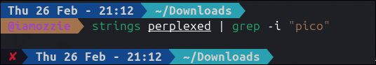
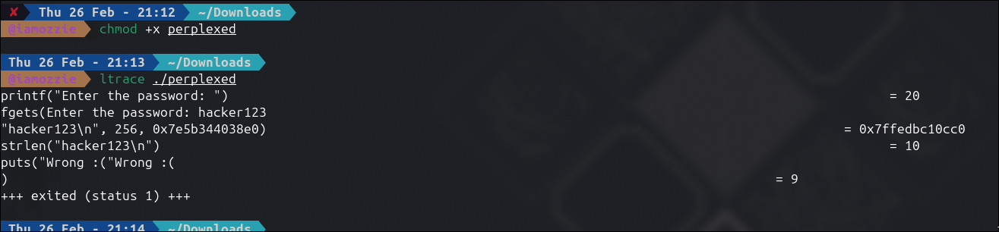
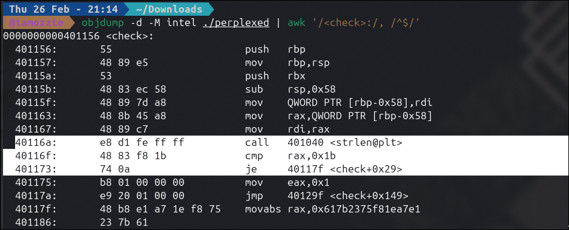
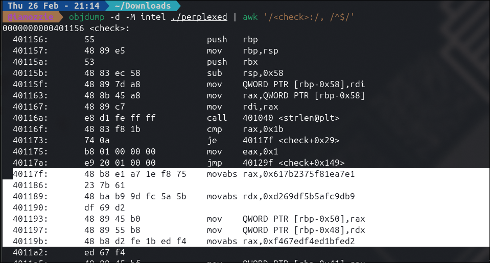
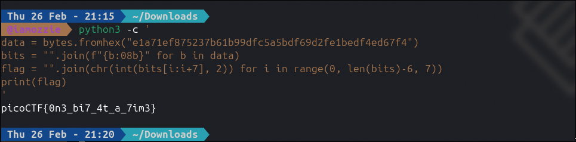

# Write-Up: perplexed (Medium)

## Analisis Masalah

Tantangan ini memberikan sebuah file *binary* Linux (ELF 64-bit) bernama `perplexed`. Berdasarkan instruksi saat dijalankan, program akan meminta pengguna memasukkan *password*. Jika salah, program mencetak `Wrong :(`, dan jika benar akan mencetak `Correct!! :D`. Tugas kita adalah menemukan *password* yang valid (yang merupakan *flag* itu sendiri) dengan membedah alur logika program tersebut.

## Langkah Penyelesaian

### 1. Inspeksi Awal & Analisis Statis

Langkah pertama yang selalu dilakukan adalah melihat isi file secara kasar. Saat melakukan `cat perplexed`, terlihat beberapa string yang dapat dibaca seperti pesan konfirmasi dan nama fungsi `main` serta `check`.

Saya mencoba mencari *flag* secara langsung menggunakan utilitas `strings`:

```bash
strings perplexed | grep -i "pico"

```
****

*Output: (Kosong)*
Hasilnya nihil. Ini membuktikan bahwa *flag* tidak disimpan sebagai teks biasa (*plaintext*) di dalam *binary*, melainkan telah dienkripsi atau dimodifikasi.

### 2. Analisis Dinamis dengan ltrace

Karena pencarian statis gagal, saya mencoba menjalankan program sambil "menyadap" pemanggilan fungsi *library* bawaan C menggunakan `ltrace`. Saya memberikan *input* asal yaitu `hacker123`:

```bash
chmod +x perplexed
ltrace ./perplexed

```

*Output:*
****
Dari *output* ini, ditemukan kejanggalan: program mengecek panjang *input* dengan `strlen`, namun **tidak memanggil fungsi perbandingan *string* standar seperti `strcmp**`. Program langsung menyatakan *input* salah (`Wrong :(`). Hal ini mengindikasikan bahwa proses validasi *password* dilakukan sepenuhnya di dalam fungsi *custom* (fungsi `check`) secara karakter-per-karakter atau bit-per-bit.

### 3. Disassembly (Membedah Logika Assembly)

Untuk melihat apa yang sebenarnya terjadi, saya membongkar instruksi fungsi `check` menggunakan `objdump`:

```bash
objdump -d -M intel ./perplexed | awk '/<check>:/, /^$/'

```

Dari ratusan baris instruksi *assembly* yang muncul, saya memfokuskan pada tiga temuan utama:

**A. Pengecekan Panjang Flag:**

****

Program membandingkan hasil `strlen` dengan `0x1b` (27 dalam desimal). Artinya, panjang *flag* harus tepat 27 karakter.

**B. Target Memori Rahasia:**

```nasm
  40117f:    movabs rax,0x617b2375f81ea7e1
  401189:    movabs rdx,0xd269df5b5afc9db9
  40119b:    movabs rax,0xf467edf4ed1bfed2

```
****

Program memuat 23 *byte* data rahasia ke dalam *stack*. Karena menggunakan arsitektur *Little-Endian*, urutan *byte*-nya menjadi: `e1 a7 1e f8 75 23 7b 61 b9 9d fc 5a 5b df 69 d2 fe 1b ed f4 ed 67 f4`.

**C. Logika Bitwise (Pemampatan Bit):**
Pada blok *looping* (sekitar alamat `4011d6` hingga `401249`), terdapat instruksi pemrosesan bit seperti `shl` (Shift Left), `and`, `setg`, dan `xor`.
Logika ini ternyata mengambil karakter ASCII *input* pengguna yang aslinya hanya memakai 7-bit informasi, lalu memampatkannya (*packing*) dengan membuang bit ke-8 yang selalu nol. Hasil *packing* dari 27 karakter (27 x 7 bit = 189 bit) inilah yang kemudian dibandingkan dengan 23 *byte* data rahasia di atas (23 x 8 bit = 184 bit, ditambah sisa padding).

### 4. Ekstraksi dan Unpacking (Python)

Alih-alih merekayasa balik (*reverse*) program utuhnya, kita hanya perlu membalik logika pemampatan bit tersebut. Menggunakan 23 *byte* data rahasia yang ditemukan, saya menggunakan *script* Python sederhana di terminal untuk mengurai (*unpack*) blok 8-bit kembali menjadi karakter 7-bit ASCII yang utuh:

```bash
python3 -c '
data = bytes.fromhex("e1a71ef875237b61b99dfc5a5bdf69d2fe1bedf4ed67f4")
bits = "".join(f"{b:08b}" for b in data)
flag = "".join(chr(int(bits[i:i+7], 2)) for i in range(0, len(bits)-6, 7))
print(flag)
'

```

*Output:*

****

## Tools yang Digunakan

1. **strings** - Untuk pengecekan awal *plaintext* (gagal/terlindungi).
2. **ltrace** - Untuk analisis dinamis dan identifikasi ketiadaan pemanggilan fungsi library perbandingan string seperti `strcmp`.
3. **objdump** - Untuk melakukan *disassembly* file *binary* ke dalam bahasa *Assembly* (Intel syntax) agar bisa membaca logika perbandingan internal program.
4. **Python 3** - Untuk mengeksekusi operasi dekripsi (*bitwise unpacking*) data hex menjadi ASCII.

## Kesimpulan

Tantangan "perplexed" mengandalkan teknik pemampatan bit (*bit packing*) pada *string* ASCII untuk menyembunyikan *flag* dari deteksi analisis statis dan dinamis tingkat dasar. Dengan membedah instruksi *assembly* (khususnya nilai konstan `movabs` dan operasi *bitwise loop*), kita dapat mengekstrak kumpulan *byte* target dan membalikkan proses pemampatannya untuk mendapatkan string aslinya.

Flag yang ditemukan adalah: **`picoCTF{0n3_bi7_4t_a_7im3}`**. Pesan pada *flag* selaras dengan algoritma *bit-by-bit* yang digunakan pada fungsi validasi program.

---