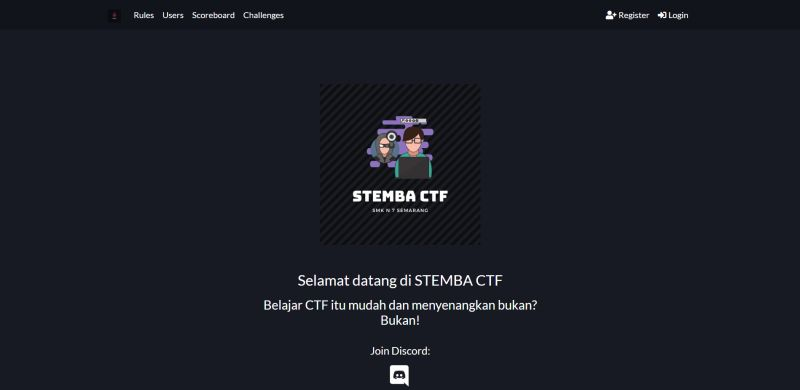

#  STEMBA CTF

#

STEMBA CTF adalah platform Capture The Flag (CTF) yang dikembangkan dan dikelola oleh siswa <strong>SMK Negeri 7 Semarang</strong> sebagai media pembelajaran dan pengembangan kompetensi di bidang Cyber Security. Platform ini dirancang untuk memberikan pengalaman praktik secara langsung dalam memahami keamanan sistem, aplikasi, dan jaringan melalui berbagai tantangan teknis yang terstruktur dan menantang.

Melalui STEMBA CTF, peserta mempelajari keamanan informasi dengan pendekatan praktik berbasis studi kasus. Setiap tantangan mendorong peserta untuk melakukan analisis kerentanan, memahami pola eksploitasi, serta mengembangkan kemampuan problem solving dalam skenario yang menyerupai kondisi nyata di dunia keamanan siber.

Platform ini menghadirkan berbagai kategori challenge seperti eksploitasi web, kriptografi, forensik digital, reverse engineering, dan studi kasus keamanan lainnya yang relevan dengan perkembangan teknologi saat ini. Seluruh aktivitas pada platform ini dilakukan dalam lingkungan yang legal dan terkontrol sebagai bagian dari proses pembelajaran resmi.

STEMBA CTF menjadi bagian dari ekosistem pembelajaran teknologi informasi di SMK Negeri 7 Semarang dan berperan dalam membangun kesiapan siswa untuk menghadapi kompetisi, sertifikasi, maupun tantangan industri di bidang keamanan siber.

