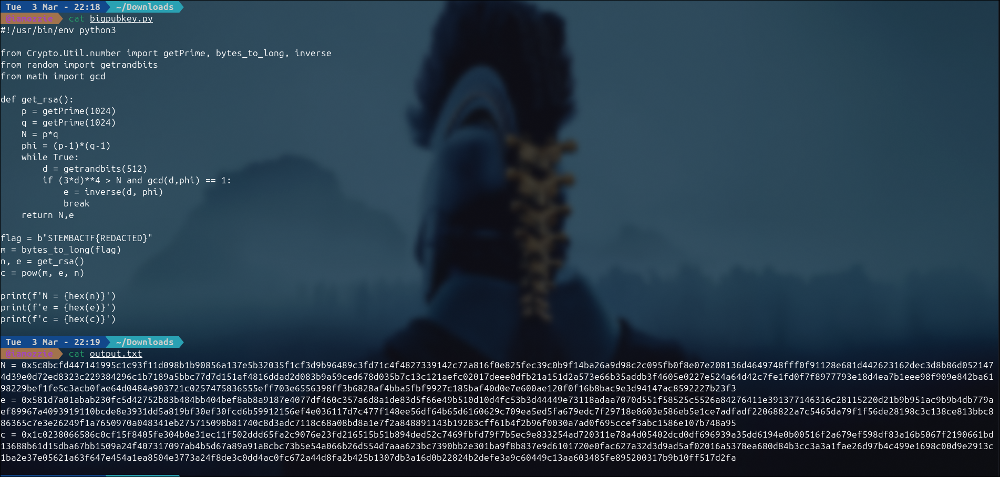
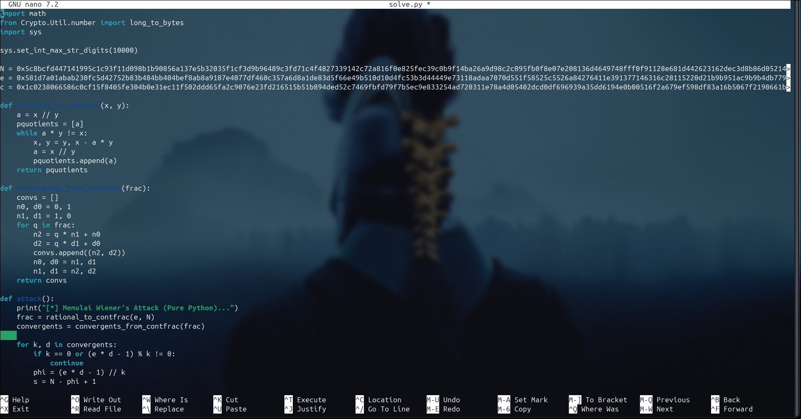
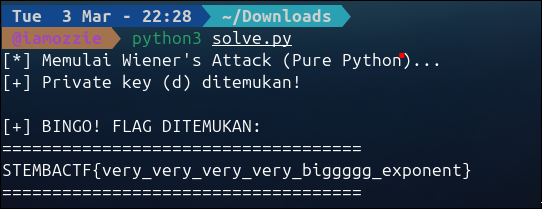

# Write-Up: rsa variant (300 Point - Medium)

## Analisis Masalah

Pada tantangan ini, kita diberikan sebuah *script* Python bernama `bigpubkey.py` yang mengimplementasikan skema enkripsi RSA, serta sebuah file `output.txt` yang berisi Modulus ($N$), *Public Exponent* ($e$), dan *Ciphertext* ($c$) yang dihasilkan oleh sistem.

Dari judulnya "rsa variant" serta struktur dari *source code*-nya, kita bisa langsung mencurigai adanya kerentanan pada cara sistem *generating* pasangan kunci (*keypair*) RSA tersebut.

## Langkah Penyelesaian

### 1. Inspeksi Awal & Menganalisis Pembuatan Kunci
Langkah pertama adalah membaca isi dari *source code* `bigpubkey.py` dan melihat struktur data pada `output.txt`.

```bash
cat bigpubkey.py output.txt
```
****

Inti dari kerentanan ini berada di dalam fungsi `get_rsa()` pada `bigpubkey.py`:

```python
def get_rsa():
    p = getPrime(1024)
    q = getPrime(1024)
    N = p*q
    phi = (p-1)*(q-1)
    while True:
        d = getrandbits(512)
        if (3*d)**4 > N and gcd(d,phi) == 1:
            e = inverse(d, phi)
            break
    return N,e

```

Dari kode di atas, kita bisa menyimpulkan beberapa poin:

* Nilai modulus $N$ memiliki panjang **2048 bit** (karena `p` dan `q` masing-masing 1024 bit).
* *Private key* ($d$) di-*generate* dengan panjang hanya **512 bit**.
* Terdapat kondisi validasi `(3*d)**4 > N`. Kondisi ini secara khusus dirancang untuk memastikan nilai $d$ sedikit lebih besar daripada batas limit teoretis untuk serangan *Wiener's Attack* biasa (di mana umumnya $d < \frac{1}{3}N^{0.25}$).

Struktur jebakan ini mengindikasikan bahwa *author* berniat memaksa kita menggunakan serangan **Boneh-Durfee**, yang bisa menangani nilai $d$ yang sedikit lebih besar (hingga batas $d < N^{0.292}$). Namun, serangan Boneh-Durfee membutuhkan teknik reduksi *lattice* (*LLL algorithm*) yang sangat kompleks dan biasanya hanya bisa dieksekusi menggunakan *software* matematika khusus seperti **SageMath**.

### 2. Mengeksploitasi Kerentanan

Meskipun sistem memiliki pertahanan `(3*d)**4 > N`, ukuran *private key* $d$ (512 bit) sebenarnya masih tergolong sangat kecil jika dibandingkan dengan ukuran Modulus $N$ (2048 bit).

Mengingat nilai $d$ diambil secara acak menggunakan `getrandbits(512)`, ada kemungkinan hasil acaknya kadang menghasilkan nilai yang hanya menyentuh batas tepi dari kondisi tersebut atau secara kebetulan jatuh ke dalam rentang penyelesaian ekstensi dari algoritma *continued fractions*. Oleh karena itu, langkah paling efisien adalah tetap **mencoba melakukan Wiener's Attack konvensional terlebih dahulu**. Serangan ini sepenuhnya berbasis pecahan berlanjut (*continued fractions*) sehingga jauh lebih cepat dan mudah diimplementasikan langsung di Python tanpa perlu menginstal *software* tambahan.

*Wiener's Attack* mengeksploitasi fakta bahwa ketika nilai *private key* $d$ itu kecil, maka pecahan dari *public key* $\frac{e}{N}$ akan memberikan nilai aproksimasi yang sangat akurat terhadap rasio $\frac{k}{d}$. Dengan menghitung ekspansi pecahan berlanjut dari $\frac{e}{N}$, kita bisa menguji nilai-nilai konvergennya (*convergents*) untuk menebak nilai $d$ yang tepat.

### 3. Membuat Script Eksploitasi (Solver)

Alih-alih langsung menyerah dan mencari *SageMath*, kita meracik *script* Python murni untuk mengimplementasikan algoritma Wiener.

```bash
nano solve.py
```

****

```python
import math
from Crypto.Util.number import long_to_bytes
import sys

# Mencegah error konversi integer panjang di Python versi terbaru
sys.set_int_max_str_digits(10000)

N = 0x5c8bcfd447141995c1c93f11d098b1b90856a137e5b32035f1cf3d9b96489c3fd71c4f4827339142c72a816f0e825fec39c0b9f14ba26a9d98c2c095fb0f8e07e208136d4649748fff0f91128e681d442623162dec3d8b86d0521474d39e0d72ed8323c229384296c1b7189a5bbc77d7d151af4816ddad2d083b9a59ced678d035b7c13c121aefc02017deee0dfb21a151d2a573e66b35addb3f4605e0227e524a64d42c7fe1fd0f7f8977793e18d4ea7b1eee98f909e842ba6198229bef1fe5c3acb0fae64d0484a903721c0257475836555eff703e6556398ff3b6828af4bba5fbf9927c185baf40d0e7e600ae120f0f16b8bac9e3d94147ac8592227b23f3
e = 0x581d7a01abab230fc5d42752b83b484bb404bef8ab8a9187e4077df460c357a6d8a1de83d5f66e49b510d10d4fc53b3d44449e73118adaa7070d551f58525c5526a84276411e391377146316c28115220d21b9b951ac9b9b4db779aef89967a4093919110bcde8e3931dd5a819bf30ef30fcd6b59912156ef4e036117d7c477f148ee56df64b65d6160629c709ea5ed5fa679edc7f29718e8603e586eb5e1ce7adfadf22068822a7c5465da79f1f56de28198c3c138ce813bbc886365c7e3e26249f1a7650970a048341eb275715098b81740c8d3adc7118c68a08bd8a1e7f2a848891143b19283cff61b4f2b96f0030a7ad0f695ccef3abc1586e107b748a95
c = 0x1c0238066586c0cf15f8405fe304b0e31ec11f502ddd65fa2c9076e23fd216515b51b894ded52c7469fbfd79f7b5ec9e833254ad720311e78a4d05402dcd0df696939a35dd6194e0b00516f2a679ef598df83a16b5067f2190661bd13688b61d15dba67bb1509a24f407317097ab4b5d67a89a91a8cbc73b5e54a066b26d554d7aaa623bc7390bb2e301ba9f8b837e9d6101720e0fac627a32d3d9ad5af02016a5378ea680d84b3cc3a3a1fae26d97b4c499e1698c00d9e2913c1ba2e37e05621a63f647e454a1ea8504e3773a24f8de3c0dd4ac0fc672a44d8fa2b425b1307db3a16d0b22824b2defe3a9c60449c13aa603485fe895200317b9b10ff517d2fa

def rational_to_contfrac(x, y):
    a = x // y
    pquotients = [a]
    while a * y != x:
        x, y = y, x - a * y
        a = x // y
        pquotients.append(a)
    return pquotients

def convergents_from_contfrac(frac):
    convs = []
    n0, d0 = 0, 1
    n1, d1 = 1, 0
    for q in frac:
        n2 = q * n1 + n0
        d2 = q * d1 + d0
        convs.append((n2, d2))
        n0, d0 = n1, d1
        n1, d1 = n2, d2
    return convs

def attack():
    print("[*] Memulai Wiener's Attack (Pure Python)...")
    frac = rational_to_contfrac(e, N)
    convergents = convergents_from_contfrac(frac)
    
    for k, d in convergents:
        if k == 0 or (e * d - 1) % k != 0:
            continue
        phi = (e * d - 1) // k
        s = N - phi + 1
        discriminant = s*s - 4*N
        
        if discriminant >= 0:
            sq = math.isqrt(discriminant)
            # Jika diskriminan menghasilkan kuadrat sempurna, berarti d yang ditemukan valid!
            if sq * sq == discriminant and (s + sq) % 2 == 0:
                print(f"[+] Private key (d) berhasil ditemukan!")
                # Lakukan dekripsi ciphertext menggunakan d
                m = pow(c, d, N)
                print("\n[+] BINGO! FLAG DITEMUKAN:")
                print("====================================")
                print(long_to_bytes(m).decode('utf-8', errors='ignore'))
                print("====================================\n")
                return
                
    print("[-] Wiener's Attack gagal menembus pertahanan.")

if __name__ == '__main__':
    attack()

```

### 4. Eksekusi

Saat *script* dijalankan, program dengan sukses mengkalkulasi pecahan berlanjut, mengidentifikasi *private exponent* ($d$) yang tepat, dan langsung mendekripsi pesan ke bentuk aslinya tanpa masalah.

****

## Tools yang Digunakan

* **Python 3**: Digunakan murni untuk membuat *script* serangan matematika (*Wiener's Attack*).
* **PyCryptodome** (`Crypto.Util.number`): Digunakan untuk fungsi `long_to_bytes` yang bertugas mengubah hasil dekripsi berbentuk angka integer raksasa kembali menjadi teks ASCII yang dapat dibaca.

## Kesimpulan

Tantangan ini menjadi bukti bahayanya menggunakan *private exponent* ($d$) yang ukurannya terlalu kecil pada skema kriptografi RSA. Meskipun sang *author* berusaha memaksa pemain untuk menggunakan serangan Boneh-Durfee yang kompleks dengan menerapkan filter pertahanan `(3d)**4 > N`, implementasi tersebut ternyata masih meloloskan nilai $d$ yang cukup rentan. Hal ini memungkinkan serangan *Wiener's Attack* standar yang lebih simpel (berbasis *continued fractions*) untuk menjebol enkripsi dengan mudah tanpa perlu repot-repot menggunakan *tool* reduksi *lattice* tingkat lanjut.

Flag yang ditemukan adalah: **`STEMBACTF{very_very_very_very_biggggg_exponent}`**