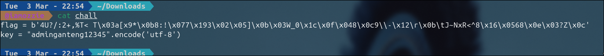
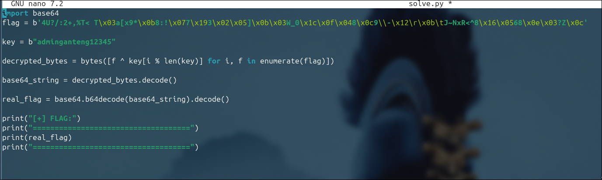
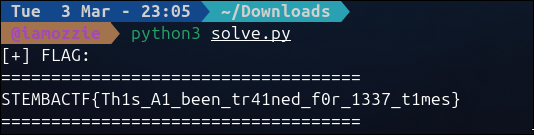

# Write-Up: xor variant (300 Point - Medium)

## Analisis Masalah

Tantangan "xor variant" menyajikan kode *simple scripting* yang berisi dua informasi dasar: sekumpulan string yang tampak cacat atau *mangled* (berisi *escape sequence* seperti `\x0b`, `\x07`) yang didefinisikan sebagai `flag`, serta sebuah variabel kunci bernama `key` yang berbunyi `"adminganteng12345"`.

Dari judul tantangan dan ketersediaan *key*, bisa dipastikan tantangan ini menggunakan enkripsi XOR konvensional, di mana plaintext (teks yang dapat dibaca) diubah menggunakan operator bitwise XOR dengan *string* teks kunci tersebut sehingga menjadi tidak terbaca lagi (ciphertext/`flag`).

## Langkah Penyelesaian

### 1. Membedah Mekanisme Enkripsi

Mari kita pelajari `chall` yang disediakan:

```bash
cat chall
```

****

Kode memperlihatkan:

```python
flag = b'4U?/:2+,%T< T\x03a[x9*\x0b8:!\x077\x193\x02\x05]\x0b\x03W_0\x1c\x0f\x048\x0c9\\-\x12\r\x0b\tJ~NxR<^8\x16\x0568\x0e\x03?Z\x0c'
key = "adminganteng12345".encode('utf-8')

```

XOR (Eksklusif-OR) dalam sistem kriptografi memiliki salah satu sifat yang paling berharga untuk dimanfaatkan saat *reverse engineering* (*dekripsi*): **Operasi ini bersifat *reversible* (bisa dikembalikan ke posisi semula dengan sendirinya).**

Ini artinya:

* Jika: `Plaintext ⊕ Key = Ciphertext`
* Maka: `Ciphertext ⊕ Key = Plaintext`

Dengan kata lain, untuk mendekripsi variabel `flag` tersebut, kita cukup *meng-XOR-kan* kembali isinya dengan *string* `key` yang tersedia.

Karena panjang ciphertext (`flag`) jauh lebih panjang dibandingkan dengan `key`, kunci akan diulang (*repeated*) secara berkesinambungan saat proses perbandingan per-karakternya. Hal ini bisa disimulasikan menggunakan indeks matematika operator sisa bagi / modulo (`%`).

### 2. Mengeksekusi Script Dekripsi

Berbekal sifat operasi XOR yang bisa di-*reverse* tanpa alat kompleks, saya membangun sedikit tambahan pada baris *script* yang sudah disediakan di tantangan untuk mencetak hasilnya.

Saya me-reka ulang dan meletakkan script dalam file `solve.py`:

```bash
nano solve.py

```

****

```python
# solve.py

import base64

# 1. Menampung data ciphertext yang disediakan
flag = b'4U?/:2+,%T< T\x03a[x9*\x0b8:!\x077\x193\x02\x05]\x0b\x03W_0\x1c\x0f\x048\x0c9\\-\x12\r\x0b\tJ~NxR<^8\x16\x0568\x0e\x03?Z\x0c'

# 2. Menampung data kunci yang disediakan dan mengonversi menjadi karakter byte (UTF-8)
key = "adminganteng12345".encode('utf-8')

# 3. Proses Dekripsi Tahap 1: Ciphertext ⊕ Key = Plaintext (Base64)
# - Untuk setiap karakter di 'flag', kita pasangkan dengan karakter di 'key'.
# - Jika 'flag' lebih panjang dari 'key', penggunaan modulo (i % len(key)) 
#   akan mereset indeks kunci kembali ke awal sehingga operasi ini berulang secara siklus.
decrypted_bytes = bytes([f ^ key[i % len(key)] for i, f in enumerate(flag)])

# 4. Proses Dekripsi Tahap 2: Decode hasil XOR dari Base64 menjadi flag asli
# - Hasil XOR masih berupa string Base64.
# - Kita decode terlebih dahulu menjadi string.
# - Kemudian dilakukan decoding Base64 untuk mendapatkan plaintext sebenarnya.
base64_string = decrypted_bytes.decode('utf-8')
real_flag = base64.b64decode(base64_string).decode('utf-8')

# 5. Mencetak hasil akhir (flag asli)
print("[+] BINGO! FLAG DITEMUKAN:")
print("====================================")
print(real_flag)
print("====================================\n")
```

### 3. Pengambilan Flag

Ketika script dekripsi XOR kita eksekusi:

```bash
python3 solve.py

```

****

Sistem membaca data ASCII dari baris ke-baris yang terkunci, kemudian men-XOR-kannya dan mencetak flag hasil dekripsinya.

## Tools yang Digunakan

* **Python 3:** Digunakan sebagai basis pembuatan skrip dekripsi (menggunakan *list comprehension* dan bitwise eksklusif-OR).

## Kesimpulan

Sifat matematika bitwise Exclusive-OR (XOR) menyatakan bahwa fungsi dapat berjalan dua arah ketika *Key* diketahui. Berbeda dengan mekanisme asimetris, karena `xor variant` mengekspos kata kuncinya (`adminganteng12345`), kita cukup menterjemahkan variabel byte teracak (*ciphertext*) menggunakan operasi yang persis sama dengan bagaimana ciphertext tersebut terbentuk untuk membongkarnya menjadi plaintext.

Berdasarkan *output*, flag berhasil ditarik: **`STEMBACTF{Th1s_A1_been_tr41ned_f0r_1337_t1mes}`**.