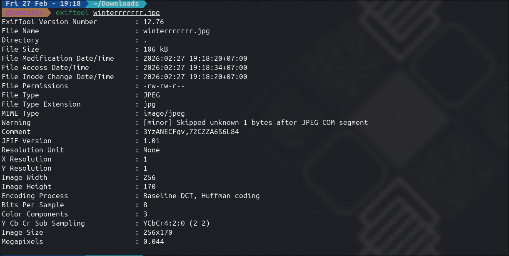
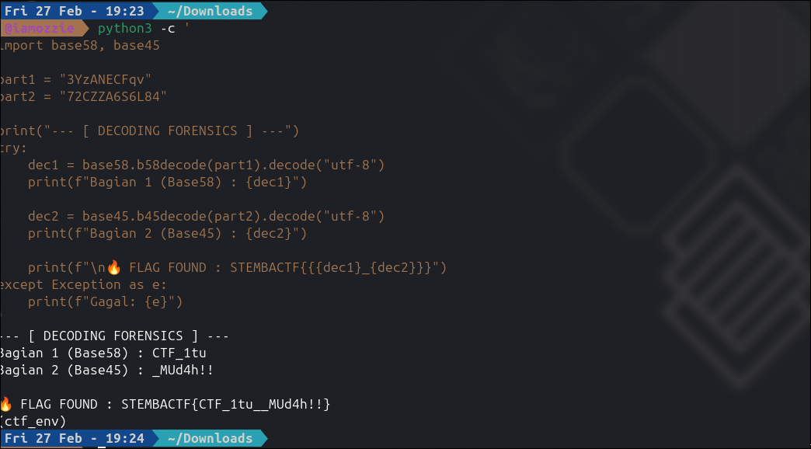

# Write-Up: File Snowwinterr (150 Point -  Medium)

## Analisis Masalah

Challenge "File Snowwinterr" merupakan soal gabungan kategori *Digital Forensics* dan *Cryptography*. Diberikan sebuah file gambar bernama `winterrrrrrr.jpg` beserta petunjuk: *"datanya di encrypt di tahun 58 & 45"*.

Kerentanan dan logika utama pada tantangan ini terletak pada dua hal:

1. **Hidden Metadata**: Informasi rahasia tidak berada pada visual gambar, melainkan disembunyikan di dalam *metadata* (Exif) file tersebut.
2. **Double Encoding**: Clue angka "58 & 45" bukanlah menunjuk pada sebuah tahun, melainkan format algoritma *encoding*, yaitu **Base58** dan **Base45**. Terdapat sebuah karakter pemisah (koma) yang mengindikasikan bahwa *payload* rahasia dibagi menjadi dua bagian dengan *encoding* yang berbeda.

## Langkah Penyelesaian

### 1. Ekstraksi Metadata Gambar

Langkah pertama dalam forensik file dasar adalah memeriksa *metadata* yang tertanam di dalamnya. Saya menggunakan perintah `exiftool` pada file gambar yang diberikan:

```bash
exiftool winterrrrrrr.jpg

```

****
Hasil ekstraksi menunjukkan adanya kejanggalan pada tag `Comment`. Terdapat *string* acak yang disisipkan oleh *author*: `3YzANECFqv,72CZZA6S6L84`. Perhatikan adanya karakter koma `,` di tengah *string* tersebut yang memisahkan teks menjadi bagian kiri dan kanan.

### 2. Decoding Base58 dan Base45

Berbekal petunjuk dari deskripsi soal, saya membagi *string* tersebut menjadi dua:

* Bagian 1: `3YzANECFqv` (Di-*encode* dengan Base58)
* Bagian 2: `72CZZA6S6L84` (Di-*encode* dengan Base45)

Untuk mengotomatisasi proses penerjemahannya, saya membuat dan menjalankan *script* Python sederhana di dalam *virtual environment* yang sudah terinstal *library* `base58` dan `base45`:

```bash
python3 -c '
import base58, base45

part1 = "3YzANECFqv"
part2 = "72CZZA6S6L84"

dec1 = base58.b58decode(part1).decode("utf-8")
dec2 = base45.b45decode(part2).decode("utf-8")

print(f"Bagian 1: {dec1}")
print(f"Bagian 2: {dec2}")
print(f"Flag Gabungan: STEMBACTF{{{dec1}_{dec2}}}")
'

```

---

### 3. Mendapatkan Flag

Setelah *script* dieksekusi, kedua bagian tersebut berhasil diterjemahkan menjadi teks yang dapat dibaca (*leet speak*). Menggabungkan keduanya menghasilkan *plaintext* yang utuh.

****
## Tools yang Digunakan

1. **Exiftool** - Untuk melakukan inspeksi dan ekstraksi *metadata* (Exif) tersembunyi dari file gambar JPEG.
2. **Python 3 (base58, base45)** - Untuk melakukan operasi *decoding* kriptografi secara cepat dan presisi melalui terminal.

## Kesimpulan

Tantangan ini mendemonstrasikan teknik *steganografi* tingkat dasar di mana data disembunyikan di dalam *metadata Comment* sebuah gambar, alih-alih di dalam pikselnya. Selain itu, penggunaan kombinasi multi-format *encoding* (Base58 dan Base45) yang digabung dalam satu *string* mengharuskan pemecah masalah untuk jeli melihat karakter pemisah (koma) dan memahami petunjuk angka pada deskripsi soal.

Flag yang ditemukan adalah: **`STEMBACTF{CTF_1tu_MUd4h!!}`**.

---