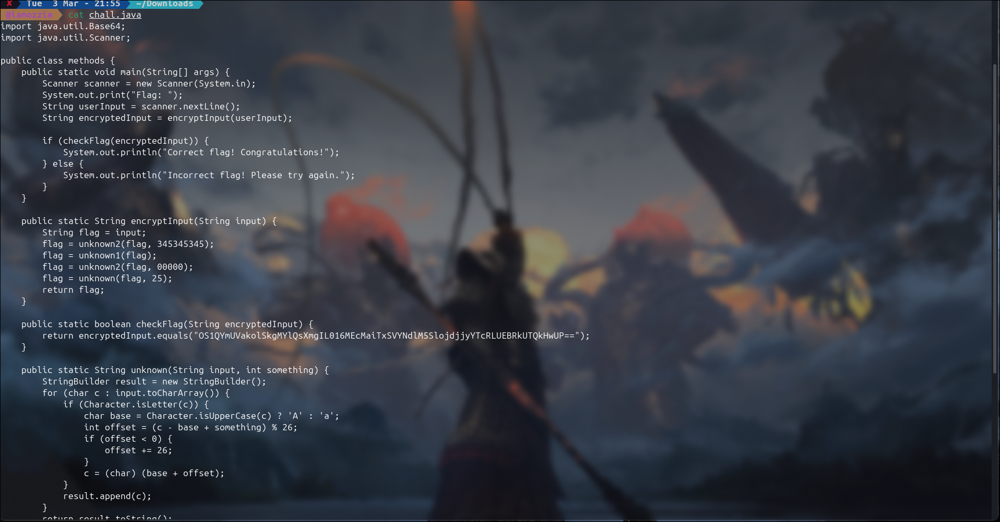
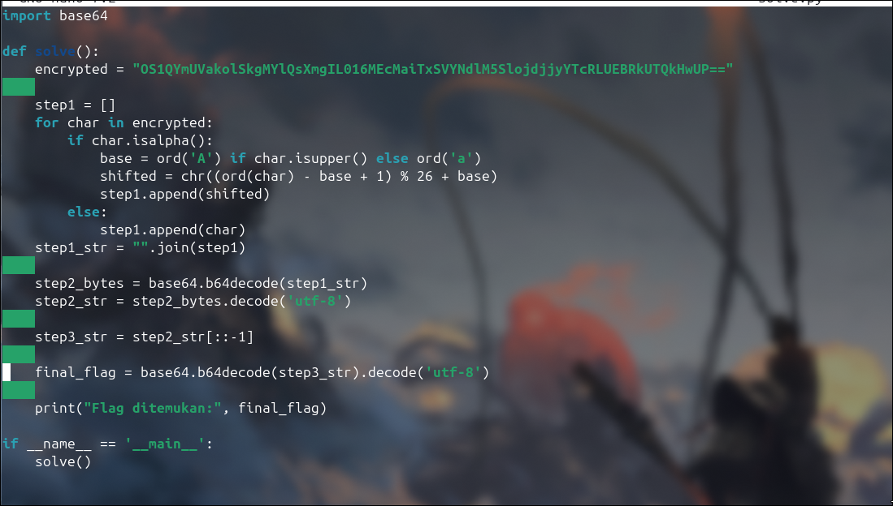
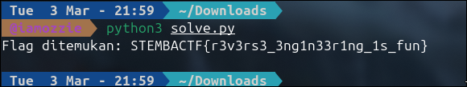

# Write-Up: Power Methods (250 Point - Medium)

## Analisis Masalah

Tantangan ini memberikan sebuah file *source code* Java bernama `chall.java`. Deskripsi tantangan menyebutkan "Cuman base64 hwewhehwhehwe", yang memberikan petunjuk awal bahwa kita akan berhadapan dengan manipulasi *encoding* Base64. Program ini meminta *input* berupa *flag* dari pengguna, memprosesnya melalui serangkaian fungsi kustom, dan mencocokkan hasil akhirnya dengan sebuah *ciphertext* statis: `OS1QYmUVakolSkgMYlQsXmgIL016MEcMaiTxSVYNdlM5SlojdjjyYTcRLUEBRkUTQkHwUP==`. Tugas kita adalah menganalisis alur enkripsi pada *source code* tersebut dan membalikkan (*reverse*) prosesnya untuk mengekstrak *flag* asli.

## Langkah Penyelesaian

### 1. Inspeksi Awal & Analisis Source Code

Langkah pertama adalah membaca dan memahami alur logika di dalam file `chall.java`.

```bash
cat chall.java
```

****

---

Fokus analisis diarahkan pada metode `encryptInput` yang memanggil beberapa fungsi `unknown` secara berurutan:

```java
public static String encryptInput(String input) {
    String flag = input;
    flag = unknown2(flag, 345345345);
    flag = unknown1(flag);
    flag = unknown2(flag, 00000);
    flag = unknown(flag, 25);
    return flag;
}

```

### 2. Identifikasi Celah Logika (Vulnerability)

Dari penelusuran fungsi-fungsi bantuan tersebut, algoritma enkripsinya dapat dipetakan menjadi empat tahap:

1. **`unknown2`:** Mengubah *string* menjadi *encoding* **Base64** (parameter integer diabaikan oleh fungsi).
2. **`unknown1`:** Melakukan **Reverse String** (membalikkan urutan teks).
3. **`unknown2`:** Melakukan **Base64** *encoding* untuk kedua kalinya.
4. **`unknown`:** Menerapkan **Caesar Cipher** pada huruf alfabet dengan pergeseran (*shift*) sebanyak **+25**.

Karena tidak ada proses *hashing* satu arah atau perusakan data, enkripsi ini sepenuhnya bisa dibongkar. Kita hanya perlu mengeksekusi operasi kebalikannya secara mundur: **Caesar Cipher (-25 atau +1) -> Base64 Decode -> Reverse String -> Base64 Decode**.

### 3. Pembuatan Script Unpacking (Reverse Engineering)

Untuk mengotomatiskan proses dekripsi, saya menyusun sebuah *script solver* menggunakan Python. *Script* ini akan memproses *ciphertext* secara mundur sesuai dengan identifikasi logika sebelumnya.

```bash
nano solve.py
```

****

---

Berikut adalah *script* dekonstruksinya:

```python
import base64

def solve():
    encrypted = "OS1QYmUVakolSkgMYlQsXmgIL016MEcMaiTxSVYNdlM5SlojdjjyYTcRLUEBRkUTQkHwUP=="
    
    # 1. Caesar Shift +1 (Kebalikan dari +25)
    step1 = []
    for char in encrypted:
        if char.isalpha():
            base = ord('A') if char.isupper() else ord('a')
            shifted = chr((ord(char) - base + 1) % 26 + base)
            step1.append(shifted)
        else:
            step1.append(char)
    step1_str = "".join(step1)
    
    # 2. Base64 Decode pertama
    step2_bytes = base64.b64decode(step1_str)
    step2_str = step2_bytes.decode('utf-8')
    
    # 3. Reverse String
    step3_str = step2_str[::-1]
    
    # 4. Base64 Decode kedua (hasil akhir)
    final_flag = base64.b64decode(step3_str).decode('utf-8')
    
    print("Flag ditemukan:", final_flag)

if __name__ == '__main__':
    solve()
```

### 4. Eksekusi dan Pengambilan Flag

Setelah *script solver* disiapkan, langkah terakhir adalah mengeksekusinya di terminal. Proses dekripsi berjalan dengan sempurna dan *flag* yang valid berhasil diekstrak.

```bash
python3 solve.py
```

****
---

## Tools yang Digunakan

1. **Python 3** - Digunakan untuk membangun *script solver* yang membalikkan logika Caesar Cipher dan melakukan *decoding* Base64 secara otomatis.
2. **Cat & Nano (CLI Tools)** - Digunakan untuk inspeksi *source code* Java dan penulisan *script* dekripsi di lingkungan terminal.

## Kesimpulan

Tantangan "Power Methods" menuntut ketelitian dalam melacak alur manipulasi *string* di dalam bahasa Java. Deskripsi soal yang menyebutkan "Cuman base64" merupakan sebuah jebakan, karena program juga menyisipkan *String Reversing* dan operasi matematika modular (Caesar Cipher). Kunci penyelesaiannya terletak pada pemahaman bahwa membalikkan pergeseran Caesar +25 langkah sama artinya dengan menggeser karakter tersebut +1 langkah ke depan agar kembali ke posisi asalnya.

Flag yang ditemukan adalah: **`STEMBACTF{r3v3rs3_3ng1n33r1ng_1s_fun}`**.

