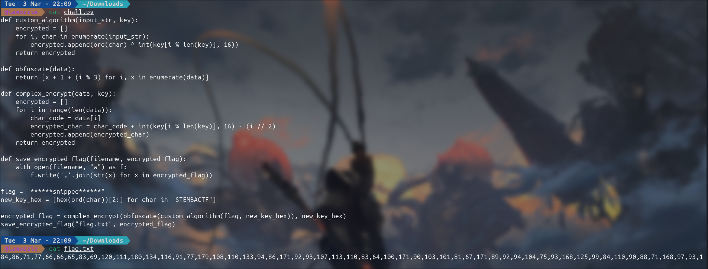
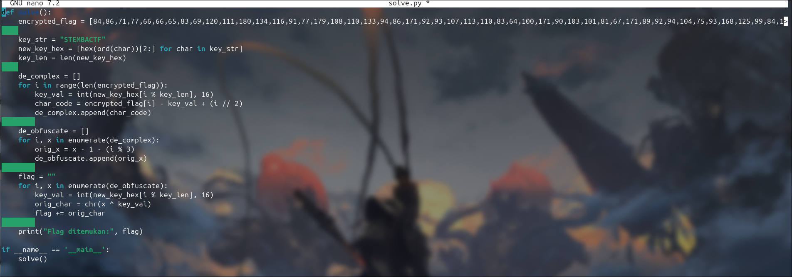
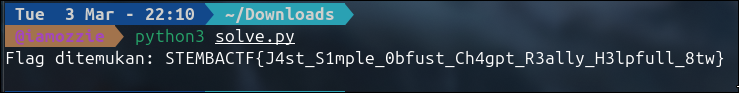

# Write-Up: Simple Obfust (400 Point - Medium)

## Analisis Masalah

Pada tantangan "Simple Obfust" ini, kita diberikan dua buah file: `chall.py` yang berisi *source code* algoritma enkripsi kustom berbasis Python, dan `flag.txt` yang berisi deretan angka dipisahkan koma (*comma-separated values*) yang merupakan hasil akhir dari enkripsi *flag* tersebut. Tugas kita adalah membaca alur matematis pada skrip enkripsi, lalu membuat skrip dekoder (*reverse engineering*) untuk mengembalikan deretan angka tersebut menjadi *string* teks *flag* yang dapat dibaca.

## Langkah Penyelesaian

### 1. Inspeksi Awal & Analisis Source Code

Langkah pertama adalah membaca isi dari *source code* `chall.py` dan melihat struktur data pada `flag.txt`.

```bash
cat chall.py flag.txt
```

****

---

Dari inspeksi kode, proses enkripsi berjalan melalui tiga tahapan fungsi yang dipanggil secara bersarang (berurutan dari dalam ke luar):
`complex_encrypt(obfuscate(custom_algorithm(flag, new_key_hex)), new_key_hex)`

Variabel kunci (`new_key_hex`) yang digunakan diambil dari representasi *hexadecimal* *string* `"STEMBACTF"`.

### 2. Identifikasi Logika Enkripsi & Dekonstruksi

Untuk mendapatkan *flag* asli, saya harus membedah ketiga fungsi tersebut dan menyusun operasi matematika kebalikannya (*inverse*), lalu mengeksekusinya dari urutan paling luar ke dalam (mundur):

1. **Reverse `complex_encrypt`:**
* Logika Asli: `encrypted_char = char_code + key - (i // 2)`
* Kebalikan: `char_code = encrypted_char - key + (i // 2)`


2. **Reverse `obfuscate`:**
* Logika Asli: `x_new = x + 1 + (i % 3)`
* Kebalikan: `x_original = x_new - 1 - (i % 3)`


3. **Reverse `custom_algorithm`:**
* Logika Asli: `ord(char) ^ key` (Operasi XOR)
* Kebalikan: Sifat operasi XOR adalah *reversible* dengan cara di-XOR-kan kembali dengan kunci yang sama. Jadi: `char = char_code ^ key`.


### 3. Pembuatan Script Unpacking (Reverse Engineering)

Berdasarkan rumus kebalikan di atas, saya menyusun *script solver* menggunakan Python. Data dari `flag.txt` langsung saya masukkan (*hardcode*) ke dalam skrip agar lebih praktis.

```bash
nano solve.py
```

****

---

Berikut adalah *script* dekonstruksinya:

```python
def solve():
    # Data deretan angka dari flag.txt
    encrypted_flag = [84,86,71,77,66,66,65,83,69,120,111,180,134,116,91,77,179,108,110,133,94,86,171,92,93,107,113,110,83,64,100,171,90,103,101,81,67,171,89,92,94,104,75,93,168,125,99,84,110,90,88,71,168,97,93,100]
    
    # Generate key yang sama dengan script asli
    key_str = "STEMBACTF"
    new_key_hex = [hex(ord(char))[2:] for char in key_str]
    key_len = len(new_key_hex)
    
    # Tahap 1: Reverse complex_encrypt
    de_complex = []
    for i in range(len(encrypted_flag)):
        key_val = int(new_key_hex[i % key_len], 16)
        char_code = encrypted_flag[i] - key_val + (i // 2)
        de_complex.append(char_code)
        
    # Tahap 2: Reverse obfuscate
    de_obfuscate = []
    for i, x in enumerate(de_complex):
        orig_x = x - 1 - (i % 3)
        de_obfuscate.append(orig_x)
        
    # Tahap 3: Reverse custom_algorithm (XOR)
    flag = ""
    for i, x in enumerate(de_obfuscate):
        key_val = int(new_key_hex[i % key_len], 16)
        orig_char = chr(x ^ key_val)
        flag += orig_char
        
    print("[+] Membongkar Obfuscation...")
    print("====================================")
    print("Flag ditemukan:", flag)
    print("====================================\n")

if __name__ == '__main__':
    solve()

```

### 4. Eksekusi dan Pengambilan Flag

Setelah *script* tersimpan, saya mengeksekusinya di terminal. Operasi matematika terbalik berjalan dengan presisi dan mencetak *string flag* yang valid.

```bash
python3 solve.py
```

****

---

## Tools yang Digunakan

1. **Python 3** - Sangat ideal untuk mereplikasi operasi matematika kustom dan manipulasi *array* secara terbalik untuk proses *Reverse Engineering*.
2. **Cat & Nano (CLI Tools)** - Digunakan untuk inspeksi *source code* dan *debugging script solver*.

## Kesimpulan

Tantangan "Simple Obfust" mendemonstrasikan bahwa algoritma enkripsi kustom yang dibangun murni dari operasi aritmatika dasar (penjumlahan, pengurangan, pembagian pembulatan, dan operasi *bitwise* XOR) sangat rentan untuk dibongkar. Selama tidak ada data yang dihancurkan secara permanen (seperti melalui *hashing* satu arah) dan algoritma tersebut deterministik, setiap langkah matematisnya dapat dipetakan dan dikembalikan nilainya (*inversed*) secara presisi menggunakan *script* otomatis.

Flag yang ditemukan adalah: **`STEMBACTF{J4st_S1mple_0bfust_Ch4gpt_R3ally_H3lpfull_8tw}`**