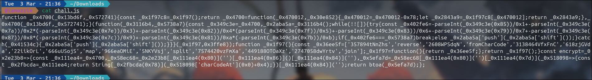
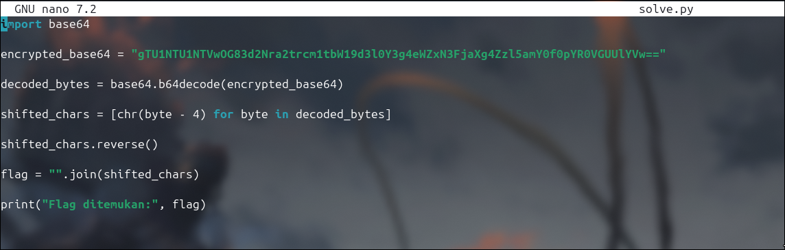
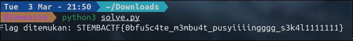

# Write-Up: Membingungkan (250 Point - Medium)

## Analisis Masalah

Tantangan ini memberikan dua buah file, yaitu `chall.js` dan `output.txt`. File `chall.js` berisi *source code* JavaScript yang telah melalui proses *obfuscation* (penyamaran kode) untuk menyembunyikan alur kerjanya, sementara `output.txt` berisi sebuah *string* acak yang dienkripsi dalam format Base64. Tujuan dari tantangan ini adalah menganalisis dan membongkar (*reverse engineering*) algoritma enkripsi di dalam `chall.js`, kemudian membuat fungsi kebalikannya (*dekoder*) untuk memulihkan teks asli (*flag*) dari file `output.txt`.

## Langkah Penyelesaian

### 1. Inspeksi Awal & Analisis Source Code

Langkah pertama adalah membaca isi dari kedua file yang diberikan untuk memahami struktur data dan kode yang kita hadapi.

```bash
cat chall.js output.txt
```

****

---

Meskipun kode JS dibungkus dengan array *obfuscator* dan pergeseran indeks, saya memfokuskan analisis pada fungsi `encrypt` yang berada di bagian paling akhir kode, karena di situlah logika utamanya berjalan:

```javascript
const encrypt = _0x2e23b8 => {
    const _0x111ea4 = _0x4700,
    _0x58ec68 = _0x2e23b8['split']('')['reverse']()['join'](''),
    _0x5efa7d = _0x58ec68['split']('')['map'](_0x518098 => {
        const _0x2fbcda = _0x111ea4;
        return String['fromCharCode'](_0x518098['charCodeAt'](0x0) + 0x4);
    })['join']('');
    return btoa(_0x5efa7d);
};
```

### 2. Identifikasi Logika Enkripsi

Dari hasil dekonstruksi mental pada fungsi `encrypt` di atas, algoritma ini melakukan tiga tahapan modifikasi pada teks input secara berurutan:

1. **Reverse String:** Mengubah urutan karakter dari belakang ke depan menggunakan metode `split('').reverse().join('')`.
2. **Shift ASCII (+4):** Melakukan perulangan (`map`) pada setiap karakter, mengambil nilai desimal ASCII-nya (`charCodeAt(0)`), lalu menambahkannya dengan 4 (`+ 0x4`).
3. **Base64 Encoding:** Mengubah hasil modifikasi karakter tersebut ke dalam format Base64 menggunakan fungsi bawaan `btoa()`.

Karena kita melakukan *Reverse Engineering*, kita harus menyusun algoritma dekripsi dengan mengeksekusi kebalikan dari instruksi tersebut dengan urutan mundur.

### 3. Pembuatan Script Unpacking (Reverse Engineering)

Untuk mendapatkan *flag*, saya menyusun sebuah *script solver* menggunakan Python. *Script* ini akan membaca *string* Base64 dari `output.txt` dan melakukan proses dekripsi mundur: **Base64 Decode -> Shift ASCII (-4) -> Reverse String**.

```bash
nano solve.py
```
****


---

*Script* dekonstruksi:

```python
import base64

def decrypt_flag(encrypted_b64):
    # 1. Reverse tahapan 3: Base64 Decode
    decoded_bytes = base64.b64decode(encrypted_b64)
    
    # 2. Reverse tahapan 2: Shift ASCII -4
    # (Mengurangi nilai desimal ASCII sebanyak 4 pada setiap byte)
    shifted_chars = [chr(byte - 4) for byte in decoded_bytes]
    
    # 3. Reverse tahapan 1: Reverse String
    # (Membalikkan kembali urutan array ke posisi semula)
    shifted_chars.reverse()
    
    # Rakit array karakter menjadi string utuh
    flag = "".join(shifted_chars)
    return flag

def main():
    # Ciphertext yang diambil dari output.txt
    encrypted_payload = "gTU1NTU1NTVwOG83d2Nra2trcm1tbW19d3l0Y3g4eWZxN3FjaXg4Zzl5amY0f0pYR0VGUUlYVw=="
    
    print("[*] Memulai dekripsi payload...")
    flag = decrypt_flag(encrypted_payload)
    
    print("\n[+] BINGO! FLAG DITEMUKAN:")
    print("====================================")
    print(flag)
    print("====================================\n")

if __name__ == '__main__':
    main()


```

### 4. Eksekusi dan Pengambilan Flag

Setelah *script solver* selesai dibuat, saya menjalankannya di terminal. Proses dekripsi berjalan instan dan *flag* yang disembunyikan berhasil dipulihkan.

```bash
python3 solve.py
```
****


---

## Tools yang Digunakan

1. **Python 3** - Digunakan untuk membuat *script solver* otomatis untuk proses *decoding* Base64, manipulasi nilai ASCII, dan manipulasi *array/string*.
2. **Cat & Nano (CLI Tools)** - Digunakan untuk membaca file dan menulis *script* langsung melalui terminal.

## Kesimpulan

Tantangan "Membingungkan" mengajarkan bahwa *obfuscation* pada JavaScript (seperti pengubahan nama variabel menjadi heksadesimal dan penyembunyian pemanggilan fungsi ke dalam *array*) hanya berfungsi untuk memperlambat analisis visual, namun tidak mengubah logika program itu sendiri. Dengan memahami operasi dasar seperti manipulasi nilai ASCII dan konversi *encoding*, proses enkripsi kustom sederhana dapat dengan mudah dipetakan alur mundurnya (*reversed*).

Flag yang ditemukan adalah: **`STEMBACTF{4bfu5c4te_m3mbu4t_pusyiiinggg_s3k4l1111111}`**.