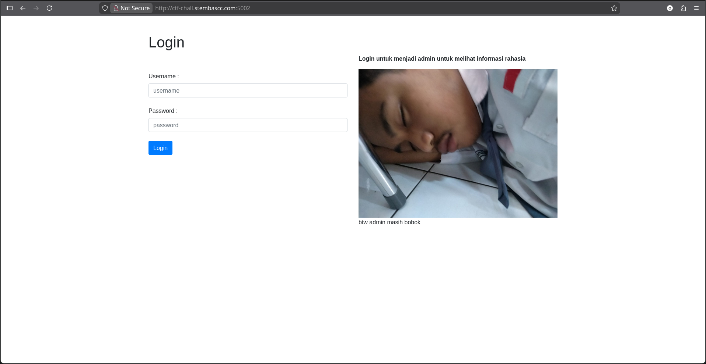
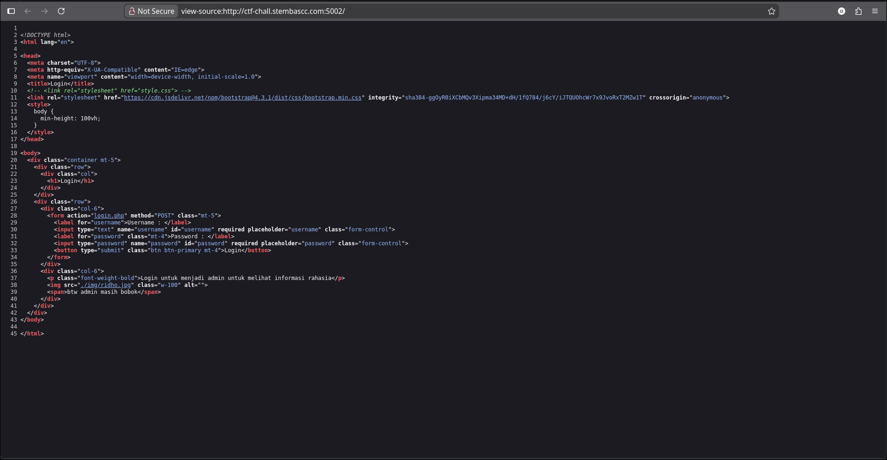
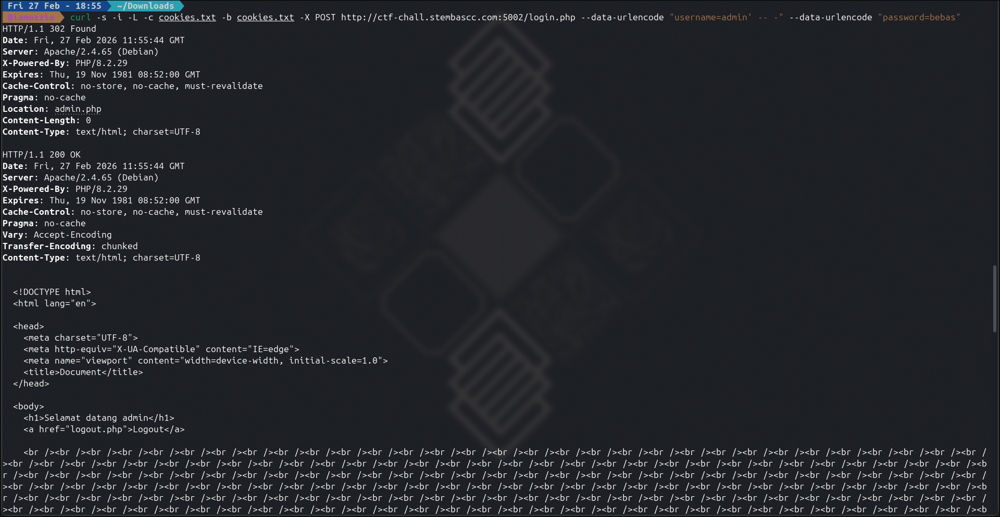
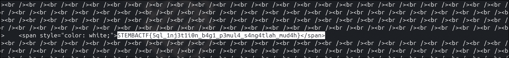

# Write-Up: SQLI Putih (200 Point - Medium)

Tantangan ini menyajikan halaman login sederhana. Terdapat petunjuk berupa teks: "Login untuk menjadi admin untuk melihat informasi rahasia". Ini mengindikasikan bahwa target utama kita adalah melakukan Authentication Bypass agar sistem mengenali kita sebagai admin.

##  Inspeksi Awal & Tampilan Web
Saat pertama kali mengakses tautan yang diberikan, kita disambut oleh sebuah halaman *login* sederhana. Terdapat petunjuk eksplisit di sebelah kanan form: *"Login untuk menjadi admin untuk melihat informasi rahasia"*. 

****

##  Analisis Source Code (HTML)
Untuk memahami ke mana dan bagaimana data dikirimkan, saya melakukan inspeksi pada *source code* HTML halaman tersebut.

****

Berdasarkan *source code* form tersebut, ditemukan informasi krusial berikut:
```html
<form action="login.php" method="POST" class="mt-5">
  <label for="username">Username : </label>
  <input type="text" name="username" id="username" required placeholder="username" class="form-control">
  <label for="password" class="mt-4">Password : </label>
  <input type="password" name="password" id="password" required placeholder="password" class="form-control">
  <button type="submit" class="btn btn-primary mt-4">Login</button>
</form>

```

1. **Endpoint Target:** Data dikirimkan ke file `login.php`.
2. **HTTP Method:** Menggunakan metode `POST`.
3. **Parameter:** Terdapat dua parameter *input* yang dieksekusi, yaitu `username` dan `password`.

---

##  Analisis Kerentanan

Melihat pengiriman data langsung ke `login.php`, sangat besar kemungkinan *backend* PHP mengeksekusi kueri ke *database* tanpa sanitasi input yang aman (seperti tidak menggunakan *prepared statements*).

Logika kueri *backend* kemungkinan besar seperti ini:

```sql
SELECT * FROM users WHERE username = '$username' AND password = '$password'

```

Dengan memasukkan *payload* injeksi seperti `admin' #` atau `admin' -- -` pada parameter `username`, kita bisa memaksa *database* memutus kueri lebih awal:

```sql
SELECT * FROM users WHERE username = 'admin' #' AND password = '$password'

```

Tanda pagar (`#`) atau minus ganda (`-- -`) akan membuat sistem menganggap sisa kueri (pengecekan *password*) sebagai komentar yang harus diabaikan, sehingga kita bisa *login* sebagai admin tanpa mengetahui *password* aslinya.

---

##  Langkah Eksploitasi (Terminal)

### 1. Percobaan Awal (Gagal karena Redirect)

Awalnya, saya mengeksekusi *payload* SQL Injection menggunakan utilitas `curl` dasar:

```bash
curl -s -X POST [http://ctf-chall.stembascc.com:5002/login.php](http://ctf-chall.stembascc.com:5002/login.php) -d "username=admin' #" -d "password=bebas"

```
****
Hasilnya kosong. Ini menandakan server melakukan **HTTP Redirect (302 Found)** setelah memproses *login*, dan `curl` tidak otomatis mengikuti *redirect* tersebut.

### 2. Penyesuaian Command curl

Agar injeksi karakter spesial (seperti spasi dan pagar) aman dikirim via HTTP, saya mengubah `-d` menjadi `--data-urlencode`. Saya juga menambahkan *flag* `-L` (mengikuti redirect otomatis), serta `-c` dan `-b` untuk menyimpan *Session Cookie* agar sesi *login* dipertahankan.

*Command* eksekusi final:

```bash
curl -s -i -L -c cookies.txt -b cookies.txt -X POST [http://ctf-chall.stembascc.com:5002/login.php](http://ctf-chall.stembascc.com:5002/login.php) --data-urlencode "username=admin' #" --data-urlencode "password=bebas"

```

### 3. Ekstraksi Flag

Hasil eksekusi terminal memberikan dua buah respons HTTP: `302 Found` yang mengarahkan ke `admin.php`, disusul oleh `200 OK` yang menampilkan isi halaman admin.

****

Berhasil masuk! Namun, saat menginspeksi isi HTML-nya, *developer* mencoba mengecoh dengan menyisipkan ratusan tag `<br />` dan mewarnai teks *flag* dengan warna putih (`color: white;`) agar tidak terlihat oleh mata telanjang di *browser*.

Karena kita mengeksekusinya via terminal, trik *CSS styling* tersebut tidak berpengaruh, dan *flag* dapat ditemukan dengan jelas di bagian paling bawah *output* HTML:

****
##  Kesimpulan & Flag

Tantangan ini berhasil diselesaikan menggunakan teknik **SQL Injection (Authentication Bypass)**. Dengan memanipulasi parameter `username` menggunakan karakter penutup string dan komentar SQL (`' #`), kita dapat memanipulasi logika kueri *database* dan masuk sebagai admin tanpa autentikasi *password*.

**Flag:** `STEMBACTF{5ql_1nj3t1i0n_b4g1_p3mul4_s4ng4tlah_mud4h}`