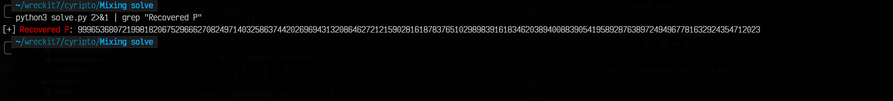
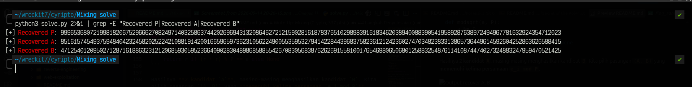
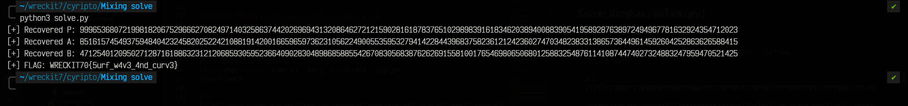

# Write-Up: Mixing (Crypto, 337 pts)

## Analisis Masalah

Pada tantangan ini, kita diberikan sebuah *script* Python bernama `chall.py` serta file `out.txt`. Tantangan ini **tidak memberikan parameter kurva** (`P`, `A`, `B`) sama sekali — yang bocor cuma 6 nilai yang diklaim sebagai "data".

```python
P = getPrime(512)
while P % 4 != 3:
    P = getPrime(512)
A = int.from_bytes(os.urandom(64), 'big') % P
Y1 = int.from_bytes(flag.ljust(64, b'\x00'), 'big')
X1 = int.from_bytes(os.urandom(64), 'big') % P
B = (Y1**2 - X1**3 - A*X1) % P

X = [X1]
for _ in range(5):
    curr_X = X[-1]
    num = (curr_X**2 - A)**2 - 8*B*curr_X
    den = 4*(curr_X**3 + A*curr_X + B)
    next_X = (num * pow(den, -1, P)) % P
    X.append(next_X)
```

Beberapa fakta penting dari source code:

1. `P` adalah **safe-ish prime 512-bit** dengan `P % 4 == 3` — ini bukan kebetulan: nanti kita butuh `sqrt` modular via `pow(a, (P+1)/4, P)`, dan `P ≡ 3 (mod 4)` membuat itu valid.
2. `Y1` adalah flag yang di-pad ke 64 byte pakai `\x00` di kanan, lalu dibaca sebagai integer big-endian.
3. `B` dihitung supaya titik `(X1, Y1)` berada di kurva Weierstrass `y² = x³ + A·x + B (mod P)`.
4. Loop 5 kali menerapkan **rumus point doubling** pada kurva eliptik untuk koordinat-x saja:

```
num = (x² - A)² - 8·B·x
den = 4·(x³ + A·x + B)
x'  = num / den  (mod P)
```

Ini persis rumus `x' = λ² - 2x` dengan `λ = (3x² + A)/(2y)`, hanya ditulis ulang dalam bentuk polinomial.

**Artinya:** `X = [X1, X2, X3, X4, X5, X6]` adalah **rantai doubling** dari titik rahasia `P1 = (X1, Y1)`, dan kita harus merecover `P`, `A`, `B` cuma dari 6 koordinat-x ini.

## Langkah Penyelesaian

### 1. Inspeksi Awal

```bash
cat chall.py out.txt
```


Kita catat:

- `data` berisi **6 integer besar** (~512-bit) — persis x-coordinate chain.
- Tidak ada `P`, `A`, `B` yang bocor.
- Flag ada di `Y1`, yang cuma bisa didapat kalau kita tahu `P`, `A`, `B`, dan `X1`.

### 2. Recover `P` via Resultant Elimination

Setiap pasangan `(X_i, X_{i+1})` memenuhi identitas yang di-*clear* dari modular inverse:

```
e_i(A, B) = (X_i² - A)² - 8·B·X_i - 4·X_{i+1}·(X_i³ + A·X_i + B) ≡ 0 (mod P)
```

Polinomial `e_i` ini **kuadratik dalam `A`** dan **linear dalam `B`**.

**Trik 1 — Eliminasi `B`:** Ambil dua `e_i`, `e_j`, eliminasi `B` dengan kombinasi linear memakai koefisien `B` masing-masing:

```
g_ij(A) = b_j · e_i − b_i · e_j
```

Hasilnya: polinomial **kuadratik murni dalam `A`** yang juga ≡ 0 mod `P`.

**Trik 2 — Eliminasi `A`:** Ambil dua `g` yang berbeda (share root `A` mod `P`), hitung **resultant** terhadap `A`:

```
r_ij,kl = Res_A(g_ij, g_kl)
```

Karena kedua `g` punya root bersama `A` di `F_P`, resultant-nya **habis dibagi `P`** di `Z`.

**Trik 3 — Isolasi `P`:** Hitung beberapa `r`, ambil **GCD**-nya → mengisolasi `P` (setelah strip small cofactor).

```python
from sympy import symbols, Poly, resultant, isprime
import math

A_s, B_s = symbols('A B')

def make_e(xi, xj):
    return (xi**2 - A_s)**2 - 8 * B_s * xi - 4 * xj * (xi**3 + A_s * xi + B_s)

es = [make_e(X[i], X[i+1]) for i in range(5)]

# Eliminasi B dari pasangan berurutan
gs = []
for i in range(4):
    p1, p2 = Poly(es[i], B_s), Poly(es[i+1], B_s)
    b1 = p1.coeff_monomial(B_s)
    b2 = p2.coeff_monomial(B_s)
    gs.append(Poly(b2 * es[i] - b1 * es[i+1], A_s))

# Eliminasi A via resultant
pairs = [(0,1),(1,2),(2,3),(0,2),(1,3)]
rs = [int(resultant(gs[i].as_expr(), gs[j].as_expr(), A_s)) for i,j in pairs]

g = rs[0]
for r in rs[1:]:
    g = math.gcd(g, r)

# Strip small cofactors
for sp in range(2, 100000):
    while g % sp == 0:
        g //= sp

assert isprime(g) and g % 4 == 3
P = g
```



### 3. Recover `A` dan `B` (mod P)

Dengan `P` diketahui, setiap `e_i mod P` tetap linear dalam `B`:

```
B ≡ -(a2_i·A² + a1_i·A + a0_i) / b1_i  (mod P)
```

**Trik:** Samakan ekspresi `B` dari dua index `i ≠ j` → `B` tereliminasi, sisa **satu persamaan kuadratik dalam `A`**:

```python
def solve_pair(i, j):
    c2 = (a2i * inv_bi - a2j * inv_bj) % P
    c1 = (a1i * inv_bi - a1j * inv_bj) % P
    c0 = (a0i * inv_bi - a0j * inv_bj) % P

    inv_c2 = pow(c2, -1, P)
    b, c = (c1 * inv_c2) % P, (c0 * inv_c2) % P
    disc = (b*b - 4*c) % P
    sq = modsqrt(disc, P)   # P % 4 == 3 → pakai (P+1)/4

    inv2 = pow(2, -1, P)
    return [((-b + sq) * inv2 % P, ...), ((-b - sq) * inv2 % P, ...)]
```

Karena `P ≡ 3 (mod 4)`, `sqrt` modular valid:

```python
def modsqrt(a, P):
    a %= P
    r = pow(a, (P + 1) // 4, P)
    return r if (r * r) % P == a else None
```

Hasilnya **2 kandidat `A`**, masing-masing menghasilkan kandidat `B`. Kita pilih pasangan `(A, B)` yang **memenuhi kelima persamaan `e_i mod P`**.



### 4. Recover Flag

Dengan `(A, B)` diketahui dan `X1 = X[0]`:

```
rhs = X1³ + A·X1 + B (mod P) = Y1² mod P
```

Karena `P ≡ 3 (mod 4)`, ambil `sqrt` modular → dapat **dua kandidat `Y1`**: `{y, P - y}`.

Flag di-pad ke 64 byte pakai `\x00` di kanan, dibaca sebagai integer big-endian. Jadi:

1. Konversi tiap kandidat ke 64 byte big-endian.
2. Pilih yang byte pertamanya printable ASCII (bukan `\x00`).
3. Strip trailing `\x00` (padding).

```python
def recover_flag(P, A, B):
    X1 = X[0]
    rhs = (X1**3 + A*X1 + B) % P
    y = modsqrt(rhs, P)

    for cand in (y, P - y):
        raw = cand.to_bytes(64, 'big')
        if raw[:1].isascii() and raw[0:1] != b'\x00':
            return raw.rstrip(b'\x00')
```

## Solver (`solve.py`)

```python
#!/usr/bin/env python3
from sympy import symbols, Poly, resultant, isprime
import math

X = [1310728018303650763936027566726118990540730463418184722626247766533259897833339472201369793020753036897354956372655805443666265539520643579468280542790912,
     1948567695288789033882726566040664624967196105123510164670807174337853448573304124592834588010330665765241266759938926247542041919802062304813097620037961,
     3770888144390194259291756870781587478561974187172600114039080697232166318179389261967556513452232735112227886010717711511566088733244254977109884050750521,
     6685219650661520592837452091527901959121163338051479114854456479415168009003692128002422024872994156351020672099581144020816412383886103779026501845968524,
     3445973769773227766423737354206143846342976057594988433631816479986063937687945211927469517217182447001986012000990667311685794996130773953481639400178746,
     341460821872650281559806202378121714041594962254191119981490154027800966470418186955386638018116210324473072042502834593429857879741880406950528171126212]

A_s, B_s = symbols('A B')


def make_e(xi, xj):
    """Integer polynomial that must vanish mod P for consecutive x-coords."""
    return (xi**2 - A_s)**2 - 8 * B_s * xi - 4 * xj * (xi**3 + A_s * xi + B_s)


def get_coeffs(e):
    """e = a2*A^2 + a1*A + a0 + b1*B  ->  return (a2, a1, a0, b1)."""
    p = Poly(e, A_s, B_s)
    a2 = p.coeff_monomial(A_s**2)
    a1 = p.coeff_monomial(A_s)
    a0 = p.coeff_monomial(1)
    b1 = p.coeff_monomial(B_s)
    return a2, a1, a0, b1


def modsqrt(a, P):
    """Square root mod P, valid because P % 4 == 3."""
    a %= P
    if a == 0:
        return 0
    r = pow(a, (P + 1) // 4, P)
    return r if (r * r) % P == a else None


# ---------------------------------------------------------------------
# 1. Recover P via resultant elimination
# ---------------------------------------------------------------------
def recover_P():
    es = [make_e(X[i], X[i + 1]) for i in range(5)]

    # eliminate B between consecutive e_i -> quadratics in A only
    gs = []
    for i in range(4):
        p1, p2 = Poly(es[i], B_s), Poly(es[i + 1], B_s)
        b1 = p1.coeff_monomial(B_s)
        b2 = p2.coeff_monomial(B_s)
        g = b2 * es[i] - b1 * es[i + 1]        # B eliminated
        gs.append(Poly(g, A_s))

    # eliminate A via resultant between several independent pairs of g's
    pairs = [(0, 1), (1, 2), (2, 3), (0, 2), (1, 3)]
    rs = [int(resultant(gs[i].as_expr(), gs[j].as_expr(), A_s)) for i, j in pairs]

    g = rs[0]
    for r in rs[1:]:
        g = math.gcd(g, r)

    # strip small cofactors that got dragged along in the gcd
    for sp in range(2, 100000):
        while g % sp == 0:
            g //= sp

    assert isprime(g) and g % 4 == 3, "failed to recover P cleanly"
    return g


# ---------------------------------------------------------------------
# 2. Recover A, B  (mod P)
# ---------------------------------------------------------------------
def recover_A_B(P):
    es = [make_e(X[i], X[i + 1]) for i in range(5)]
    coeffs = [tuple(int(c) % P for c in get_coeffs(e)) for e in es]

    def solve_pair(i, j):
        a2i, a1i, a0i, b1i = coeffs[i]
        a2j, a1j, a0j, b1j = coeffs[j]
        inv_bi, inv_bj = pow(b1i, -1, P), pow(b1j, -1, P)

        # B = -(a2*A^2 + a1*A + a0) * inv_b   (from e_i = 0)
        # equate B from i and j  ->  quadratic in A
        c2 = (a2i * inv_bi - a2j * inv_bj) % P
        c1 = (a1i * inv_bi - a1j * inv_bj) % P
        c0 = (a0i * inv_bi - a0j * inv_bj) % P
        if c2 == 0:
            return []

        inv_c2 = pow(c2, -1, P)
        b, c = (c1 * inv_c2) % P, (c0 * inv_c2) % P
        disc = (b * b - 4 * c) % P
        sq = modsqrt(disc, P)
        if sq is None:
            return []

        inv2 = pow(2, -1, P)
        out = []
        for Acand in [(-b + sq) * inv2 % P, (-b - sq) * inv2 % P]:
            Bcand = (-(a2i * Acand * Acand + a1i * Acand + a0i) * inv_bi) % P
            out.append((Acand, Bcand))
        return out

    def check(Acand, Bcand):
        for xi, xj in zip(X, X[1:]):
            e = (xi**2 - Acand)**2 - 8 * Bcand * xi - 4 * xj * (xi**3 + Acand * xi + Bcand)
            if e % P != 0:
                return False
        return True

    for Acand, Bcand in solve_pair(0, 1):
        if check(Acand, Bcand):
            return Acand, Bcand

    raise RuntimeError("no valid (A, B) found")


# ---------------------------------------------------------------------
# 3. Recover the flag
# ---------------------------------------------------------------------
def recover_flag(P, A, B):
    X1 = X[0]
    rhs = (X1**3 + A * X1 + B) % P
    y = modsqrt(rhs, P)
    if y is None:
        raise RuntimeError("X1 not on the recovered curve")

    for cand in (y, P - y):
        raw = cand.to_bytes(64, 'big')
        if raw[:1].isascii() and raw[0:1] != b'\x00':
            return raw.rstrip(b'\x00')
    return None


if __name__ == "__main__":
    P = recover_P()
    print("[+] Recovered P:", P)

    A, B = recover_A_B(P)
    print("[+] Recovered A:", A)
    print("[+] Recovered B:", B)

    flag = recover_flag(P, A, B)
    print("[+] FLAG:", flag.decode())
```

## Bukti Eksekusi (Confirmed Values)

Output final `solve.py`:

```
$ python3 solve.py
[+] Recovered P: 9996536807219981820675296662708249714032586374420269694313208646272121590281618783765102989839161834620389400883905419589287638972494967781632924354712023
[+] Recovered A: 8516157454937594840423245820252242108819142001665965973623105622490055359532794142284439683758236121242360274703482383313865736449614592604252863626588415
[+] Recovered B: 4712540120950271287161886323121206859305952366409028304898685885542670830568387626269155810017654698065068012588325487611410874474027324883247959470521425
[+] FLAG: WRECKIT70{5urf_w4v3_4nd_curv3}
```



Parameter confirmed:
| Komponen | Nilai |
|---|---|
| `P` | 9996536807219981820675296662708249714032586374420269694313208646272121590281618783765102989839161834620389400883905419589287638972494967781632924354712023 |
| `P mod 4` | 3 ✅ |
| `P` primality | ✅ `isprime()` lolos |
| `A` | 8516157454937594840423245820252242108819142001665965973623105622490055359532794142284439683758236121242360274703482383313865736449614592604252863626588415 |
| `B` | 4712540120950271287161886323121206859305952366409028304898685885542670830568387626269155810017654698065068012588325487611410874474027324883247959470521425 |
| **FLAG** | `WRECKIT70{5urf_w4v3_4nd_curv3}` |


## Kesimpulan Tiap Langkah (Ringkas)

| # | Target | Teknik |
|---|--------|--------|
| 1 | Recover `P` | Eliminasi `B` → `g_ij(A)`, resultant `Res_A` → GCD → `P` |
| 2 | Recover `A, B` | Selesaikan `e_i mod P` (kuadratik dalam `A`, linear dalam `B`), verifikasi 5 persamaan |
| 3 | Recover flag | `Y1² = X1³ + A·X1 + B`, `sqrt` via `(P+1)/4`, pilih kandidat printable |

## Flag

```
WRECKIT70{5urf_w4v3_4nd_curv3}
```

Tema flag `surf_w4v3_4nd_curv3` ("surface wave and curve") pas banget dengan teknik serangan: kurva Eliptik (Weierstrass) + "wave" dari doubling chain yang bocor.