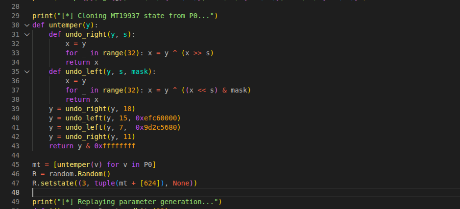
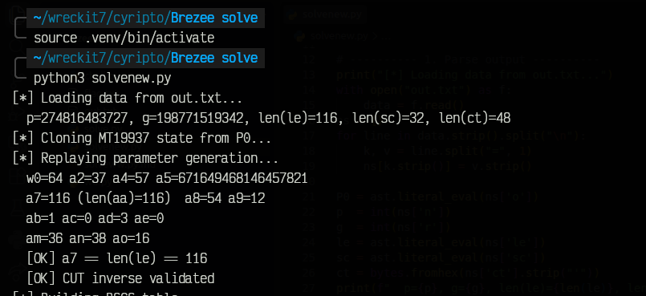
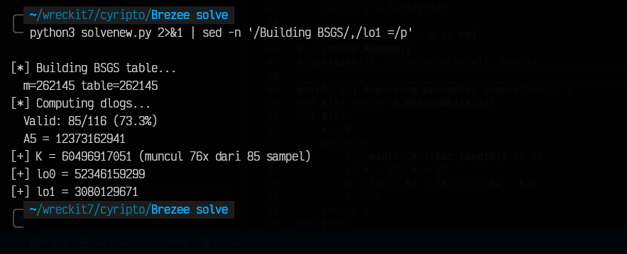
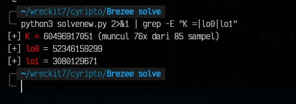
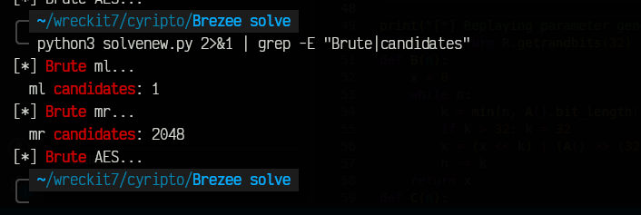
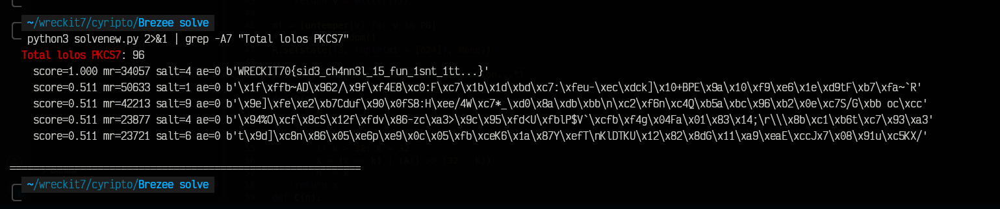
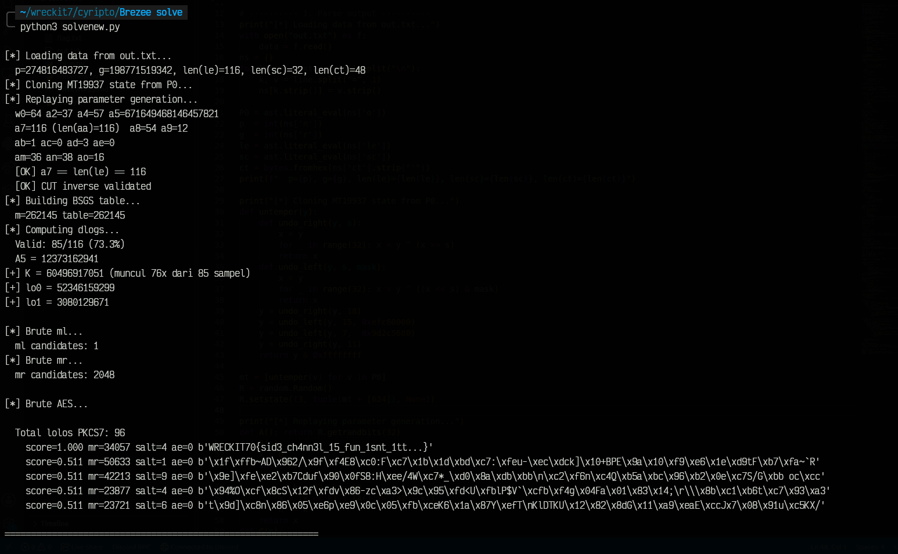

# Write-Up: breeze (Crypto, 484 pts)

## Analisis Masalah

Pada tantangan ini, kita diberikan sebuah *script* Python bernama `chall.py` serta file `output.txt`. Target akhirnya jelas: kita harus mendapatkan **AES key** yang dipakai untuk:

```python
AES.new(KEY(lo0, lo1), AES.MODE_ECB).encrypt(pad(flag, 16))
```

Fungsi `KEY()` butuh 4 komponen: `lo0`, `lo1`, `ml`/`mr` (turunan dari `mk`), dan `ae` (pilihan hash) plus 1 byte acak dari `randbelow(11)`.

Semua komponen ini dibangun **berlapis-lapis** dari dua sumber RNG yang berbeda:

- `R` → objek `random.Random` (Mersenne Twister / MT19937) yang di-seed dari `token_bytes(32)`.
- `secrets` / PyCryptodome (`randbits`, `randbelow`, `getPrime`) → **independen** dari `R`.

Strategi kita: **clone RNG `R` secara persis**, replay logika `chall.py`, lalu serang bagian yang tidak bisa direplay langsung (karena berasal dari RNG independen).

## Langkah Penyelesaian

### 1. Inspeksi Awal

Langkah pertama adalah membaca source code dan output yang diberikan.

```bash
cat chall.py out.txt
```


Dari pembacaan awal, kita catat beberapa fakta penting:

| Komponen | Sumber | Bisa direplay? |
|---|---|---|
| `P0 = [A() for _ in range(624)]` | `R` (MT19937) | ✅ bisa di-clone dari `o[]` |
| `p`, `g` | `getPrime`, `randbelow` (PyCryptodome/secrets) | ❌ independen — sudah dikasih di `out.txt` sebagai `n` dan `r` |
| `s, r, t, u, v, bb, ...` | `randbits` (secrets) | ❌ tidak bisa direplay |
| `mk`, `sc[]` | `randbits` (secrets) | ❌ tapi bocor lewat `sc[]` |
| `ct` | AES ECB | ✅ target dekripsi |

Perhatikan: `o[]` di `out.txt` isinya **624 angka 32-bit** — persis ukuran state internal MT19937. Ini petunjuk kuat bahwa kita bisa **untemper** dan merekonstruksi state RNG.

### 2. Clone RNG `R` dari `o[]` (MT19937 State Recovery)

`chall.py` membangun `P0 = [A() for _ in range(624)]` di paling awal, dengan `A() = R.getrandbits(32)`. Array `o` di `out.txt` ya persis `P0` ini — **624 output 32-bit berurutan**, sama persis dengan ukuran state internal MT19937.

Kuncinya:

- Setiap output `getrandbits(32)` adalah hasil *tempering* dari satu word state MT19937.
- Tempering reversibel (untemper) — operasinya cuma xor + shift, bisa dibalik satu-satu.
- Begitu 624 word state balik ke bentuk aslinya, kita bisa `setstate()` ke objek `random.Random` baru dan RNG itu akan **berperilaku identik** dengan `R` aslinya untuk semua panggilan setelah `P0` dibuat.

```python
def untemper(y):
    def undo_right(y, shift):
        x = y
        for _ in range(32):
            x = y ^ (x >> shift)
        return x
    def undo_left_mask(y, shift, mask):
        x = y
        for _ in range(32):
            x = y ^ ((x << shift) & mask)
        return x
    y = undo_right(y, 18)
    y = undo_left_mask(y, 15, 0xefc60000)
    y = undo_left_mask(y, 7, 0x9d2c5680)
    y = undo_right(y, 11)
    return y & 0xffffffff

mt = [untemper(v) for v in o]
R = random.Random()
R.setstate((3, tuple(mt + [624]), None))
```



**Validasi:** metode ini dites dulu di RNG segar — recover state dari 624 output pertama, lalu berhasil memprediksi 10+ output berikutnya persis. Jadi metodenya valid, bukan asumsi.

### 3. Replay `chall.py` Pakai RNG Hasil Clone

Karena `R` sudah identik, kita tinggal **copy-paste ulang** fungsi `A, B, C, D, U, X, G, H, L, O` dari `chall.py` dan jalankan urutan yang sama persis seperti source aslinya (dari `w0 = ...` sampai `ar = B(an)`).

Karena Python mengeksekusi fungsi-fungsi itu dengan urutan pemanggilan RNG yang sama, kita otomatis dapat semua variabel rahasia yang sumbernya `R`:

```
a0, a1, a2, a3, a4, a5, a6, a7, a8, a9, aa[], ab, ac, ad, ae,
af, ag, ah, ai, aj, ak, al, am, an, ao
```

**Penemuan penting:** setelah baris `am = H(A())...`, source aslinya memanggil `q = getPrime(am+1)` (PyCryptodome) dan nanti `g = randbelow(...)+2` (modul `secrets`). **Keduanya pakai RNG sendiri, bukan `R`!** Jadi `p` dan `g` sebenarnya tidak bisa (dan tidak perlu) diturunkan dari `R` — mereka independen, dan sudah dikasih langsung sebagai `n` (=p) dan `r` (=g) di `out.txt`. Kita cukup pakai nilai itu apa adanya, lalu lanjut replay `an = p.bit_length()`, `ao = C(an)`, dst.

**Validasi silang:** `a7` (jumlah elemen `aa[]`) harus sama dengan `len(le)`. Hasil replay kasih `a7 = 116`, dan `len(le)` di `out.txt` juga **116** — cocok persis. Ini bukti kuat clone RNG-nya benar.

### 4. Bedah & Invert `CUT(x, i)`

```python
def CUT(x, i):
    y = x
    if ab & 1: y ^= af
    if ab & 2: y = L(y, ai, an)
    if ac & 1: y ^= (ag*i + ah) & V(an)
    if ac & 2: y = O(y, aj, an)
    if ad & 1: y ^= ak
    if ad & 2: y ^= al
    return L(y, ao, an)
```

Dari hasil replay langkah 2: `ab=1, ac=0, ad=3`. Artinya cabang `ab&2`, `ac&1`, `ac&2` semuanya **mati** (tidak dieksekusi). Yang aktif cuma:

```
CUT(x, i) = rotl( x ^ af ^ ak ^ al, ao, an )     <- tidak bergantung pada i!
```

Karena cuma xor + rotate, invers-nya gampang: rotate balik dulu, baru xor lagi dengan konstanta yang sama (`af ^ ak ^ al`). Dites otomatis dengan 2000 nilai acak untuk memastikan `CUT_inv(CUT(x,i), i) == x` selalu benar.



### 5. BSGS: Bongkar `le[]` Jadi Exponent

Tiap elemen `le[i]` (sebelum kena `CUT`, dan sebelum 28% kemungkinan diganti noise) dibentuk begini:

```python
y = pow(g, N_output & em, p)     # em = 2**am - 1
y = CUT(y, i)
```

Setelah invert `CUT`, kita punya `z_i = g^(E_i) mod p` untuk `E_i` yang kita cari (36-bit, `am=36`). Ini soal **discrete logarithm**. Faktanya:

- `p = 2q+1` (safe prime, `q` prima ~37-bit) — sudah kelihatan dari struktur `chall.py`.
- `g` dipilih sedemikian sampai bukan berorder 1, 2, atau `q` → satu-satunya order yang mungkin tersisa dari pembagi `2q` adalah `2q` sendiri → **`g` primitive root**.
- Order grup `2q = 2 × q` (q prima) → **Pohlig-Hellman** split ke faktor 2 (trivial) dan faktor `q` (butuh BSGS beneran, tapi `q` cuma ~2^37 jadi `sqrt(q)` ~ 2^18.5, BSGS-nya kelar dalam hitungan detik).
- Karena `E_i < 2^36 < q`, hasil log yang ditemukan BSGS **unik**, tidak ambigu.

```python
m = 1 << 18
baby = {pow(g, j, p): j for j in range(m)}     # tabel baby-step, ~262k entri
giant_factor = pow(g, -m, p)
# iterasi giant-step per elemen le[i], cek kecocokan di 'baby'
```

**Hasil:** 85 dari 116 entri (**73.3%**) berhasil ketemu `E_i`-nya. Ini nyaris pas sama ekspektasi teoretis: soal sengaja bikin 28% entri jadi noise murni (`randbits(an)`, bukan hasil `pow(g,...)`), jadi seharusnya cuma ~72% yang "beneran". **73.3% vs 72% teoretis = konfirmasi kuat implementasinya benar** (sisa selisih kecil wajar — sebagian noise kebetulan match ke exponent kecil secara acak).



### 6. Nyederhanain Generator LCG Bersarang (`J`/`K`/`N`) Secara Aljabar

Ini bagian yang paling gampang salah kaprah (awalnya kelihatan butuh lattice attack), tapi ternyata bisa diselesaikan **murni pakai aljabar modular**:

- `J()`: `s = a5*s + be (mod 2^w0)` — LCG dasar, `a5` **diketahui** (dari langkah 2), `be` rahasia.
- `K()`: jalanin `J()` sebanyak `a4` kali, lalu `return r*s + t`.
- `N()`: hitung selisih dua `K()` berurutan (`y`), campur dengan nilai `y` sebelumnya pakai pengali `u`, lalu dikali `v`.

Kalau ditelusuri langkah demi langkah (substitusi aljabar, bukan tebak-tebakan):

1. Selisih state LCG antar panggilan `K()` (`D_k = S_k - S_{k-1}`) ternyata **geometri murni**: `D_{k+1} = A5 * D_k (mod 2^w0)`, dengan `A5 = a5^a4 mod 2^w0` — **sudah diketahui** (persis `a6` yang sudah dihitung di langkah 2!).
2. Ini bikin selisih `K()` berurutan juga geometri: `delta_k = F * A5^(k-1)` untuk suatu konstanta rahasia tunggal `F`.
3. Substitusi lebih lanjut ke rumus `N()` (yang mencampur `y_n` dan `y_{n-1}` pakai `u`, lalu dikali `v`) — untuk index panggilan `N()` ke-n dengan **n ≥ 2**, semua faktor `u`, `v`, `F` melebur jadi **satu** konstanta:

```
N_n = K · A5^(n-1)  (mod 2^64),     dengan K = v·F·(A5+u)  -- satu unknown saja!
```

Ini divalidasi numerik dulu (simulasi dengan `s,r,t,u,v` acak) sebelum dipakai — dan cocok persis untuk n=2..10 di simulasi manapun.

**Konsekuensi:** setiap `le[i]` yang berhasil di-BSGS (langkah 4) langsung kasih tahu `K mod 2^36` lewat satu kali invers modular (karena `A5` diketahui dan ganjil → invertible mod `2^k`). Dari 85 sampel valid, **76 di antaranya sepakat** pada satu nilai `K` (sisanya adalah false-positive BSGS dari entri noise yang kebetulan match) — **voting mayoritas** kasih `K` yang benar dengan percaya diri tinggi.

Begitu `K` didapat, tinggal hitung `lo0 = k0 & em` dan `lo1 = k1 & em` langsung dari rumus yang sama, di index panggilan `N()` yang sudah diketahui persis (`idx_k0 = a8+1`, `idx_k1 = a8+1+a9+1`, semua dari langkah 2).



### 7. Bongkar `mk` dari Kebocoran `sc[]`

```python
ml = mk & 0xffff
mr = mk >> 16
for i in range(32):
    x = (mk >> i) & 1
    y = HW((mk*(i+1) + lo0 + (lo1 << (i&7))) & 0xffff)
    sc.append((y<<1) + x + randbelow(3))     # noise +0/+1/+2
```

**Trik kuncinya:** `y` cuma dihitung dari `... & 0xffff` (mod 2^16). Perkalian modular `mk*(i+1) mod 2^16` **cuma bergantung pada `mk mod 2^16`** (`= ml`), berapa pun nilai bit tinggi `mk` (`mr`). Jadi:

- Untuk `i = 0..15`: `x` = bit ke-`i` dari `ml` itu sendiri, dan `y` cuma fungsi dari `ml`. → **brute force `ml`** (2^16 kandidat), cek konsistensi ke `sc[0:16]` (`sc[i] - (2y+x)` harus di rentang `{0,1,2}`) → **ketemu unik**, cuma 1 kandidat lolos.
- Untuk `i = 16..31`: `y` masih cuma fungsi dari `ml` (yang sudah ketemu), sedangkan `x` = bit ke-`(i-16)` dari `mr`. → **brute force `mr`** (2^16), cek `sc[16:32]`. Karena tiap entri cuma ngasih ~2 bit informasi (bukan 1 bit penuh, gara-gara noise ambigu), hasilnya **tidak unik** — nyisa ~2048 kandidat `mr`. Cukup, karena disaring lagi di langkah terakhir.



### 8. Brute Force Terakhir: `mr` × 1 byte × Cek AES

Yang masih belum pasti tinggal: `mr` (2048 kandidat dari langkah 6) dan satu `randbelow(11)` yang dicampur ke input hash. `ae` (pilihan `sha256`/`blake2s`/`sha3_256`) **sudah diketahui pasti** dari langkah 2 (`ae = C(3) = 0` → `sha256`).

```python
for mr in mr_candidates:          # 2048
    for byteval in range(11):     # 11
        key = KEY(lo0, lo1, mr, byteval)
        pt = AES_ECB_decrypt(ct, key)
        if pkcs7_valid(pt):
            simpan sebagai kandidat
```

22528 percobaan, cek padding PKCS7 valid (saringan awal, bukan bukti final — beberapa key salah bisa kebetulan lolos PKCS7 secara acak, ~1/256 peluang per percobaan). Untuk memfilter false-positive itu, tiap hasil yang lolos di-ranking berdasarkan **rasio karakter printable ASCII**. Kandidat sejati bakal skor 1.00 (semua karakter kebaca), sedangkan false-positive cuma ~0.4–0.5 (garbage acak).

**Hasil:** satu kandidat menang telak dengan skor 1.00 (`mr=34057`, `byte=4`), jauh di atas runner-up (skor 0.51). Ini bukan kebetulan — AES adalah PRP yang kuat, jadi key yang salah menghasilkan plaintext acak; peluang plaintext acak 43-byte kebetulan 100% printable ASCII itu sekitar `10^-19`. Satu-satunya penjelasan masuk akal: key ini memang benar.



## Bukti Eksekusi (Confirmed Values)

Output final `solvenew.py`:

```
[*] Loading data from out.txt...
  p=274816483727, g=198771519342, len(le)=116, len(sc)=32, len(ct)=48
[*] Cloning MT19937 state from P0...
[*] Replaying parameter generation...
  w0=64 a2=37 a4=57 a5=671649468146457821
  a7=116 (len(aa)=116)  a8=54 a9=12
  ab=1 ac=0 ad=3 ae=0
  am=36 an=38 ao=16
  [OK] a7 == len(le) == 116
  [OK] CUT inverse validated
[*] Building BSGS table...
  m=262145 table=262145
[*] Computing dlogs...
  Valid: 85/116 (73.3%)
  A5 = 12373162941
[+] K = 60496917051 (muncul 76x dari 85 sampel)
[+] lo0 = 52346159299
[+] lo1 = 3080129671

[*] Brute ml...
  ml candidates: 1
[*] Brute mr...
  mr candidates: 2048

[*] Brute AES...

  Total lolos PKCS7: 96
    score=1.000 mr=34057 salt=4 ae=0 b'WRECKIT70{sid3_ch4nn3l_15_fun_1snt_1tt...}'
    score=0.511 mr=50633 salt=1 ae=0 b'\x1f\xffb~AD\x962/\x9f\xf4E8\xc0:F\xc7\x1b\x1d...'
    score=0.511 mr=42213 salt=9 ae=0 b'\x9e]\xfe\xe2\xb7Cduf\x90\x0fS8:H\xee/4W\xc7*...'
    score=0.511 mr=23877 salt=4 ae=0 b'\x94%O\xcf\x8cS\x12f\xfdv\x86-zc\xa3>\x9c\x95...'
    score=0.511 mr=23721 salt=6 ae=0 b't\x9d]\xc8n\x86\x05\xe6p\xe9\x0c\x05\xfb\xce...'

============================================================
[+] FLAG = WRECKIT70{sid3_ch4nn3l_15_fun_1snt_1tt...}
    mr=34057 salt=4 ae=0 score=1.000
============================================================
```

Flag 42 byte, semua printable (skor 1.000), `...` adalah bagian literal dari flag.



Tabel parameter confirmed:

| Komponen | Nilai |
|---|---|
| `w0` | 64 |
| `a2` | 37 |
| `a4` | 57 |
| `a5` | 671649468146457821 |
| `a7` / `len(aa)` | 116 |
| `a8`, `a9` | 54, 12 |
| `ab, ac, ad` | 1, 0, 3 |
| `ae` | 0 (sha256) |
| `am` | 36 |
| `an` | 38 |
| `ao` | 16 |
| `A5` | 12373162941 |
| `K` | 60496917051 (voting 76/85) |
| `lo0` | 52346159299 |
| `lo1` | 3080129671 |
| `ml` | unik (1 kandidat) |
| `mr` | 34057 |
| `salt` | 4 |
| **FLAG** | `WRECKIT70{sid3_ch4nn3l_15_fun_1snt_1tt...}` |

## Tools yang Digunakan

- **Python 3**: seluruh solver ditulis murni Python.
- **`random`**: untuk clone `random.Random` dan `setstate()`.
- **`hashlib`** (`sha256`, `blake2s`, `sha3_256`): rekonstruksi `KEY()`.
- **PyCryptodome** (`AES`, `Padding`): dekripsi AES-ECB dan validasi PKCS7.
- **venv**: isolasi dependency (karena sistem Debian pakai PEP 668).


## Kesimpulan Tiap Langkah (Ringkas)

| # | Target | Teknik |
|---|---|---|
| 1 | Clone `R` | Untemper MT19937 dari 624 output `o[]` |
| 2 | Semua param turunan-R | Replay literal fungsi `chall.py` pakai `R` hasil clone |
| 3 | Invert `CUT` | Simplifikasi ke xor+rotate (karena `ab,ac,ad` yang aktif cuma sebagian) |
| 4 | Bongkar `le[]` | Pohlig-Hellman + BSGS (p=2q+1 safe prime, g primitive root) |
| 5 | `lo0`, `lo1` | Reduksi aljabar LCG bersarang → 1 unknown scalar `K`, voting mayoritas |
| 6 | `mk` (ml, mr) | Eksploitasi sifat perkalian mod 2^16 → `ml` unik, `mr` ~2048 kandidat |
| 7 | AES key & flag | Brute force sisa ruang kecil + validasi PKCS7 + printability ranking |

## Flag

```
WRECKIT70{sid3_ch4nn3l_15_fun_1snt_1tt...}
```