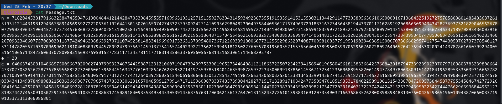
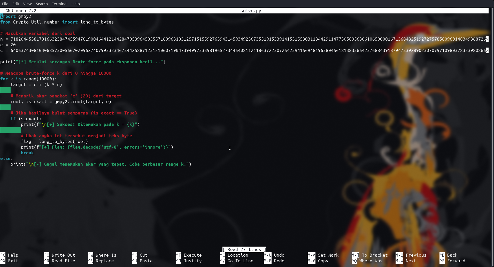
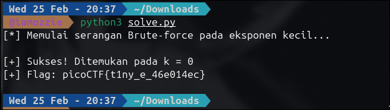

# Write-Up: Crack the Power (Unknown Points - Medium)

## Analisis Masalah

Challenge ini menyajikan masalah enkripsi RSA. Berdasarkan deskripsi, modulus $n$ dibangun dari bilangan prima yang sangat besar sehingga serangan faktorisasi tidak memungkinkan dilakukan. Namun, terdapat anomali pada nilai eksponen publiknya, yaitu $e = 20$.

Dalam kriptografi RSA, nilai $e$ yang sangat kecil sangat rentan terhadap serangan **Low Exponent Attack**. Karena $e$ kecil, ada kemungkinan nilai $m^e$ tidak melampaui $n$ sama sekali. Jika $m^e < n$, maka operasi modulo $n$ tidak berpengaruh, dan kita dapat mencari pesan asli $m$ hanya dengan menarik akar pangkat $e$ dari *ciphertext* $c$.

## Langkah Penyelesaian

### 1. Ekstraksi Parameter RSA

Saya mulai dengan membaca file `message.txt` untuk mendapatkan nilai $n, e,$ dan $c$. Saya mencatat bahwa $e$ bernilai 20, yang sangat tidak lazim dan lemah untuk standar RSA.

```bash
cat message.txt

```
****
*(Di sini saya mengambil screenshot isi file message.txt yang menampilkan angka-angka masif)*

### 2. Implementasi Serangan Low Exponent

Saya membuat *script* Python menggunakan *library* `gmpy2` untuk menarik akar pangkat 20 dari nilai $c$. Saya juga menyiapkan fungsi iterasi $k$ untuk berjaga-jaga jika terjadi *wrap around* pada modulus, namun ternyata pada $k = 0$ akar yang sempurna sudah ditemukan.

```python
import gmpy2
from Crypto.Util.number import long_to_bytes
# ... [isi script solve.py] ...
root, is_exact = gmpy2.iroot(c, 20)

```
****
*(Di sini saya mengambil screenshot terminal saat menjalankan solve.py dan menemukan hasil pada k = 0)*

### 3. Dekripsi Flag

Setelah menemukan akar pangkat yang sempurna, saya mengonversi nilai integer tersebut menjadi *bytes* untuk mendapatkan teks flag-nya.

```bash
python3 solve.py

```
****
*(Di sini saya mengambil screenshot terminal yang menampilkan output flag: picoCTF{t1ny_e_46e014ec})*

## Tools yang Digunakan

1. **Python 3** - Untuk eksekusi script otomasi dekripsi.
2. **gmpy2** - Library untuk operasi akar pangkat tinggi presisi tinggi (`iroot`).
3. **pycryptodome** - Untuk fungsi utilitas `long_to_bytes`.

## Kesimpulan

Challenge "Crack the Power" membuktikan bahwa modulus yang sangat besar sekalipun tidak berguna jika eksponen publik $e$ terlalu kecil. Karena $e=20$, nilai pesan yang dipangkatkan ternyata tidak cukup besar untuk melewati nilai modulus ($m^e < n$), sehingga enkripsi ini kehilangan sifat "modulo"-nya dan hanya menjadi operasi pemangkatan biasa yang sangat mudah dipatahkan.

Flag yang ditemukan adalah: **`picoCTF{t1ny_e_46e014ec}`**. Makna dari flag ini merujuk pada "Tiny E" atau eksponen yang sangat kecil, yang merupakan akar masalah dari kerentanan enkripsi ini.

---