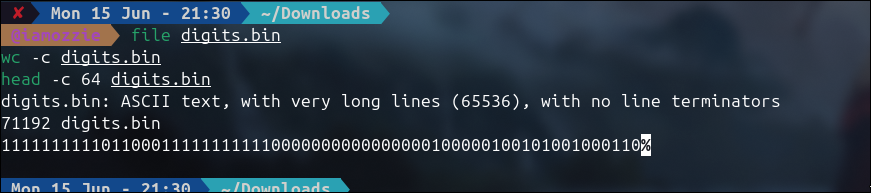
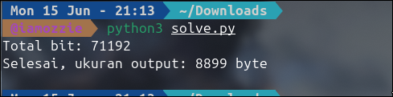
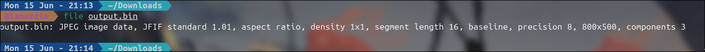
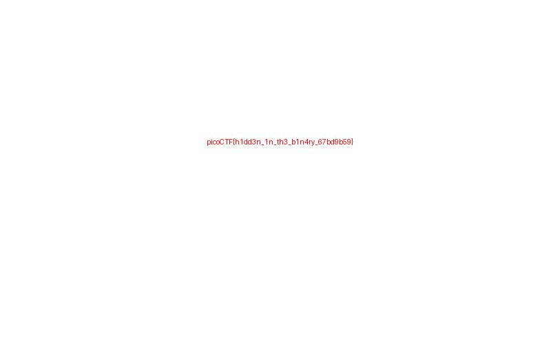

# Write-Up: Binary Digits (Easy)

## Analisis Masalah
Challenge ini memberikan sebuah *file* bernama `digits.bin` dengan deskripsi "This file doesn't look like much... just a bunch of 1s and 0s. But maybe it's not just random noise. Can you recover anything meaningful?". Pesan ini adalah petunjuk kuat bahwa isi *file* yang terlihat seperti deretan `0` dan `1` sebenarnya adalah **representasi bit** dari sebuah *file* biner asli yang perlu direkonstruksi kembali.

Saat saya melakukan analisis awal menggunakan `file digits.bin`, hasilnya menunjukkan *file* tersebut adalah **ASCII text dengan satu baris yang sangat panjang (65536 karakter) tanpa *line terminator***. Setelah saya cek lebih detail dengan `wc -c` dan `head -c`, isi *file* tersebut murni terdiri dari karakter `0` dan `1` sepanjang **71192 karakter**. Karena 71192 habis dibagi 8 (71192 ÷ 8 = 8899), ini mengonfirmasi bahwa setiap 8 karakter (`0`/`1`) merepresentasikan **1 byte** dalam bentuk *binary string*, dan jika dikonversi seharusnya menghasilkan *file* biner berukuran 8899 *byte*.

## Langkah Penyelesaian

### 1. Identifikasi Jenis File dan Struktur Data
Pertama-tama, saya memeriksa *file* menggunakan `file` untuk mengetahui tipe data awal, kemudian mengecek ukuran *file* dengan `wc -c` dan melihat sebagian isinya dengan `head -c` untuk memastikan bahwa isinya benar-benar hanya karakter `0` dan `1`.

```bash
file digits.bin
wc -c digits.bin
head -c 64 digits.bin
```

****
*(Di sini saya mengambil screenshot tampilan terminal saat menjalankan ketiga perintah di atas, yang menunjukkan bahwa `digits.bin` adalah ASCII text sepanjang 71192 karakter berisi `0` dan `1`)*

### 2. Merekonstruksi Binary String Menjadi File Biner
Setelah mengetahui bahwa isi *file* adalah *binary string* sepanjang 71192 *bit* (= 8899 *byte*), saya menulis sebuah *script* Python (`solve.py`) untuk membaca *file* tersebut, memecahnya menjadi *chunk* 8 *bit*, lalu mengonversi setiap *chunk* menjadi nilai *byte* dan menuliskannya ke *file* baru bernama `output.bin`.

```python
with open("digits.bin", "r") as f:
    bits = f.read().strip()

print("Total bit:", len(bits))

data = bytearray()
for i in range(0, len(bits), 8):
    byte_str = bits[i:i+8]
    if len(byte_str) == 8:
        data.append(int(byte_str, 2))

with open("output.bin", "wb") as f:
    f.write(bytes(data))

print("Selesai, ukuran output:", len(data), "byte")
```

Setelah dijalankan, *script* ini berhasil mengonversi 71192 *bit* menjadi *file* `output.bin` berukuran 8899 *byte*, sesuai dengan perhitungan awal.

```bash
python3 solve.py
```

****

*(Di sini saya mengambil screenshot output `python3 solve.py` yang menampilkan "Total bit: 71192" dan "Selesai, ukuran output: 8899 byte")*

### 3. Identifikasi Tipe File Hasil Konversi dan Ekstraksi Flag
Setelah `output.bin` terbentuk, saya memeriksa tipe *file*-nya menggunakan `file` dan hasilnya menunjukkan bahwa *file* tersebut adalah **JPEG image data** dengan resolusi 800x500 dan 3 *color components*. Saya kemudian mengubah ekstensi *file* menjadi `.jpg` agar dapat dibuka oleh *image viewer*, serta memeriksa *metadata*-nya dengan `exiftool` (yang tidak menunjukkan adanya teks tersembunyi di *metadata*). Langkah terakhir adalah membuka *file* `.jpg` tersebut secara visual, di mana flag ditemukan tertulis langsung di dalam gambar.

```bash
file output.bin
mv output.bin output.jpg
exiftool output.jpg
xdg-open output.jpg
```

****
*(Di sini saya mengambil screenshot output `file output.bin` yang menampilkan "JPEG image data, JFIF standard 1.01, ... 800x500, components 3")*

****

*(Di sini saya menampilkan gambar `output.jpg` yang berhasil dibuka, di mana terdapat teks flag berwarna merah dengan latar belakang putih)*

## Tools yang Digunakan
1. **file** - Untuk mengidentifikasi tipe *file* awal (`digits.bin`) dan tipe *file* hasil konversi (`output.bin`).
2. **wc & head** - Untuk memeriksa ukuran dan isi awal *file* secara cepat di terminal.
3. **python3** - Untuk menulis *script* yang merekonstruksi *binary string* (`0`/`1`) menjadi *byte* asli.
4. **exiftool** - Untuk memverifikasi *metadata* *file* JPEG hasil konversi.
5. **Image viewer** - Untuk membuka *file* JPEG hasil rekonstruksi dan membaca flag secara visual.

## Kesimpulan
Challenge "Binary Digits" adalah tantangan forensik dasar yang berfokus pada **rekonstruksi data biner dari representasi teks** (*bit string*). Banyak *file* biner — termasuk gambar, audio, maupun arsip — pada dasarnya hanyalah deretan *byte*, dan setiap *byte* dapat direpresentasikan sebagai 8 *bit* dalam bentuk `0` dan `1`. Dengan memecah *string* 71192 karakter menjadi *chunk* 8 *bit* dan mengonversinya kembali menjadi nilai *byte*, saya berhasil merekonstruksi *file* JPEG yang valid berukuran 8899 *byte*.

Flag yang ditemukan di dalam gambar tersebut adalah **`picoCTF{h1dd3n_1n_th3_b1n4ry_67bd9b69}`**. Makna dari flag ini adalah "*hidden in the binary*" (tersembunyi dalam biner), yang mendeskripsikan secara tepat teknik penyelesaian challenge ini, di mana flag asli "disembunyikan" dengan cara mengubah seluruh *file* gambar menjadi representasi *bit*-nya, dan saya berhasil memulihkannya kembali ke bentuk aslinya.