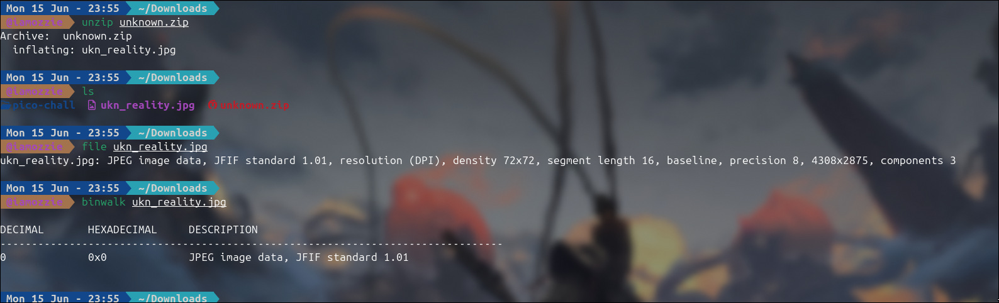
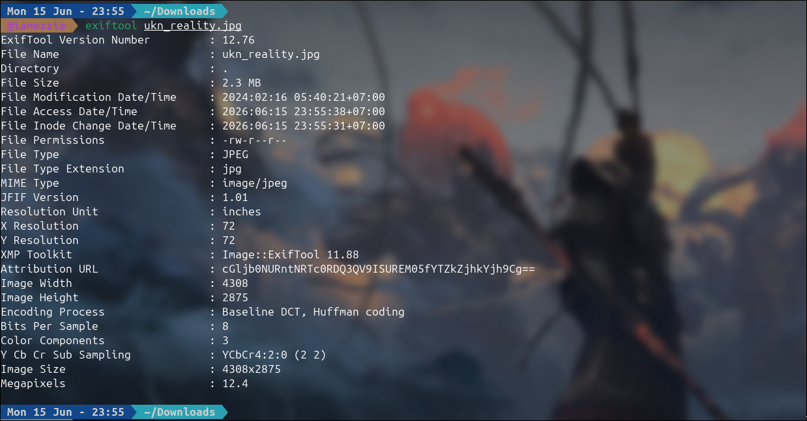
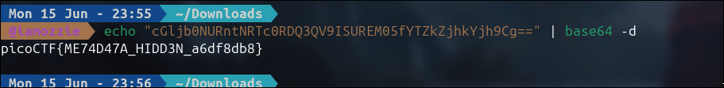

# Write-Up: CanYouSee (Easy)

## Analisis Masalah

Challenge ini memberikan sebuah berkas arsip bernama `unknown.zip`. Deskripsi soal memberikan petunjuk bertema petak umpet (*"How about some hide and seek?"*), disertai dua buah *hint* penting:

1. *How can you view the information about the picture?*
2. *If something isn't in the expected form, maybe it deserves attention?*

*Hint 1* secara langsung mengarahkan kita untuk memeriksa informasi atau properti dari berkas gambar menggunakan *tool* analisis metadata. Sementara itu, *Hint 2* memperingatkan bahwa jika ada informasi atau struktur data yang terlihat tidak wajar atau tidak sesuai dengan peruntukan aslinya pada properti gambar tersebut, maka bagian itulah yang perlu diselidiki lebih lanjut.

## Langkah Penyelesaian

### 1. Ekstraksi Berkas dan Identifikasi Awal

Langkah pertama yang saya lakukan adalah mengekstrak berkas `unknown.zip` menggunakan perintah `unzip`. Proses ekstraksi menghasilkan sebuah berkas gambar bernama `ukn_reality.jpg`. Saya kemudian melakukan verifikasi tipe berkas menggunakan perintah `file` dan memeriksa struktur internalnya menggunakan `binwalk` untuk memastikan tidak ada berkas lain yang tertanam (*embedded*) di dalamnya.

```bash
unzip unknown.zip
file ukn_reality.jpg
binwalk ukn_reality.jpg
```

****
*(Di sini saya mengambil screenshot tampilan terminal saat menjalankan perintah `unzip unknown.zip`, `file ukn_reality.jpg`, dan `binwalk ukn_reality.jpg` untuk mengekstrak sekaligus memastikan jenis berkas yang dihadapi)*

### 2. Pemeriksaan Metadata Gambar Menggunakan ExifTool

Merujuk pada *Hint 1*, saya menggunakan `exiftool` untuk membaca seluruh informasi metadata yang melekat pada berkas `ukn_reality.jpg`. Saat memeriksa baris-baris outputnya, saya menemukan sebuah kejanggalan pada salah satu *field* metadata sesuai dengan peringatan pada *Hint 2*.

*Field* bernama **`Attribution URL`** diisi oleh sebuah *string* acak yang diakhiri dengan karakter `==`. Pola ini merupakan indikasi kuat dari representasi data teks tersandi format **Base64**.

```bash
exiftool ukn_reality.jpg
```

****
*(Di sini saya mengambil screenshot tampilan terminal saat menjalankan perintah `exiftool ukn_reality.jpg` yang memperlihatkan teks string Base64 asing pada bagian field `Attribution URL`)*

### 3. Mendekode Payload Base64 untuk Mendapatkan Flag

Langkah terakhir adalah mengambil *string* Base64 dari *field* `Attribution URL` tersebut, yaitu `cGljb0NURntNRTc0RDQ3QV9ISUREM05fYTZkZjhkYjh9Cg==`, kemudian mendekodenya ke dalam format teks biasa teks biasa menggunakan utilitas `base64 -d` di terminal.

```bash
echo "cGljb0NURntNRTc0RDQ3QV9ISUREM05fYTZkZjhkYjh9Cg==" | base64 -d
```

****
*(Di sini saya mengambil screenshot tampilan terminal saat menjalankan perintah `echo` yang di-pipe ke `base64 -d` untuk memproses string tersebut hingga memunculkan flag asli)*

## Tools yang Digunakan

1. **unzip** - Untuk mengekstrak berkas arsip `unknown.zip`.
2. **file & binwalk** - Untuk mengidentifikasi tipe data biner berkas dan memeriksa apakah ada *file* tersembunyi di dalam komponen gambar.
3. **exiftool** - Untuk melakukan analisis metadata secara menyeluruh pada gambar JPEG hingga menemukan kejanggalan data.
4. **base64 (utility)** - Untuk mendekode *string* Base64 yang ditemukan di dalam metadata menjadi teks flag asli.

## Kesimpulan

Challenge "CanYouSee" merupakan tantangan forensik mendasar yang berfokus pada **Metadata Manipulation**. Tantangan ini memperlihatkan bagaimana sebuah informasi sensitif atau rahasia (dalam hal ini sebuah flag) dapat disembunyikan di dalam properti gambar (*Exchangeable Image File Format* / EXIF) tanpa merusak atau mengubah visualisasi luar dari gambar itu sendiri. Dengan ketelitian membaca struktur *field* metadata yang tidak biasa, *payload* yang disembunyikan dapat dengan mudah diidentifikasi.

Flag yang berhasil didapatkan dari tantangan ini adalah **`picoCTF{ME74D47A_HIDD3N_a6df8db8}`**. Isi dari flag tersebut merepresentasikan teks *"METADATA_HIDDEN"* (ditulis dengan gaya *leetspeak*), yang secara tepat merangkum metode penyembunyian flag yang diaplikasikan oleh pembuat soal dalam tantangan ini.