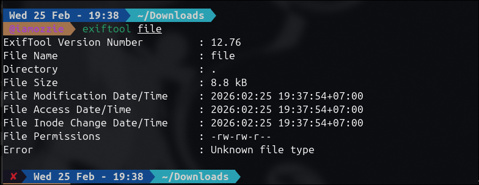
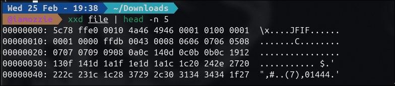
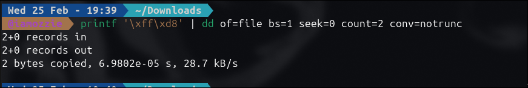
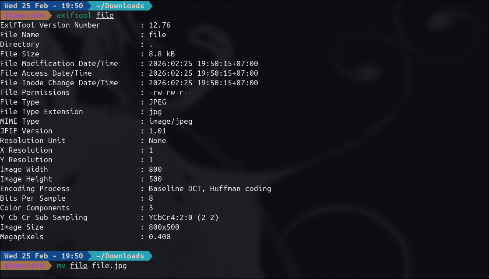
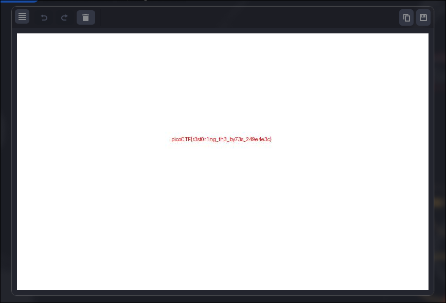

# Write-Up: Corrupted file (Easy)

## Analisis Masalah

Challenge ini memberikan sebuah file bernama `file` tanpa ekstensi dengan deskripsi "This file seems broken... or is it? Maybe a couple of bytes could make all the difference." Pesan ini adalah petunjuk kuat bahwa *file* tersebut mengalami kerusakan pada *Magic Bytes* (File Signature) di bagian *header*-nya.

Saat saya melakukan analisis awal menggunakan `exiftool`, file tersebut tidak dikenali (*Unknown file type*). Namun, ketika saya mencetak isi *file* menggunakan `cat` dan melihat struktur *hexadecimal*-nya dengan `xxd`, saya menemukan *string* `JFIF` yang merupakan indikator kuat bahwa ini sebenarnya adalah *file* gambar JPEG. Kesalahannya terletak pada 2 *byte* pertama yang bernilai `5c78` (merepresentasikan karakter `\x` dalam ASCII), padahal sebuah *file* JPEG yang valid harus selalu diawali dengan *byte* `FF D8`.

## Langkah Penyelesaian

### 1. Identifikasi Jenis File dan Kerusakan

Pertama-tama, saya memeriksa *file* menggunakan `exiftool` yang ternyata gagal mendeteksi formatnya. Kemudian saya memeriksa isi mentah *file* tersebut dengan membaca 5 baris pertama *hexadecimal*-nya menggunakan `xxd`.

```bash
exiftool file
xxd file | head -n 5

```
****
****

*(Di sini saya mengambil screenshot tampilan terminal saat menjalankan perintah `exiftool` dan `xxd` yang menampilkan output `5c78 ffe0 0010 4a46 4946`)*

### 2. Memperbaiki Magic Bytes (Header)

Setelah mengetahui bahwa 2 *byte* pertamanya salah, saya perlu mengganti `5c78` kembali menjadi `FF D8`. Saya menggunakan perintah bawaan Linux yaitu `printf` untuk mencetak *byte* yang benar, lalu mem- *pipe* hasilnya ke perintah `dd` untuk menimpa tepat 2 *byte* pertama pada *file* tanpa merusak sisa isinya.

```bash
printf '\xff\xd8' | dd of=file bs=1 seek=0 count=2 conv=notrunc

```
****

*(Di sini saya mengambil screenshot saat menjalankan perintah `printf` dan `dd` di terminal beserta output konfirmasi dari `dd`)*

### 3. Verifikasi dan Ekstraksi Flag

Setelah *header* diperbaiki, saya memastikan *file* sudah kembali normal dengan `exiftool`. Setelah format JPEG terdeteksi dengan benar, saya mengubah nama *file* agar memiliki ekstensi `.jpg` dan membukanya menggunakan *image viewer*.

```bash
exiftool file
mv file file.jpg

```
****

****

*(Di sini saya mengambil screenshot yang menampilkan gambar yang berhasil dibuka, di mana terdapat teks flag berwarna merah di tengah gambar dengan latar belakang putih)*

## Tools yang Digunakan

1. **exiftool** - Untuk membaca dan memverifikasi metadata/format *file*.
2. **cat** - Untuk melihat isi mentah *file* secara cepat di terminal.
3. **xxd** - Untuk melakukan *hex dump* dan melihat representasi *byte* dari *file*.
4. **printf & dd** - Untuk melakukan *hex editing* secara langsung dari terminal dengan menimpa (*overwrite*) *byte* yang rusak.

## Kesimpulan

Challenge "Corrupted file" adalah tantangan forensik dasar yang berfokus pada perbaikan *File Signature* atau *Magic Bytes*. Sistem operasi dan berbagai aplikasi mengandalkan beberapa *byte* pertama dari sebuah *file* untuk mengidentifikasi jenisnya, bukan sekadar melihat ekstensinya. Dengan mengenali sisa struktur *header* yang valid (`JFIF`), saya dapat menyimpulkan bahwa *file* tersebut adalah JPEG dan mengembalikan *byte* awalnya (`FF D8`) yang sengaja diubah oleh *author*.

Flag yang ditemukan di dalam gambar tersebut adalah **`picoCTF{r3st0r1ng_th3_by73s_249e4e3c}`**. Makna dari flag ini adalah "*restoring the bytes*" (memulihkan byte), yang mendeskripsikan secara tepat teknik penyelesaian challenge ini, di mana saya memulihkan *byte* yang rusak agar *file* bisa hidup kembali.

---