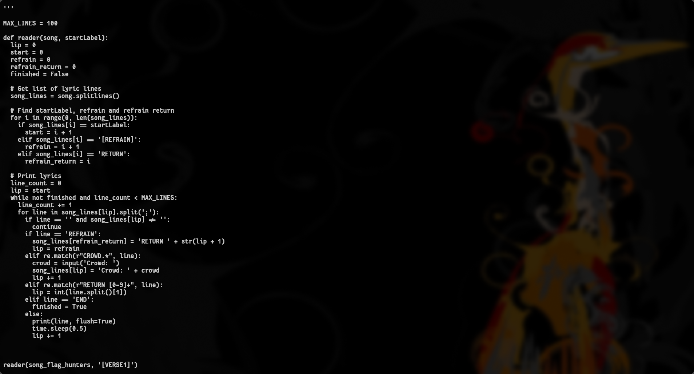
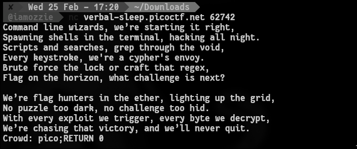
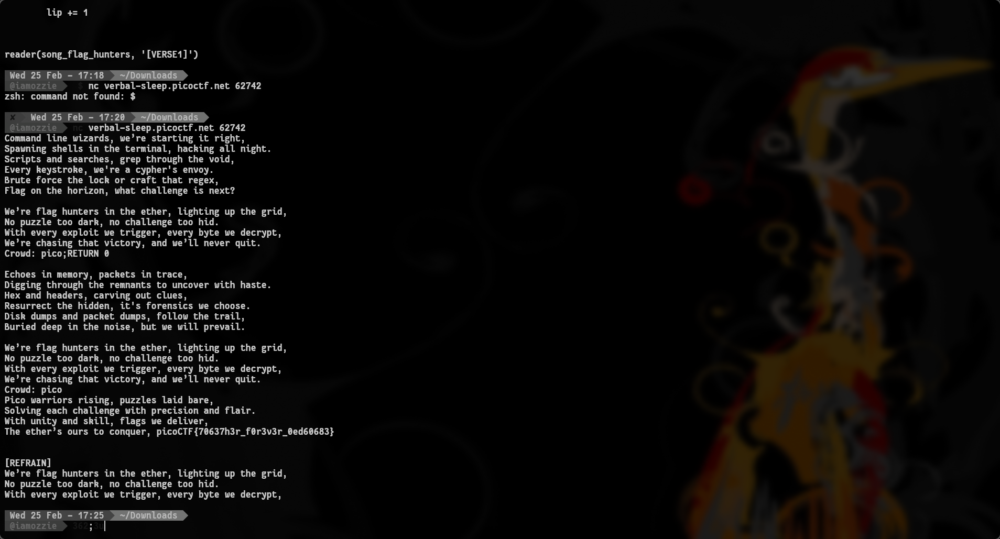

# Write-Up: Lyric Reader (Easy)

## Analisis Masalah

Challenge ini memberikan *source code* Python bernama `lyric-reader.py` dan sebuah alamat *instance* netcat (`nc`). Dari deskripsi, disebutkan bahwa lirik melompat dari *verse* ke *refrain* seperti pemanggilan *subroutine*, dan ada lirik rahasia yang tidak dicetak secara *default*.

Setelah menganalisis file `lyric-reader.py`, saya menemukan sebuah *logic bug* atau kerentanan pada fungsi *interpreter* kustom di dalamnya. Saat program meminta input melalui *prompt* pada regex `CROWD.*` di dalam *Refrain*, program menyimpan input tersebut ke dalam *array* memori `song_lines` dengan mengubah format kapitalisasinya menjadi `Crowd: <input>`.

Saat *Refrain* dipanggil untuk kedua kalinya, regex `CROWD.*` tidak lagi cocok (karena 'C' kapital dan sisanya huruf kecil). Akibatnya, input saya diproses sebagai lirik biasa yang dieksekusi oleh program, di mana lirik tersebut dipisah berdasarkan titik koma (`;`). Ini membuka celah *command injection* untuk memasukkan perintah seperti `RETURN <angka>`. Lirik rahasia yang berisi flag berada di indeks ke-0, sehingga target saya adalah memanipulasi *instruction pointer* agar kembali ke baris 0.

## Langkah Penyelesaian

### 1. Analisis Source Code

Pertama-tama, saya membaca dan menganalisis *source code* `lyric-reader.py` di terminal Arch Linux saya untuk memahami bagaimana program mengeksekusi lirik.

```bash
cat lyric-reader.py

```
****
*(Di sini saya mengambil screenshot saat menampilkan isi source code `lyric-reader.py` yang memperlihatkan blok kerentanan regex dan pemecahan titik koma)*

### 2. Menghubungkan ke Server Instance

Setelah mengetahui letak kerentanannya, saya menjalankan *instance* challenge di web picoCTF dan menghubungkan terminal ke server menggunakan perintah `nc`:

```bash
nc verbal-sleep.picoctf.net 62742

```

Program langsung mencetak lirik *Verse 1* perlahan-lahan dan berhenti sejenak untuk meminta input di bagian `Crowd: `

### 3. Eksekusi Payload (Command Injection)

Untuk mengeksploitasi celah ini, saya memasukkan *payload* yang memanfaatkan titik koma untuk menjalankan perintah ganda. Saya memasukkan `pico` sebagai input lirik palsu, diikuti perintah `RETURN 0` untuk memaksa program melompat ke baris ke-0 tempat `secret_intro` berada.

```text
Crowd: pico;RETURN 0

```
****
Setelah menekan Enter, program melanjutkan eksekusi ke *Verse 2*.
*(Di sini saya mengambil screenshot saat mengetikkan payload `pico;RETURN 0` di terminal)*

### 4. Mendapatkan Flag

Saat *Verse 2* selesai dan *Refrain* dipanggil kembali, program membaca baris input yang sudah saya modifikasi sebelumnya. Program mengeksekusi `RETURN 0`, memaksanya melompat ke awal *string* dan mencetak lirik rahasia beserta *flag*.
****
*(Di sini saya mengambil screenshot saat terminal menampilkan output lirik rahasia (Pico warriors rising...) beserta flag yang muncul)*

## Tools yang Digunakan

1. **cat** - Untuk membaca dan menganalisis source code Python di terminal lokal.
2. **nc (Netcat)** - Untuk melakukan koneksi TCP ke *instance* server picoCTF dan berinteraksi dengan program.

## Kesimpulan

Challenge "Lyric Reader" ini menguji kemampuan *Reverse Engineering* dan analisis *source code* untuk mencari celah pada logika pemrograman (*Logic Bug*). Terdapat kelemahan pada *custom interpreter* lirik di mana modifikasi state variabel di memori digabungkan dengan regex yang tidak konsisten (`CROWD.*` vs `Crowd:`). Hal ini memungkinkan eksekusi perintah arbitrer saat putaran *loop* kedua.

Teknik utama yang digunakan adalah memanipulasi nilai *array* di memori dan menyuntikkan perintah (*Command Injection* / *Interpreter Injection*) menggunakan pemisah titik koma (`;`) untuk memaksa program melompat kembali ke baris ke-0 menggunakan `RETURN 0`.

Flag yang ditemukan adalah **`picoCTF{70637h3r_f0r3v3r_0ed60683}`**. Makna dari *string* leetspeak `70637h3r_f0r3v3r` adalah "together forever" (bersama selamanya). *String* ini sangat relevan dengan tema challenge, yaitu kerumunan (*crowd*) yang bernyanyi bersama-sama tiada henti karena terjebak di dalam sebuah *looping* pemanggilan *Refrain*.

---