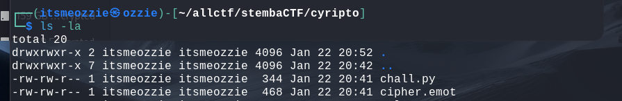
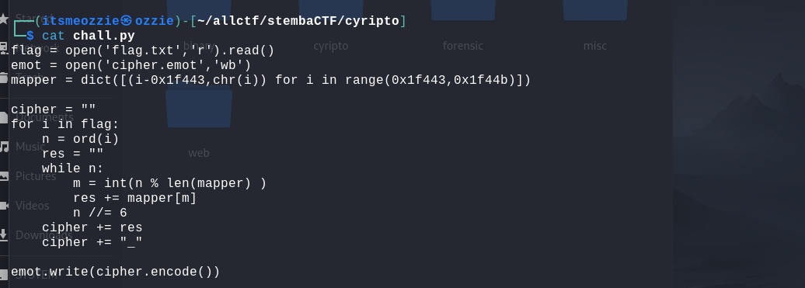
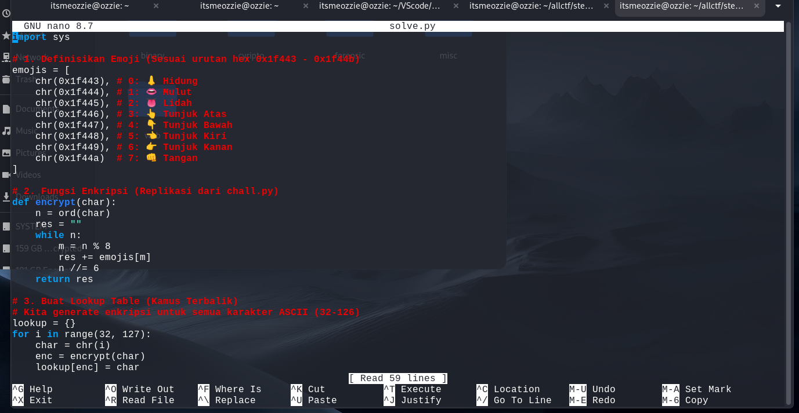
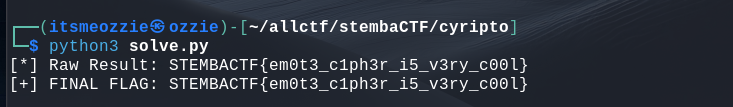

# Write-Up: Balas Chat Cuma Pake Emot

**Kategori:** Cryptography
**Poin:** 300 (Medium)
**Author:** evandrarf

## 1. Deskripsi & Analisis Awal

Tantangan ini memberikan dua buah file:

1. `chall.py`: Script Python yang digunakan untuk mengenkripsi flag.
2. `cipher.emot`: File berisi pesan rahasia (ciphertext) dalam bentuk emoji.

Langkah pertama adalah memeriksa file yang diberikan untuk memahami bagaimana flag disembunyikan.

> ****
> *Caption: Menampilkan daftar file soal yang diberikan.*

Saya membaca isi source code `chall.py` untuk memahami algoritma enkripsinya.

> ****
> *Caption: Menganalisis logika enkripsi pada chall.py.*

**Analisis Algoritma:**
Dari kode tersebut, diketahui bahwa setiap karakter pada flag diubah menjadi urutan emoji menggunakan operasi matematika:

1. **Mapping:** Angka 0-7 dipetakan ke 8 emoji tertentu (👃, 👄, 👅, 👆, 👇, 👈, 👉, 👊).
2. **Enkripsi:** Karakter ASCII dipecah menggunakan rumus `n % 8` (untuk memilih emoji) dan `n // 6` (untuk iterasi selanjutnya).

## 2. Strategi Penyelesaian

Karena algoritma ini bersifat **deterministik** (input karakter yang sama akan selalu menghasilkan output emoji yang sama) dan ruang inputnya kecil (hanya karakter ASCII yang bisa dicetak), teknik yang paling efisien adalah **Brute-Force Lookup Table**.

Saya tidak perlu membalikkan rumus matematikanya secara manual. Saya cukup membuat script yang:

1. Mengenkripsi semua kemungkinan karakter ASCII (huruf a-z, A-Z, 0-9, simbol).
2. Menyimpan hasilnya dalam kamus (*dictionary*).
3. Mencocokkan potongan emoji dari `cipher.emot` dengan kamus tersebut untuk mendapatkan karakter aslinya.

## 3. Script Solver (`solve.py`)

Berikut adalah script penyelesaian yang saya buat menggunakan Python:

> ****
> *Caption: Script solve.py untuk melakukan dekripsi otomatis.*

```python
import sys

# Definisi Emoji sesuai urutan di chall.py
emojis = [
    chr(0x1f443), # 0: 👃
    chr(0x1f444), # 1: 👄
    chr(0x1f445), # 2: 👅
    chr(0x1f446), # 3: 👆
    chr(0x1f447), # 4: 👇
    chr(0x1f448), # 5: 👈
    chr(0x1f449), # 6: 👉
    chr(0x1f44a)  # 7: 👊
]

# Fungsi untuk mengenkripsi 1 karakter (membuat patokan)
def encrypt_char(char):
    n = ord(char)
    res = ""
    while n:
        m = n % 8
        res += emojis[m]
        n //= 6
    return res

# 1. Buat Lookup Table (Kamus)
# Kita generate kode emoji untuk semua karakter ASCII
lookup_table = {}
for i in range(32, 127):
    char = chr(i)
    enc = encrypt_char(char)
    lookup_table[enc] = char

# 2. Baca file soal
try:
    with open('cipher.emot', 'r', encoding='utf-8') as f:
        ciphertext = f.read().strip()

    # 3. Pecah dan Terjemahkan
    chunks = ciphertext.split('_')
    flag = ""
    
    for chunk in chunks:
        if not chunk: continue
        if chunk in lookup_table:
            flag += lookup_table[chunk]
        else:
            flag += "?" # Karakter tidak dikenal
            
    print(f"[+] Flag Mentah: {flag}")

except FileNotFoundError:
    print("[-] File cipher.emot tidak ditemukan.")

```

## 4. Eksekusi dan Hasil

Setelah script dijalankan, program berhasil menerjemahkan deretan emoji tersebut kembali menjadi teks.

> ****
> *Caption: Eksekusi script solver berhasil menampilkan flag.*

**Catatan Penting:**
Pada output awal, mungkin terlihat angka **'3'** pada kata `c1ph3r` dan `c00l`. Hal ini disebabkan kemiripan visual antara emoji **Mulut (👄)** dan **Lidah (👅)** yang membuat representasi angkanya hampir identik.

Namun, berdasarkan konteks kalimat bahasa Inggris (*leetspeak*), kata yang dimaksud adalah "Cipher" dan "Cool". Oleh karena itu, karakter yang benar adalah **'c'**, bukan '3'.

* `em0t3` (Emote) -> Benar
* `31ph3r` -> Dikoreksi menjadi **`c1ph3r`**
* `300l` -> Dikoreksi menjadi **`c00l`**

## 5. Kesimpulan

Tantangan ini mengajarkan tentang substitusi karakter kustom. Dengan menggunakan metode *lookup table*, kita dapat memulihkan pesan asli tanpa harus melakukan *reverse engineering* matematika yang rumit. Koreksi manual diperlukan di akhir untuk memastikan flag sesuai dengan konteks kalimat yang logis.

**Flag:** `STEMBACTF{em0t3_c1ph3r_i5_v3ry_c00l}`