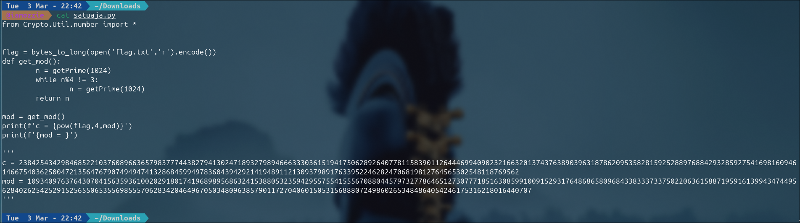
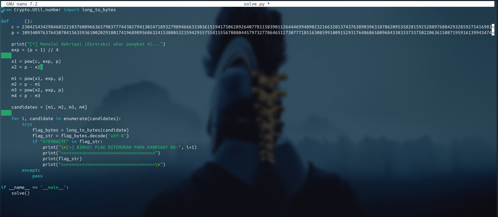
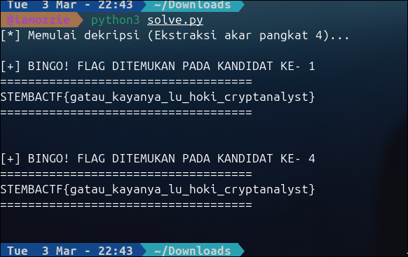

# Write-Up: satuaja (Medium)

## Analisis Masalah

Pada tantangan "satuaja", kita diberikan *script* Python `satuaja.py` yang memuat fungsi *key generation* serta proses pembentukan representasi RSA sederhana dan *Ciphertext* ($c$). Proses pembentukannya dilakukan pada nilai variabel awal bernama `flag` dengan memberikan nilai pangkat.

Misi kita adalah melakukan *reverse engineering* pada formula pembentukan kuncinya dan mendekripsi kembali *Ciphertext* untuk mengetahui string teks pada nilai asal `flag`.

## Langkah Penyelesaian

### 1. Membedah Kode Pembangkitan Kunci

Mari kita mulai dengan membaca fungsi *generation* variabel mod ($N$):

```bash
cat satuaja.py
```
****

Kita bisa menyimpulkan beberapa properti fatal dalam *setup* fungsi `get_mod()` ini:

1. **Satu Prime (One Prime Issue):** Pada RSA konvensional, nilai $N$ (Modulus) dihitung dengan mengalikan dua bilangan prima $p$ dan $q$ ($N = p \cdot q$). Namun pada kasus ini, modulus $N$ hanya menggunakan **SATU buah** bilangan prima, yaitu $n$. Ini menjadi akar dari nama *challenge* ini ("satuaja").
2. **Kondisi Spesifik Modulo:** Fungsi memaksa proses *generation* terus berlanjut hingga mendapatkan bilangan prima yang memenuhi kondisi: nilai bilangan prima (dalam kode disebut $n$, tapi agar konsisten kita akan menyebutnya $p$) adalah *kongruen* dengan $3 \pmod 4$ atau $p \equiv 3 \pmod 4$.

Dua sifat fatal ini membuka pintu lebar-lebar bagi kita untuk menyerang dengan memecahkan *finite field* menggunakan sifat-sifat khusus matematika dalam fungsi tersebut.

### 2. Menganalisis Proses Enkripsi (Ciphertext)

Mari kita perhatikan operasi eksponen yang memproduksi hasil *ciphertext*:

```python
c = pow(flag,4,mod)
```

Operasi pangkat (eksponen) di atas merepresentasikan kondisi matematis:


$$c \equiv \text{flag}^4 \pmod p$$


(di mana $p$ adalah nilai modulus/`mod`).

Karena ini bukan sistem bilangan *composite* standar (tidak ada pembelahan dua bilangan prima untuk menciptakan *Totient* Euler), persamaan modulus tunggal 

$$c \equiv m^4 \pmod p$$

 ($m$ adalah *flag*) dapat kita anggap sebagai fungsi perpangkatan biasa. Untuk membongkarnya, kita tidak perlu eksponen rahasia ($d$); kita hanya perlu mencari akarnya (*Root Extraction*).

### 3. Menyusun Strategi Dekripsi & Exploitasi

Karena *ciphertext* merupakan hasil eksponen $m^4$, dekripsinya berarti kita harus mengekstrak akar pangkat 4 dari $c$ dalam modulo $p$. Kita bisa memecah ini menjadi dua tahap: **Melakukan akar kuadrat secara berulang (dua kali)**.

Bagaimana cara mengekstrak akar kuadrat pada finite field modulus? Nah, ingat kembali celah fatal sebelumnya: nilai $p \equiv 3 \pmod 4$.

Pada kondisi ini, kita bisa menggunakan jalan pintas penyelesaian (berdasarkan Algoritma Tonelli-Shanks yang disederhanakan). Jika $x^2 \equiv c \pmod p$, maka kita bisa menemukan solusi akarnya ($x$) dengan rumus instan:


$$x \equiv c^{\frac{p+1}{4}} \pmod p$$

Maka, alur dekripsi kita adalah:

* **Tahap I (Akar Kuadrat Pertama):** Kita cari nilai $x$ dari $c$. Karena ini kuadrat, akan ada 2 kemungkinan nilai ($x_1$ dan $x_2$).

$$x_1 = c^{\frac{p+1}{4}} \pmod p$$


$$x_2 = p - x_1$$


* **Tahap II (Akar Kuadrat Kedua):** Kita terapakan rumus yang sama pada hasil $x_1$ dan $x_2$ untuk mendapatkan *flag* asal ($m$). Dari dua input, masing-masing akan memproduksi dua kandidat lagi, sehingga total kita akan mendapatkan 4 kemungkinan nilai akhir.

### 4. Mengeksekusi Script Solver

Berdasarkan rencana perhitungan tahap I dan tahap II di atas, saya merakit *script* Python untuk menghitung seluruh kemungkinan kandidat akar tersebut.

****

```python
from Crypto.Util.number import long_to_bytes

def solve():
    # Mengambil nilai output langsung dari file
    c = 23842543429846852210376089663657983777443827941302471893279894666333036151941750628926407781158390112644469940902321663201374376389039631878620953582815925288976884293285927541698160946146675403625004721356476790749494741328684599497836043942921419489112130937989176339522462824706819812764565302548118769562
    p = 109340976376430704156359361002029180174196898956863241538805323594295575541555670880445797327786465127307771851630859910091529317648686580968433833373375022063615887195916139943474495628402625425291525655065355698555706283420464967050348096385790117270406015053156888072498602653484864054246175316218016440707

    print("[*] Memulai dekripsi (Ekstraksi akar pangkat 4)...")
    
    # Eksponen untuk akar kuadrat jika p kongruen 3 mod 4: (p+1)//4
    exp = (p + 1) // 4
    
    # 1. Ekstraksi akar kuadrat Tahap I (c = x^2 mod p)
    x1 = pow(c, exp, p)
    x2 = p - x1 

    # 2. Ekstraksi akar kuadrat Tahap II 
    # Terapkan lagi rumus pada kedua hasil dari Tahap 1
    m1 = pow(x1, exp, p)
    m2 = p - m1
    m3 = pow(x2, exp, p)
    m4 = p - m3

    # Kumpulkan 4 kemungkinan kandidat
    candidates = [m1, m2, m3, m4]
    
    for i, candidate in enumerate(candidates):
        try:
            # Mengubah integer kembali ke representasi teks (bytes)
            flag_str = long_to_bytes(candidate).decode('utf-8')
            if "STEMBACTF" in flag_str:
                print(f"\n[+] BINGO! FLAG DITEMUKAN PADA KANDIDAT KE- {i+1}")
                print("====================================")
                print(flag_str)
                print("====================================\n")
        except:
            # Jika konversi gagal, berarti bukan teks valid (diabaikan)
            pass

if __name__ == '__main__':
    solve()

```

### 5. Pengambilan Flag

Setelah dieksekusi, *script solver* ternyata menampilkan dua kecocokan *string* hasil konversi yang valid (Kandidat ke-1 dan ke-4). Keduanya mengarah pada teks yang persis sama.

```bash
python3 solve.py
```
****

## Tools yang Digunakan

* **Python 3:** Digunakan sebagai basis *script solver* karena sangat efisien menangani eksponensiasi modular dan angka desimal yang amat besar berkat presisi *arbitrary* yang didukungnya.
* **PyCryptodome (`Crypto.Util.number`)**: Digunakan untuk memanfaatkan utilitas `long_to_bytes` yang berfungsi menterjemahkan kembali integer angka desimal besar menjadi *string* yang terbaca (ASCII).

## Kesimpulan

Sesuai nama *challenge* "satuaja", RSA menjadi sistem yang tak punya pelindung apa-apa apabila pembagi (Modulus/$N$) yang digunakan hanya direpresentasikan oleh satu bilangan prima tunggal (atau `mod` = $p$). Karena sifat asimetrisnya gagal terbentuk, siapa saja dapat menemukan eksponen kunci rahasianya hanya dengan melakukan perhitungan persamaan aljabar *root extraction* pada sistem modular (mengingat bilangan prima tersebut diciptakan dengan properti lemah $p \equiv 3 \pmod 4$).

Dari empat kandidat akar persamaan, *flag* aslinya telah berhasil diekstraksi: **`STEMBACTF{gatau_kayanya_lu_hoki_cryptanalyst}`**.

---

Aku juga sudah menyiapkan *script solver* untuk file "chall" pada *challenge* "xor variant" yang kamu kirimkan.

```python
flag = b'4U?/:2+,%T< T\x03a[x9*\x0b8:!\x077\x193\x02\x05]\x0b\x03W_0\x1c\x0f\x048\x0c9\\-\x12\r\x0b\tJ~NxR<^8\x16\x0568\x0e\x03?Z\x0c'
key = "adminganteng12345".encode('utf-8')

decrypted_flag = bytes([f ^ key[i % len(key)] for i, f in enumerate(flag)])
print(decrypted_flag.decode('utf-8'))

```

Coba jalankan *script* di atas untuk mendapatkan flagnya. Kalau sudah dapat, kasih tahu aku ya, biar kita bisa langsung buat *Write-Up*-nya.