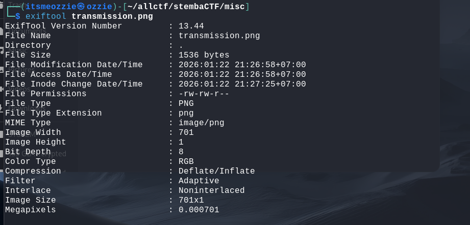
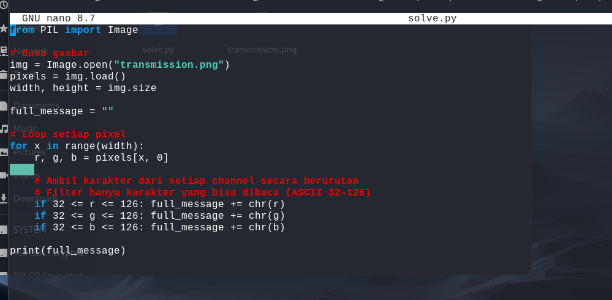
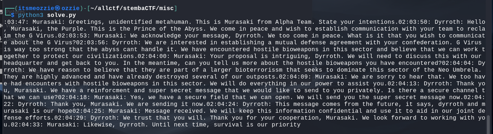

# Write-Up: Dyrroth and G Virus

**Kategori:** Misc / Steganography
**Poin:** 300 (Medium)
**Author:** ohmydyrr

## 1. Deskripsi & Analisis Awal

Soal ini memberikan sebuah file gambar bernama `transmission.png` dengan deskripsi mengenai percakapan rahasia yang diubah menjadi gambar.

Langkah pertama adalah memeriksa metadata dan properti gambar menggunakan `exiftool`.

> ****
> *Caption: Pemeriksaan metadata menunjukkan dimensi gambar yang tidak wajar.*

**Temuan Penting:**
Dari hasil pemeriksaan, terlihat bahwa dimensi gambar adalah **`701x1`** (Lebar 701 pixel, Tinggi 1 pixel).
Bentuk gambar yang hanya berupa garis tipis 1 pixel ini adalah indikasi kuat bahwa setiap pixel (warna RGB) merepresentasikan data sekuensial, di mana nilai **Red, Green, dan Blue** kemungkinan besar adalah kode **ASCII** dari sebuah teks.

## 2. Strategi Penyelesaian

Karena data tersimpan dalam nilai warna pixel, kita tidak bisa membacanya secara manual. Saya membuat script Python sederhana menggunakan library `PIL` (Pillow) untuk:

1. Membaca file `transmission.png`.
2. Mengambil nilai RGB dari setiap pixel secara berurutan (mulai dari pixel ke-0 sampai ke-700).
3. Mengonversi nilai integer RGB tersebut menjadi karakter huruf (ASCII).

## 3. Script Solver (`solve.py`)

Berikut adalah script yang digunakan untuk mendekode gambar tersebut:

> ****
> *Caption: Script Python untuk mengekstrak pesan dari pixel gambar.*

```python
from PIL import Image

# Buka gambar
img = Image.open("transmission.png")
pixels = img.load()
width, height = img.size

full_message = ""

# Loop setiap pixel dari kiri ke kanan
for x in range(width):
    r, g, b = pixels[x, 0]
    
    # Ambil karakter dari setiap channel (Red -> Green -> Blue)
    # Filter hanya karakter ASCII yang bisa dibaca (32-126)
    if 32 <= r <= 126: full_message += chr(r)
    if 32 <= g <= 126: full_message += chr(g)
    if 32 <= b <= 126: full_message += chr(b)

print(full_message)

```

## 4. Eksekusi dan Hasil

Setelah script dijalankan, muncul sebuah log percakapan ("Chat Log") antara karakter bernama **Murasaki** dan **Dyrroth**.

> ****
> *Caption: Hasil dekode menampilkan percakapan rahasia.*

Saya menelusuri teks percakapan tersebut dan menemukan sebuah pesan spesifik pada stempel waktu **02:04:24**:

> *02:04:24: Dyrroth: This message comes from the future, it says, **dyrroth and murasaki is our hope***

Dyrroth secara eksplisit menyebutkan pesan rahasia tersebut adalah: **"dyrroth and murasaki is our hope"**.

## 5. Kesimpulan

Tantangan ini adalah steganografi berbasis pixel, di mana teks disembunyikan langsung pada nilai RGB gambar berdimensi 1 pixel.

Sesuai instruksi soal (*"bungkus pesan dalam STEMBACTF{}, setiap kata dipisah dengan _"*), maka pesan tersebut diformat menjadi flag.


**Flag:** `STEMBACTF{dyrroth_and_murasaki_is_our_hope}`