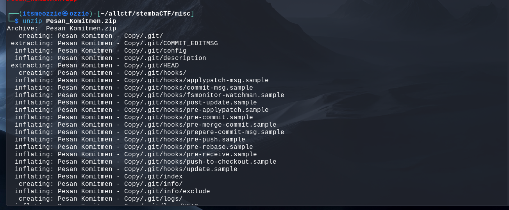
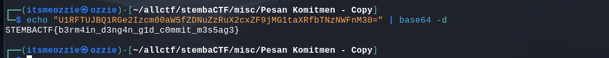

# Write-Up: Pesan Komitmen (300 Points - Medium)

## Analisis Masalah
Challenge ini memberikan sebuah file ZIP bernama `Pesan_Komitmen.zip`. Saat diekstrak, terdapat sebuah folder proyek yang memiliki subfolder tersembunyi `.git`.

Judul challenge "Pesan Komitmen" dan keberadaan folder `.git` adalah petunjuk kuat bahwa ini adalah soal kategori **Git Forensics**. Kata "Komitmen" merujuk pada "Commit" dalam Git. Saya menduga flag disembunyikan di dalam *Commit Message* (Pesan Komitmen) pada riwayat proyek tersebut.

## Langkah Penyelesaian

### 1. Ekstraksi File

Langkah pertama adalah mengekstrak file ZIP dan masuk ke direktori repository.

```bash
unzip Pesan_Komitmen.zip
cd "Pesan Komitmen - Copy"

```

### 2. Analisis Log Git

Saya memeriksa riwayat commit untuk melihat aktivitas perubahan pada repository.

```bash
git log --stat

```

**Temuan:**
Terlihat pola unik di mana terdapat banyak commit yang pesannya hanya berisi **satu karakter** dalam tanda kutip (contoh: `'='`, `'0'`, `'3'`). Karena `git log` menampilkan urutan dari terbaru ke terlama, urutan pesan ini terbalik.

### 3. Penyusunan Pesan (Flag Extraction)

Untuk membaca pesannya, saya menggunakan perintah `git log` dengan opsi `--reverse` (untuk mengurutkan dari awal) dan memformat outputnya agar bersih.

```bash
git log --reverse --pretty=format:"%s" | tr -d '\n'

```

Output raw yang didapat dari terminal:
`'U''1''R''F''T''U''J''B''Q''1''R''G''e''2''I''z''c''m''0''0''a''W''5''f''Z''D''N''u''Z''z''R''u''X''2''c''x''d''F''9''j''M''G''1''t''a''X''R''f''b''T''N''z''N''W''F''n''M''3''0''='`

Setelah menghilangkan tanda kutip, string yang terbentuk adalah:
**`U1RFTUJBQ1RGe2Izcm00aW5fZDNuZzRuX2cxdF9jMG1taXRfbTNzNWFnM30=`**

*(Catatan: Karakter di tengah adalah `d` (dari `...X2cxdF9...`), yang jika di-decode akan menghasilkan kata "git")*

### 4. Decoding Flag

String tersebut adalah format **Base64** (diakhiri dengan `=`). Saya mendekodenya menggunakan perintah `base64`.

```bash
echo "U1RFTUJBQ1RGe2Izcm00aW5fZDNuZzRuX2cxdF9jMG1taXRfbTNzNWFnM30=" | base64 -d

```

Hasil decode menampilkan flag yang benar:
**`STEMBACTF{b3rm4in_d3ng4n_g1t_c0mmit_m3s5ag3}`**

## Tools yang Digunakan

1. **unzip** - Mengekstrak file challenge.
2. **git** - Menganalisis riwayat commit (`git log`).
3. **base64** - Mendekode string flag yang ditemukan.

## Kesimpulan

Challenge "Pesan Komitmen" memanfaatkan fitur dasar Git yaitu *Commit Message* sebagai media steganografi (penyembunyian data). Pembuat soal memecah flag menjadi karakter tunggal, menyimpannya di setiap commit secara berurutan, lalu menyamarkannya dengan encoding Base64.

Poin kunci penyelesaiannya adalah:

1. Menyadari bahwa folder `.git` menyimpan informasi penting.
2. Membaca `git log` secara terbalik (`--reverse`).
3. Ketelitian membaca string Base64 (memastikan karakter `d` pada log tidak tertukar, sehingga menghasilkan kata `g1t` / git).

Flag: **`STEMBACTF{b3rm4in_d3ng4n_g1t_c0mmit_m3s5ag3}`**