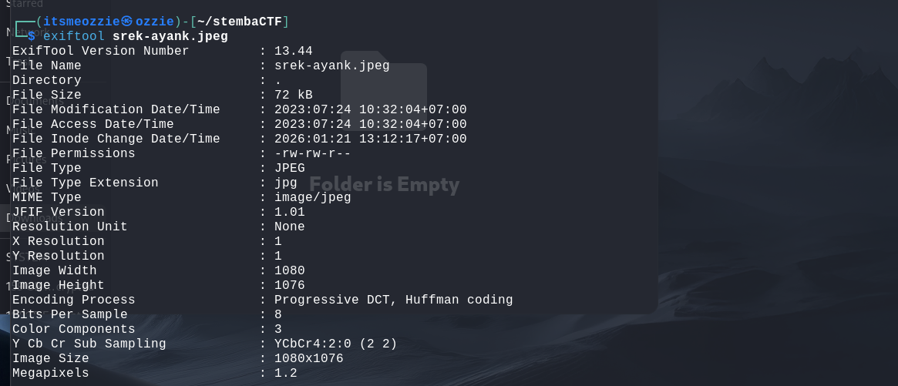
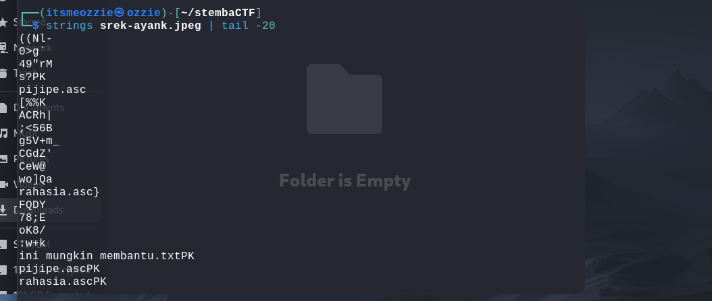
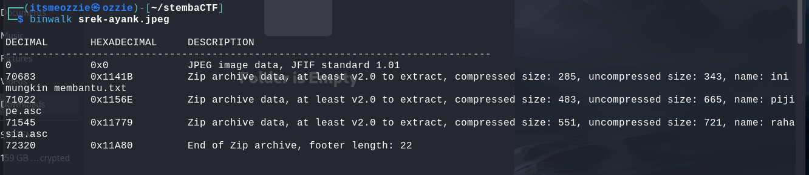
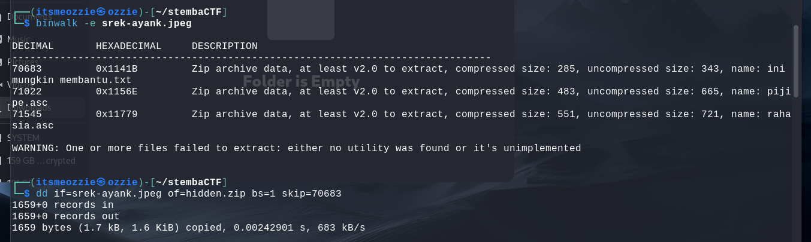
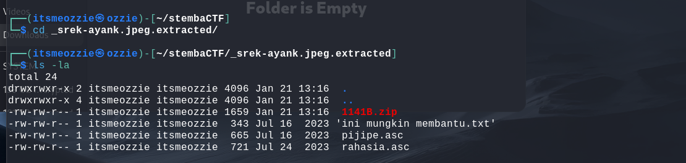
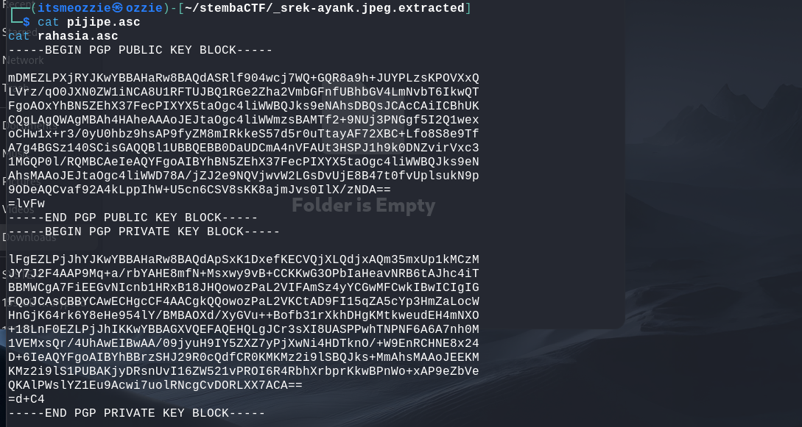
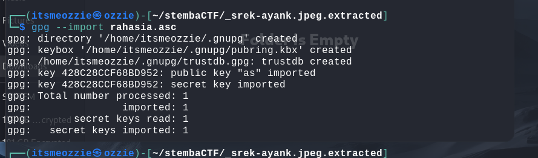

# Write-Up: Pjiipi Challenge (250 Points - Medium)

## Analisis Masalah
Challenge ini memberikan sebuah file ZIP bernama `pjipi.zip` dengan deskripsi "Ratu mesir yang terkenal...". Setelah diekstrak, saya mendapatkan dua file: `hint.txt` yang berisi informasi tentang Kleopatra VII (penguasa terakhir Mesir), dan sebuah gambar JPEG bernama `srek-ayank.jpeg`. 

Dari petunjuk yang diberikan, saya menduga challenge ini melibatkan steganografi pada gambar JPEG dan kemungkinan enkripsi menggunakan PGP/GPG, mengingat referensi ke Kleopatra yang juga merupakan nama aplikasi GPG key manager.

## Langkah Penyelesaian
### 1. Ekstraksi File Awal
Pertama-tama, saya mengekstrak file `pjipi.zip` untuk melihat isinya:

Hasilnya adalah dua file:
- `hint.txt` - Berisi informasi tentang Kleopatra VII
- `srek-ayank.jpeg` - File gambar yang akan dianalisis

### Step 2: Analisis Metadata dan Konten Gambar
Analisis file JPEG menggunakan berbagai tools untuk mencari data tersembunyi:
#### Analisis dengan exiftool:
```bash
exiftool srek-ayank.jpeg
```

#### Cari string ASCII dalam file:
```bash
strings srek-ayank.jpeg | tail -20
```

**Temuan dari strings:**
Ditemukan nama-nama file mencurigakan seperti `pijipe.asc`, `rahasia.asc`, dan `ini mungkin membantu.txt`! 🔍
#### Deteksi file tersembunyi dengan binwalk:
```bash
binwalk srek-ayank.jpeg
```

**Hasil binwalk:**
Terbukti ada **ZIP archive tersembunyi** pada offset 70683 bytes! Tool `binwalk` mengkonfirmasi adanya ZIP archive di dalam gambar JPEG.

### Step 3: Ekstraksi File Tersembunyi

Saya mengekstrak file-file yang tersembunyi menggunakan binwalk:
```bash
binwalk -e srek-ayank.jpeg
cd _srek-ayank.jpeg.extracted/
```

Alternatif lain menggunakan `dd`:
```bash
dd if=srek-ayank.jpeg of=hidden.zip bs=1 skip=70683
```

**Hasil ekstraksi menghasilkan tiga file penting:**
1. `ini mungkin membantu.txt` - berisi PGP encrypted message
2. `pijipe.asc` - berisi PGP public key
3. `rahasia.asc` - berisi PGP private key



### 4. Analisis File PGP
Setelah membaca ketiga file tersebut, saya menyadari bahwa:
- File `ini mungkin membantu.txt` berisi pesan terenkripsi PGP
- File `rahasia.asc` berisi private key yang diperlukan untuk mendekripsi pesan
- File `pijipe.asc` berisi public key (tidak digunakan dalam solusi)

### 5. Import Private Key dan Dekripsi
Saya mengimport private key GPG ke dalam keyring:

```bash
gpg --import rahasia.asc
```

Private key berhasil diimport tanpa memerlukan passphrase. Kemudian saya mendekripsi pesan:

```bash
gpg --decrypt "ini mungkin membantu.txt"
```

Pesan berhasil didekripsi dan menampilkan flag: **`STEMBACTF{kucing_mesir_viral0W0}`**

## Tools yang Digunakan

1. **unzip** - Untuk mengekstrak file ZIP awal
2. **exiftool** - Untuk menganalisis metadata gambar JPEG
3. **strings** - Untuk melihat string ASCII dalam file binary
4. **binwalk** - Untuk mendeteksi dan mengekstrak file tersembunyi dalam gambar
5. **dd** - Alternatif untuk mengekstrak file tersembunyi secara manual
6. **gpg (GnuPG)** - Untuk mengimport key dan mendekripsi pesan PGP

## Kesimpulan

Challenge "Pjiipi" adalah kombinasi dari steganografi dan kriptografi. File JPEG menyembunyikan sebuah ZIP archive yang berisi PGP private key dan encrypted message. Petunjuk tentang "Kleopatra" memiliki makna ganda: sebagai tokoh sejarah Mesir dan sebagai referensi ke aplikasi Kleopatra GPG key manager, yang mengindikasikan penggunaan enkripsi PGP/GPG dalam challenge ini.

Teknik utama yang digunakan adalah:
- **Steganografi**: Menyembunyikan ZIP archive di dalam gambar JPEG
- **Kriptografi**: Enkripsi PGP untuk melindungi flag

Flag yang ditemukan adalah **`STEMBACTF{kucing_mesir_viral0W0}`**, yang merujuk pada kucing Mesir (Egyptian cat/Sphynx) yang menjadi viral, sesuai dengan tema Mesir kuno dari challenge ini.