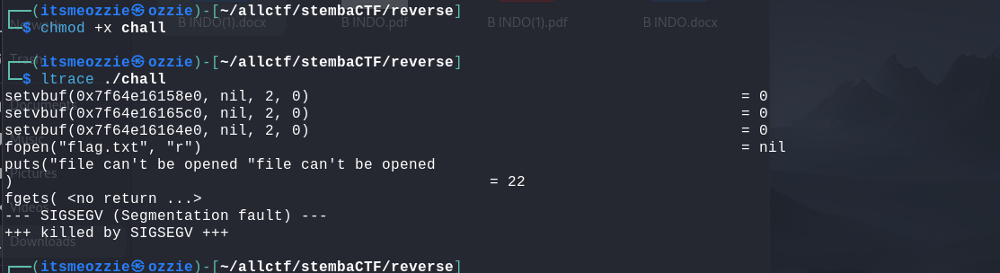
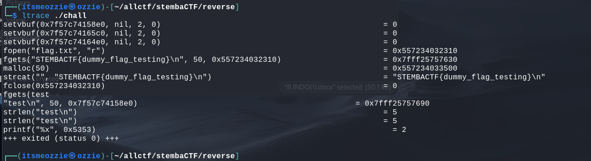
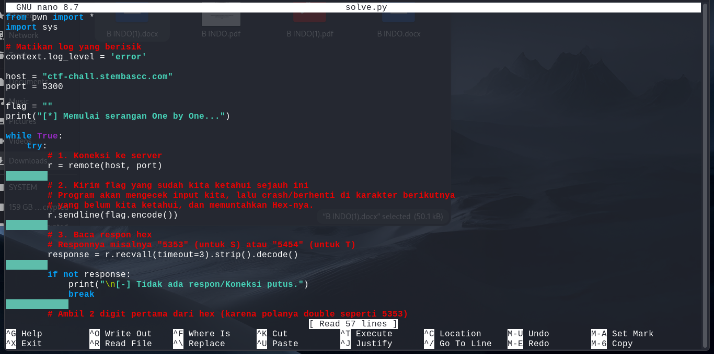
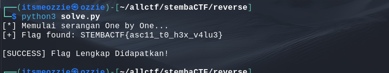

# Write-Up: One by One (200 Points - Medium)

## Analisis Masalah

Challenge ini memberikan sebuah file binary executable Linux bernama `chall` dan sebuah akses server melalui netcat (`nc ctf-chall.stembascc.com 5300`).

Judul soal **"one by one"** memberikan petunjuk kuat bahwa mekanisme pengecekan password atau flag dilakukan secara **karakter per karakter**. Tugas utamanya adalah melakukan *Reverse Engineering* pada binary tersebut untuk memahami logikanya, lalu mengeksploitasinya untuk mendapatkan flag dari server.

## Langkah Penyelesaian

### 1. Persiapan dan Analisis Awal

Langkah pertama adalah memberikan izin eksekusi pada file binary agar bisa dijalankan di lingkungan lokal.

```bash
chmod +x chall

```

Saat mencoba menjalankan program, terjadi error karena program mencoba membuka file `flag.txt` yang tidak ada di lokal.

> ****
> *Caption: Program gagal berjalan karena file flag.txt tidak ditemukan.*

### 2. Dynamic Analysis dengan `ltrace`

Untuk memahami perilaku program, saya membuat file `flag.txt` palsu (dummy) dan menggunakan tools **`ltrace`** (Library Trace) untuk memantau fungsi-fungsi perpustakaan yang dipanggil program saat berjalan.

```bash
echo "STEMBACTF{dummy}" > flag.txt
ltrace ./chall

```

Saat program meminta input, saya memasukkan string sembarang ("test"). Output `ltrace` menunjukkan perilaku yang menarik:

> ****
> *Caption: Program membocorkan nilai Hex dari karakter yang diharapkan.*

**Temuan Vulnerability (Oracle):**
Ketika saya menginputkan karakter yang salah, program mencetak angka Hexadecimal.

* Input: `t` (salah)
* Output Program: `5353` (Hex `53` adalah ASCII untuk huruf **'S'**).
* Huruf pertama flag format standar adalah 'S'.

Ini membuktikan bahwa program membandingkan input pengguna dengan flag asli satu per satu. Jika salah, program **membocorkan karakter yang benar** dalam format Hex, lalu berhenti.

### 3. Pembuatan Exploit Script (`solve.py`)

Karena proses ini harus dilakukan ke server (`nc`) dan akan sangat lama jika dilakukan manual, saya membuat script otomatis menggunakan Python dan library `pwntools`.

Script ini bekerja dengan logika:

1. Mengirim potongan flag yang sudah diketahui ke server.
2. Menangkap respon Hex dari server (karakter selanjutnya yang benar).
3. Mendekode Hex tersebut menjadi karakter ASCII.
4. Menambahkan karakter baru ke variabel flag dan mengulangi prosesnya.

```python
from pwn import *
import sys

# Konfigurasi Koneksi
context.log_level = 'error'
host = "ctf-chall.stembascc.com"
port = 5300

flag = ""
print("[*] Memulai serangan One by One...")

while True:
    try:
        r = remote(host, port)
        r.sendline(flag.encode()) # Kirim flag yang sudah diketahui
        
        # Baca respon (Hex leak)
        response = r.recvall(timeout=3).strip().decode()
        if not response: break
            
        # Ambil 2 digit hex pertama dan decode ke ASCII
        leaked_hex = response[:2]
        next_char = bytes.fromhex(leaked_hex).decode()
        
        flag += next_char
        sys.stdout.write(f"\r[+] Flag found: {flag}")
        sys.stdout.flush()
        
        if next_char == '}':
            print("\n\n[SUCCESS] Flag Lengkap Didapatkan!")
            break
            
        r.close()
    except:
        break

```

> ****
> *Caption: Script Python untuk melakukan brute-force side channel.*

### 4. Eksekusi

Saya menjalankan script tersebut dan membiarkannya menyusun flag huruf demi huruf secara otomatis.

```bash
python3 solve.py

```

> ****
> *Caption: Script berhasil menyusun flag lengkap.*

Hasil akhirnya:
**`STEMBACTF{asc11_t0_h3x_v4lu3}`**

## Tools yang Digunakan

1. **ltrace** - Untuk menganalisis jalannya program dan menemukan kebocoran logika (memory leak).
2. **Python (pwntools)** - Untuk membuat script otomatisasi serangan ke server.
3. **Terminal Linux** - Environment pengerjaan.

## Kesimpulan

Challenge "One by One" memiliki kerentanan logika jenis **Side-Channel Oracle**. Program memberikan respon berbeda (membocorkan jawaban benar) ketika input pengguna salah. Dengan memanfaatkan kebocoran informasi ini (Information Leak), kita dapat merekonstruksi seluruh flag tanpa perlu melakukan *reverse engineering* kode assembly secara mendalam.

Flag: **`STEMBACTF{asc11_t0_h3x_v4lu3}`**