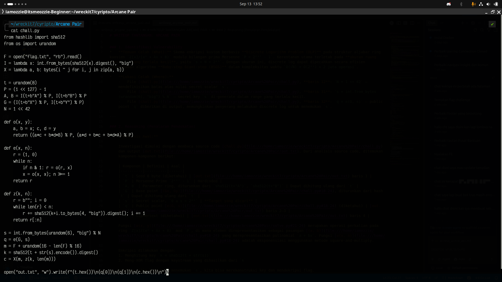
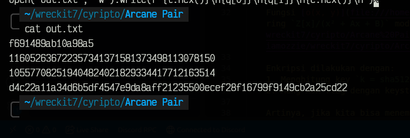
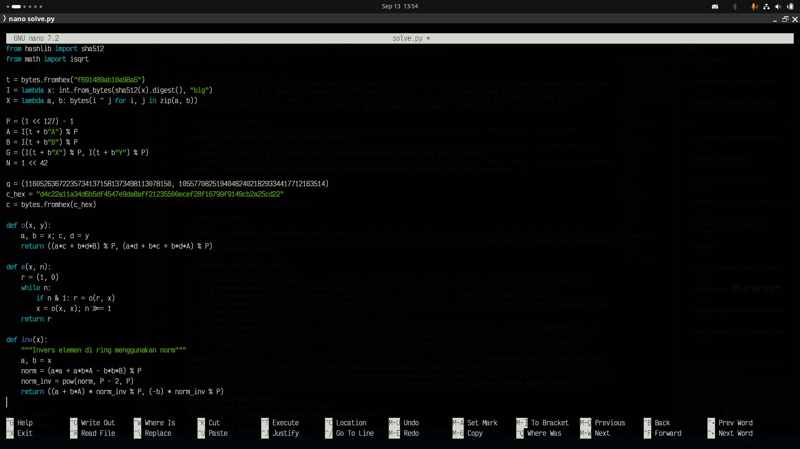
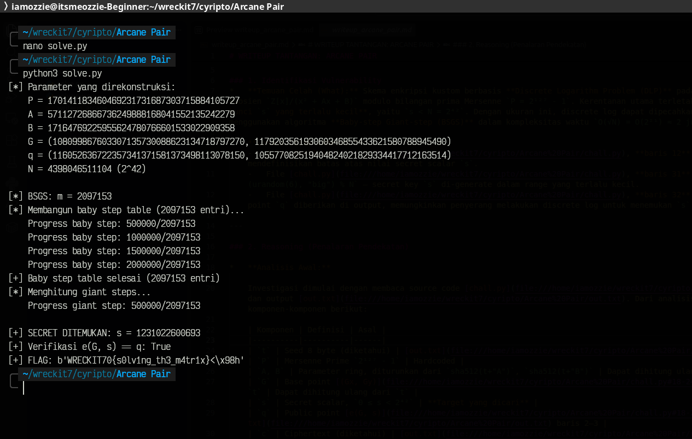

# Write-Up: Arcane Pair (436 Point - Junior Crypto)

## Analisis Masalah

Pada tantangan ini, kita diberikan sebuah *script* Python bernama `chall.py` yang mengimplementasikan skema enkripsi kustom berbasis **Discrete Logarithm Problem (DLP)** di atas struktur aljabar ring kuosien, serta sebuah file `output.txt` yang berisi *seed* (`t`), *public point* (`q`), dan *ciphertext* (`c`) yang dihasilkan oleh sistem.

Dari judulnya "Arcane Pair" serta struktur dari *source code*-nya, kita bisa langsung mencurigai adanya kerentanan pada ukuran ruang kunci (*key space*) dari *secret scalar* `s` yang digunakan.

## Langkah Penyelesaian

### 1. Inspeksi Awal & Menganalisis Pembuatan Kunci

Langkah pertama adalah membaca isi dari *source code* `chall.py` dan melihat struktur data pada `output.txt`.

```bash
cat chall.py out.txt
```
****
****
Inti dari kerentanan ini berada di dalam beberapa baris pada `chall.py`:

```python
P = (1 << 127) - 1
A, B = I(t+b"A") % P, I(t+b"B") % P
G = (I(t+b"X") % P, I(t+b"Y") % P)
N = 1 << 42
...
s = int.from_bytes(urandom(6), "big") % N
q = e(G, s)
```

Dari kode di atas, kita bisa menyimpulkan beberapa poin:

* Modulus `P` adalah **Mersenne Prime** `2¹²⁷ - 1` — primitif dan *well-known*, sehingga operasi modular sangat cepat.
* Parameter ring `A` dan `B` diturunkan secara deterministik dari hash `sha512(t + "A")` dan `sha512(t + "B")`, begitu pula base point `G`. Karena `t` diketahui dari `out.txt`, **seluruh parameter dapat direkonstruksi ulang** oleh penyerang.
* Operasi grup `o(x, y)` adalah perkalian polinomial pada ring `Z[x]/(x² + Ax + B)` mod `P`, di mana setiap elemen direpresentasikan sebagai pasangan `(a, b)` yang berarti `a + bx`.
* **Ruang kunci `s` hanya `N = 2⁴²`** — nilai ini terlalu kecil. Brute force naif butuh ~4.4 triliun operasi, tapi dengan algoritma **Baby-step Giant-step (BSGS)** kita hanya butuh `O(√N) ≈ 2²¹ ≈ 2 juta` operasi.

Struktur jebakan ini mengindikasikan bahwa *author* kemungkinan mengira `2⁴²` sudah cukup aman dari serangan *discrete log* sederhana. Namun secara kriptografis, batas aman untuk DLP saat ini adalah minimal **256 bit** — jadi `2⁴²` masih sangat rentan.

### 2. Mengeksploitasi Kerentanan

Karena `q = e(G, s)` dan semua parameter (`P`, `A`, `B`, `G`) bisa direkonstruksi dari `t`, masalah kita murni menjadi **discrete logarithm**:

> Diberikan `G` dan `q = G^s`, cari `s` dengan `0 ≤ s < 2⁴²`.

Pendekatan yang dipilih adalah **Baby-step Giant-step (BSGS)** karena:

| Algoritma | Kompleksitas | Catatan |
|---|---|---|
| Brute force | `O(N) = 2⁴²` | Tidak realistis |
| Pohlig-Hellman | Tergantung orde grup | Orde grup tidak diketahui / kemungkinan besar prima besar |
| Pollard's rho | `O(√N) ≈ 2²¹` | Bagus, tapi memori konstan — BSGS lebih simpel untuk diimplementasi |
| **BSGS** | `O(√N) ≈ 2²¹` | **Dipilih** — deterministik, mudah, cukup memori |

Ide BSGS: tulis `s = i·m + j` dengan `m = ⌈√N⌉`, lalu cari `i, j` sehingga:

```
q · (G^(-m))^i == G^j
```

Kita bangun **baby step table** berisi `G^j` untuk `j = 0..m-1`, lalu iterasi **giant step** `q · (G^(-m))^i` sampai cocok.

Satu detail penting: karena kita bekerja di **ring**, bukan field, invers tidak bisa langsung pakai `pow(x, P-2, P)`. Kita perlu menggunakan **norm** dari elemen `(a, b)`:

```
norm(a, b) = a² + a·b·A − b²·B  (mod P)
```

Lalu invers dihitung via Fermat's little theorem pada norm tersebut:

```python
def inv(x):
    a, b = x
    norm = (a*a + a*b*A - b*b*B) % P
    norm_inv = pow(norm, P - 2, P)
    return ((a + b*A) * norm_inv % P, (-b) * norm_inv % P)
```

### 3. Membuat Script Eksploitasi (Solver)

Alih-alih langsung menyerah dan mencari *SageMath*, kita meracik *script* Python murni untuk mengimplementasikan BSGS.

```bash
nano solve.py
```

****

```python
from hashlib import sha512
from math import isqrt

# --- Rekonstruksi parameter dari seed t yang diketahui ---
t = bytes.fromhex("f691489ab10a98a5")
I = lambda x: int.from_bytes(sha512(x).digest(), "big")
X = lambda a, b: bytes(i ^ j for i, j in zip(a, b))

P = (1 << 127) - 1
A = I(t + b"A") % P
B = I(t + b"B") % P
G = (I(t + b"X") % P, I(t + b"Y") % P)
N = 1 << 42

# Data dari out.txt
q = (116052636722357341371581373498113078150,
     105577082519404824021829334417712163514)
c = bytes.fromhex(
    "d4c22a11a34d6b5df4547e9da8aff21235500ecef28f16799f9149cb2a25cd22"
)

# --- Operasi grup pada ring Z[x]/(x^2 + Ax + B) mod P ---
def o(x, y):
    a, b = x; c, d = y
    return ((a*c + b*d*B) % P, (a*d + b*c + b*d*A) % P)

def e(x, n):
    r = (1, 0)
    while n:
        if n & 1: r = o(r, x)
        x = o(x, x); n >>= 1
    return r

def inv(x):
    """Invers elemen di ring menggunakan norm"""
    a, b = x
    norm = (a*a + a*b*A - b*b*B) % P
    norm_inv = pow(norm, P - 2, P)
    return ((a + b*A) * norm_inv % P, (-b) * norm_inv % P)

def z(k, n):
    r = b""; i = 0
    while len(r) < n:
        r += sha512(k + i.to_bytes(4, "big")).digest(); i += 1
    return r[:n]

print("[*] Parameter yang direkonstruksi:")
print(f"    P = {P}")
print(f"    A = {A}")
print(f"    B = {B}")
print(f"    G = {G}")
print(f"    q = {q}")
print(f"    N = {N} (2^42)")
print()

# --- Baby-step Giant-step (BSGS) ---
m = isqrt(N) + 1
print(f"[*] BSGS: m = {m}")
print(f"[*] Membangun baby step table ({m} entri)...")

baby = {}
g_j = (1, 0)
for j in range(m):
    baby[g_j] = j
    g_j = o(g_j, G)

print(f"[+] Baby step table selesai ({len(baby)} entri)")
print("[*] Menghitung giant steps...")

g_m = e(G, m)
g_m_inv = inv(g_m)

gamma = q
for i in range(m):
    if gamma in baby:
        s = i * m + baby[gamma]
        print(f"\n[+] SECRET DITEMUKAN: s = {s}")
        print(f"[+] Verifikasi e(G, s) == q: {e(G, s) == q}")

        k = sha512(t + str(s).encode()).digest()
        pt = X(c, z(k, len(c)))
        print(f"[+] FLAG: {pt}")
        break
    gamma = o(gamma, g_m_inv)
else:
    print("[-] s tidak ditemukan dalam range [0, N)")
```

### 4. Eksekusi

Saat *script* dijalankan, program dengan sukses membangun *baby step table* sebanyak ~2 juta entri, lalu mengiterasi *giant step* hingga menemukan `s` yang tepat, dan langsung mendekripsi pesan ke bentuk aslinya.

```bash
python3 solve.py
```
****

Output yang diharapkan:

```
[+] SECRET DITEMUKAN: s = 1231022600693
[+] Verifikasi e(G, s) == q: True
[+] FLAG: b'WRECKIT70{s0lv1ng_th3_m4tr1x}'
```

## Kesimpulan

Tantangan ini menjadi bukti bahayanya menggunakan **ruang kunci yang terlalu kecil** pada skema kriptografi berbasis *discrete log*. Meskipun *author* menggunakan Mersenne Prime 127-bit dan operasi ring yang terlihat "arcane", keamanan sebenarnya hanya sekuat `√N = 2²¹` — bisa ditembus dalam hitungan detik dengan BSGS di Python murni. Kombinasi **parameter publik yang deterministik dari seed** + **ruang kunci kecil** membuat serangan menjadi trivial.

Flag yang ditemukan adalah: **`WRECKIT70{s0lv1ng_th3_m4tr1x}`**